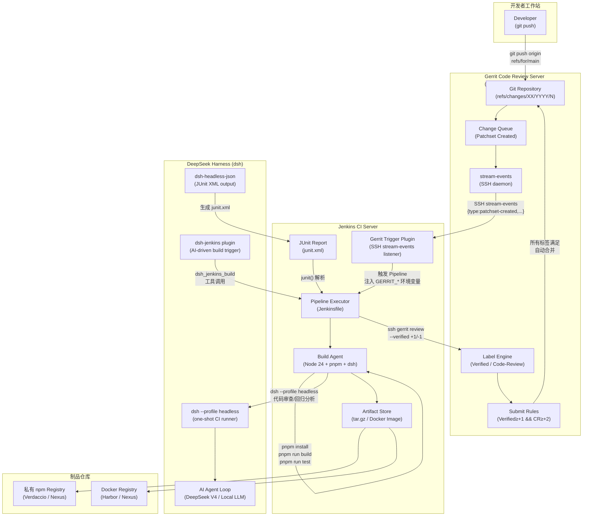
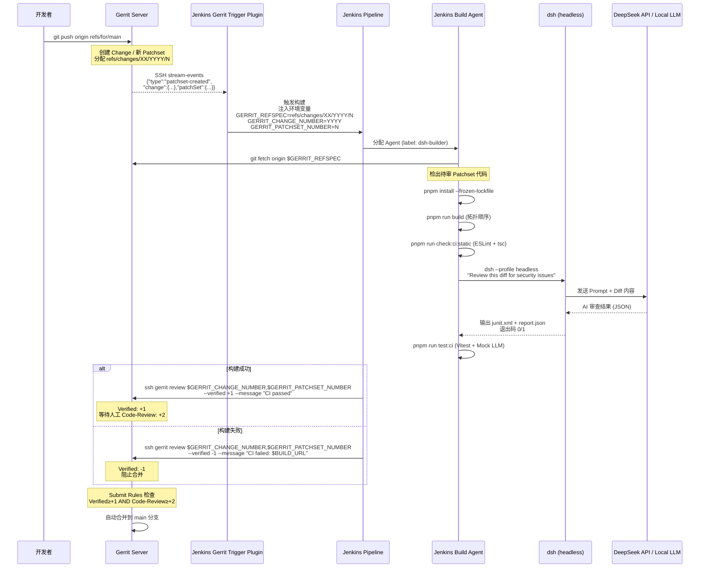
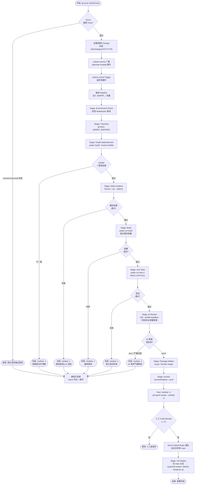

# DeepSeek Harness 社区 Jenkins CI/CD Pipeline 方案总结报告

> **摘要**：本报告系统梳理了截至 2026 年 9 月，DeepSeek Harness（dsh）社区在 Jenkins CI/CD Pipeline 集成领域的现有方案，涵盖官方 CI 基础设施（含 Gerrit 集成原理与配置实例）、社区插件、Headless 模式接入机制、Webhook 触发方案以及专用 Jenkins 管理插件，并给出以 **DSH + Gerrit + Jenkins** 为核心的完整私有化 CI/CD 架构设计，包括架构图、数据流、控制流和工程落地细节。

---

## 一、背景与现状定位

DeepSeek Harness（简称 dsh）于 2026 年 8 月 13 日以 MIT 许可证开源，在一周内斩获超过 22 万 GitHub Stars，成为史上增速最快的开源仓库之一 [1]。其核心设计哲学是"一切皆插件（Everything is a Plugin）"，基于 Cordis 组合框架构建，支持模型适配器、工具注册、会话管理、沙盒策略等全部能力以插件形式热插拔。

从 CI/CD 视角来看，dsh 的定位有两个维度需要区分：**dsh 本身作为被构建与部署的对象**（即如何用 Jenkins 对 dsh 源码进行 CI/CD），以及 **dsh 作为 CI/CD 流水线的智能增强工具**（即如何将 dsh 的 AI Agent 能力嵌入到 Jenkins 流水线中）。社区现有方案在这两个维度上均有覆盖，但成熟度存在明显差异。

---

## 二、官方 CI/CD 基础设施分析

### 2.1 GitHub Actions 工作流（主流 CI 平台）

官方仓库 `.github/workflows/` 目录下包含 21 个工作流文件 [2]，构成了 dsh 自身的完整 CI/CD 体系：

| 工作流文件 | 触发条件 | 核心职能 |
|---|---|---|
| `ci.yml` | Pull Request | 静态检查、类型校验、覆盖率测试（Node 24） |
| `ci-master.yml` | Push to master | 主干集成测试 |
| `node-addon-system.yml` | PR / Push to master | Native Addon 跨平台构建与 Docker 测试 |
| `release.yml` | Tag 推送 | 正式版本发布流程 |
| `release-publish.yml` | Tag 推送 | npm 包发布 |
| `e2e.yml` / `e2b-e2e.yml` | PR | 端到端测试 |
| `build-exe-for-python-sdk.yml` | 手动触发 | Python SDK 可执行文件构建 |
| `docs-pages.yml` | Push to master | 文档站点自动部署 |

官方 CI 的核心构建序列如下：

```yaml
# 来自官方 ci.yml 的关键步骤（简化）
- uses: pnpm/action-setup@v4
- uses: actions/setup-node@v6
  with:
    node-version: '24'
- name: Install (immutable)
  run: pnpm install --frozen-lockfile
- name: Run static gates
  run: pnpm run check:ci:static
- name: Run coverage
  run: pnpm run check:ci:coverage
```

官方 CI 的关键环境变量配置包括 `DSH_TELEMETRY_DISABLED: '1'`（禁用遥测）、`DSH_GATE_CONCURRENCY: '8'`（并发门控数量）以及 `NODE_OPTIONS: "--max-old-space-size=4096"`（防止大型 Monorepo 编译 OOM）[3]。

### 2.2 GitLab CI 配置（Python SDK 发布专用）

官方仓库根目录包含 `.gitlab-ci.yml`，但其用途高度专一，**仅用于 Python SDK 的跨平台构建与 PyPI 发布**，并非通用的 Node.js 构建流水线 [4]。该配置定义了两个 Stage：

- **build**：在 `linux-x64`、`linux-arm64`、`macos-arm64`、`macos-x64`、`windows-x64` 五个平台上分别构建 Python Runtime Wheel，并通过 Docker 在 manylinux 镜像内进行 glibc 版本兼容性验证（最高 2.28）。
- **publish**：汇聚全部 6 个 Wheel 产物，通过 `twine` 上传至 GitLab Package Registry。

### 2.3 基于 Gerrit 的 CI/CD 集成原理与配置实例

Gerrit 是 Google 开源的代码审查系统，广泛应用于 Android、Chromium、OpenStack 等大型私有化工程团队。其与 Jenkins 的集成是企业私有化 CI/CD 的经典范式，也是本报告 DSH 私有化部署方案的核心基础设施选型。

#### 2.3.1 Gerrit + Jenkins 集成核心原理

Gerrit 与 Jenkins 的集成依赖一个关键机制：**`stream-events` SSH 长连接**。Jenkins 侧安装的 Gerrit Trigger 插件通过 SSH 连接到 Gerrit 服务器（默认端口 29418），执行 `gerrit stream-events` 命令，建立一条持久化的事件流通道 [11]。Gerrit 将服务器上发生的所有代码审查事件以 JSON 格式实时推送到该通道，Jenkins 插件解析事件后触发对应的 Pipeline 构建。

整个集成的核心工作流围绕两个 Gerrit 标签（Label）运转：

- **`Verified`**（由 Jenkins 机器人写入）：取值范围 `-1 / 0 / +1`，表示自动化 CI 验证结果。`-1` 表示构建或测试失败，阻止合并；`+1` 表示 CI 通过，允许进入人工审查阶段。
- **`Code-Review`**（由人工审查者写入）：取值范围 `-2 / -1 / 0 / +1 / +2`，表示代码质量评审结果。`+2` 是合并的最终授权。

Gerrit 的 Submit Rules 通常配置为：`Verified ≥ +1 AND Code-Review ≥ +2` 时才允许自动合并（Submit）。这确保了每一次合并都经过机器验证和人工审查的双重把关。

#### 2.3.2 Gerrit 服务端权限配置

在 Gerrit 服务端，需要为 Jenkins 机器人账号（建议加入 `Service Users` 组）配置以下权限 [12]：

```
# Gerrit Access Rights 配置（在 All-Projects 或目标仓库的 Access 页面设置）
Reference: refs/*
  Read: ALLOW for Service Users

Reference: refs/heads/*
  Label Verified: -1, +1 for Service Users
  Label Code-Review: -1, +1 for Service Users  # 可选，仅需 Verified 时可省略

# Stream Events 全局能力（在 Global Capabilities 中配置）
Stream Events: ALLOW for Service Users
```

> **注意**：Gerrit v3.3 之前，CI 专用组名为 `Non-Interactive Users`；v3.3 起统一改名为 `Service Users` [12]。

#### 2.3.3 Jenkins 侧 Gerrit Trigger 插件配置

**Step 1：安装插件**

在 Jenkins 插件管理中安装 `Gerrit Trigger`（当前版本 `3.1993.vdb_00c7b_551a_5`，安装率约 2.36%）[12]。

**Step 2：配置服务器连接**（`Manage Jenkins → Gerrit Trigger`）

```
Server Name:    my-gerrit
Hostname:       gerrit.example.com
Frontend URL:   http://gerrit.example.com:8080
SSH Port:       29418
Username:       jenkins-bot
SSH Key File:   /var/jenkins_home/.ssh/id_rsa_gerrit
```

配置完成后点击 `Test Connection` 验证 SSH 连通性，然后在 `Control` 区域启动连接。

**Step 3：配置 Missed Events Playback（可选但推荐）**

为防止 Jenkins 重启期间错过事件，需在 Gerrit 服务端安装 `events-log` 插件，并在 Jenkins 的 Gerrit 服务器配置中填入 HTTP 用户名和密码（用于 REST API 回放）[12]。

**Step 4：在 Pipeline Job 中配置触发器**

```groovy
// Jenkinsfile 中的触发器配置（Declarative Pipeline）
pipeline {
    triggers {
        gerrit(
            serverName: 'my-gerrit',
            gerritProjects: [[
                compareType: 'PLAIN',
                pattern: 'deepseek-harness-custom',
                branches: [[compareType: 'ANT', pattern: '**']]
            ]],
            triggerOnEvents: [patchsetCreated(), changeMerged()]
        )
    }
    // ...
}
```

#### 2.3.4 Gerrit 环境变量在 Pipeline 中的使用

Gerrit Trigger 插件触发构建时，会向 Jenkins 注入一系列标准环境变量 [13]，这些变量是在 Pipeline 中检出正确代码版本的关键：

| 环境变量 | 示例值 | 说明 |
|---|---|---|
| `GERRIT_REFSPEC` | `refs/changes/39/4039/1` | 待审 Patchset 的 Git Refspec |
| `GERRIT_CHANGE_NUMBER` | `4039` | Change 编号 |
| `GERRIT_PATCHSET_NUMBER` | `1` | Patchset 版本号 |
| `GERRIT_PATCHSET_REVISION` | `03d9debf16a0...` | Patchset 的 Git SHA1 |
| `GERRIT_PROJECT` | `deepseek-harness-custom` | Gerrit 项目名 |
| `GERRIT_BRANCH` | `main` | 目标分支 |
| `GERRIT_CHANGE_URL` | `http://gerrit.example.com/4039` | Change 页面 URL |
| `GERRIT_EVENT_TYPE` | `patchset-created` | 触发事件类型 |

在 Pipeline 中使用这些变量检出代码：

```groovy
stage('Checkout') {
    steps {
        git url: "ssh://jenkins-bot@gerrit.example.com:29418/${GERRIT_PROJECT}"
        sh "git fetch origin ${GERRIT_REFSPEC}:change-${GERRIT_CHANGE_NUMBER}-${GERRIT_PATCHSET_NUMBER}"
        sh "git checkout change-${GERRIT_CHANGE_NUMBER}-${GERRIT_PATCHSET_NUMBER}"
    }
}
```

#### 2.3.5 Verified 标签回写

构建完成后，Jenkins 需要通过 SSH 将构建结果写回 Gerrit 的 `Verified` 标签。Gerrit Trigger 插件会自动完成此操作，但也可以在 Pipeline 的 `post` 块中手动控制：

```groovy
post {
    success {
        // 方式一：通过 Gerrit Trigger 插件的 setGerritReview step
        setGerritReview(successVote: 1, failureVote: -1)

        // 方式二：直接通过 SSH 命令（更灵活，可附加详细消息）
        sh """
            ssh -p 29418 jenkins-bot@gerrit.example.com gerrit review \
                ${GERRIT_CHANGE_NUMBER},${GERRIT_PATCHSET_NUMBER} \
                --verified +1 \
                --message "CI passed: ${BUILD_URL}"
        """
    }
    failure {
        sh """
            ssh -p 29418 jenkins-bot@gerrit.example.com gerrit review \
                ${GERRIT_CHANGE_NUMBER},${GERRIT_PATCHSET_NUMBER} \
                --verified -1 \
                --message "CI failed at stage '${STAGE_NAME}': ${BUILD_URL}"
        """
    }
}
```

#### 2.3.6 现代替代方案：Gerrit Code Review 插件（HTTP Checks API）

对于 Gerrit 3.x 及以上版本，官方推荐使用基于 HTTP Checks API 的 **Gerrit Code Review Plugin**（`gerrit-code-review-plugin`）作为 Gerrit Trigger 的现代替代方案 [14]。该插件通过 Multibranch Pipeline 自动发现 Gerrit Changes，无需手动配置 SSH stream-events，并提供原生的 Jenkinsfile DSL 步骤：

```groovy
// 使用 Gerrit Code Review Plugin 的 Declarative Pipeline
pipeline {
    agent any
    stages {
        stage('Build & Test') {
            steps {
                gerritReview labels: [Verified: 0]  // 标记构建进行中
                sh 'pnpm install --frozen-lockfile && pnpm run build && pnpm run test'
            }
        }
    }
    post {
        success {
            gerritReview labels: [Verified: 1], message: 'CI passed'
            gerritCheck checks: ['dsh-ci:build': 'SUCCESSFUL']
        }
        failure {
            gerritReview labels: [Verified: -1], message: 'CI failed'
            gerritCheck checks: ['dsh-ci:build': 'FAILED']
        }
    }
}
```

两种方案的对比如下：

| 维度 | Gerrit Trigger Plugin（SSH） | Gerrit Code Review Plugin（HTTP） |
|---|---|---|
| **触发机制** | SSH `stream-events` 长连接 | HTTP Webhook / Gerrit Checks API |
| **稳定性** | SSH 连接可能断开，需重连机制 | HTTP 无状态，更稳定 |
| **配置复杂度** | 高（服务端 + Jenkins 双端配置） | 低（仅需 HTTP 凭证） |
| **Multibranch 支持** | 有限 | 原生支持 |
| **Jenkinsfile DSL** | `setGerritReview` | `gerritReview` / `gerritComment` / `gerritCheck` |
| **适用场景** | Gerrit 2.x / 私有网络隔离环境 | Gerrit 3.x+ / 现代化部署 |

**结论**：官方并未提供面向 Jenkins 的 Jenkinsfile 模板，其 CI/CD 基础设施完全基于 GitHub Actions 和 GitLab CI，Jenkins 集成完全依赖社区贡献。

---

## 三、DSH + Gerrit + Jenkins 完整架构设计

### 3.1 整体架构图

下图展示了 DSH + Gerrit + Jenkins 私有化 CI/CD 环境的完整系统架构，涵盖代码提交、自动化验证、AI 增强审查、制品归档和持续部署的全链路：



### 3.2 数据流设计

数据流描述了信息在各系统组件之间的流动路径与格式变换。整个流水线的数据流可分为三条主线：**代码变更流**、**事件触发流**和**结果反馈流**。



**代码变更流**是从开发者的 `git push` 开始，经过 Gerrit 的 Change 创建、Patchset 版本管理，到 Jenkins Agent 的 `git fetch` 检出，最终进入构建流程的数据路径。Gerrit 为每个 Patchset 分配唯一的 `refs/changes/XX/YYYY/N` 引用，其中 XX 是 Change 编号的后两位（用于分片存储），YYYY 是完整 Change 编号，N 是 Patchset 序号。

**事件触发流**是从 Gerrit 的 `stream-events` SSH 通道推送 JSON 格式事件到 Jenkins Gerrit Trigger 插件，插件解析事件后将 Gerrit 元数据注入为 Jenkins 环境变量（`GERRIT_REFSPEC`、`GERRIT_CHANGE_NUMBER` 等），驱动 Pipeline 执行。

**结果反馈流**是 Jenkins 将构建结果（`Verified +1/-1`）通过 SSH 命令写回 Gerrit 的 Label Engine，Gerrit 根据 Submit Rules 决定是否允许合并。同时，DSH Headless 任务生成的 JUnit XML 报告被 Jenkins 解析并展示在构建页面，形成可追溯的 AI 审查记录。

### 3.3 控制流设计

控制流描述了整个 CI/CD 流水线的决策逻辑和分支路径：



控制流的设计遵循**快速失败（Fail Fast）**原则：越早发现的问题代价越低，因此静态分析（无需运行代码）排在构建之前，构建排在测试之前，AI 审查作为最后一道自动化门控。每个失败节点都会触发 Gerrit `Verified -1` 回写，阻止代码合并，并通过 Gerrit 评论和邮件通知开发者。

### 3.4 工程落地 Jenkinsfile 完整模板

以下是针对 DSH + Gerrit + Jenkins 私有化部署场景的完整 Production-Ready Jenkinsfile，整合了 Gerrit 触发、DSH Monorepo 构建规范、AI 代码审查和 CD 部署的全部工程细节：

```groovy
pipeline {
    agent {
        // 推荐使用与生产环境相同 OS 镜像的宿主机 Agent，避免 glibc 版本差异
        // 导致 node-pty 等 Native Addon 的 .node 二进制不兼容
        node { label 'dsh-builder' }
    }

    environment {
        // pnpm CAS 缓存目录，挂载为 Agent 持久化卷以避免每次重新下载依赖
        PNPM_HOME          = "/var/cache/jenkins/pnpm"
        PATH               = "${PNPM_HOME}:${env.PATH}"
        // 必须设置 CI=true，屏蔽 harness/scripts/install-lefthook.mjs
        // 对 Git 公共 config 的写操作（该脚本是 harness 中唯一读取 CI 的生命周期脚本）
        CI                 = "true"
        // 防止 TypeScript 大型 Monorepo 编译 OOM（dsh 有 450K+ 行代码）
        NODE_OPTIONS       = "--max-old-space-size=4096"
        // 禁用遥测，与官方 CI 保持一致
        DSH_TELEMETRY_DISABLED = "1"
        // Gerrit SSH 连接配置（从 Jenkins Credentials 注入）
        GERRIT_SSH_KEY     = credentials('gerrit-jenkins-ssh-key')
        GERRIT_HOST        = "gerrit.example.com"
        GERRIT_SSH_PORT    = "29418"
        GERRIT_BOT_USER    = "jenkins-bot"
        // DSH AI 审查所需的 API Key（从 Jenkins Credentials 注入）
        DEEPSEEK_API_KEY   = credentials('deepseek-api-key')
    }

    triggers {
        // Gerrit Trigger 插件配置：监听 patchset-created 和 change-merged 事件
        gerrit(
            serverName: 'my-gerrit',
            gerritProjects: [[
                compareType: 'PLAIN',
                pattern: 'deepseek-harness-custom',
                branches: [[compareType: 'ANT', pattern: '**']]
            ]],
            triggerOnEvents: [patchsetCreated(), changeMerged()]
        )
    }

    stages {
        stage('Environment Check') {
            steps {
                sh '''
                    echo "[CI] Architecture: $(uname -m), Kernel: $(uname -r)"
                    echo "[CI] Gerrit Change: ${GERRIT_CHANGE_NUMBER}, Patchset: ${GERRIT_PATCHSET_NUMBER}"
                    echo "[CI] Refspec: ${GERRIT_REFSPEC}"
                    node -v
                    # 通过 Corepack 管理 pnpm，版本与 harness/package.json 中 packageManager 字段对齐
                    corepack enable
                    pnpm -v
                '''
            }
        }

        stage('Checkout') {
            steps {
                // 检出 Gerrit Patchset 代码（而非 main 分支）
                git url: "ssh://${GERRIT_BOT_USER}@${GERRIT_HOST}:${GERRIT_SSH_PORT}/${GERRIT_PROJECT}",
                    credentialsId: 'gerrit-jenkins-ssh-key'
                sh """
                    git fetch origin ${GERRIT_REFSPEC}:change-${GERRIT_CHANGE_NUMBER}-${GERRIT_PATCHSET_NUMBER}
                    git checkout change-${GERRIT_CHANGE_NUMBER}-${GERRIT_PATCHSET_NUMBER}
                    echo "[CI] Checked out: \$(git log --oneline -1)"
                """
            }
        }

        stage('Install Dependencies') {
            steps {
                // --frozen-lockfile 确保依赖版本严格确定，拒绝静默小版本漂移
                sh 'pnpm install --frozen-lockfile'
            }
        }

        stage('Static Analysis & Typecheck') {
            steps {
                parallel(
                    "ESLint": {
                        sh 'pnpm run lint'
                    },
                    "TypeScript Typecheck": {
                        // 强制全景类型校验，拦截深度修改引起的类型破坏
                        sh 'pnpm -r exec tsc --noEmit'
                    }
                )
            }
        }

        stage('Build Core Packages & Apps') {
            steps {
                sh '''
                    # pnpm run build 内置拓扑排序：packages/* 优先，apps/* 其次
                    # 构建产物：apps/cli/dist、apps/web/dist、packages/*/dist
                    pnpm run build
                '''
            }
        }

        stage('Unit & Integration Tests') {
            steps {
                sh '''
                    # MOCK_LLM=true 启用 Mock LLM Proxy，屏蔽真实大模型网络延迟
                    # 确保测试结果 100% 确定性，避免 CI 因 LLM 非确定性偶发失败
                    MOCK_LLM=true pnpm run test:ci
                '''
            }
            post {
                always {
                    // 解析 Vitest 生成的 JUnit XML 报告
                    junit allowEmptyResults: true, testResults: 'coverage/junit.xml'
                }
            }
        }

        stage('AI Code Review (DSH Headless)') {
            steps {
                sh '''
                    # 安装 dsh-headless-json 插件（首次运行后缓存）
                    dsh plugin --profile headless add dsh-headless-json 2>/dev/null || true

                    # 获取本次 Patchset 的 diff 内容
                    git diff origin/main...HEAD > /tmp/patchset.diff

                    # 调用 DSH Headless 进行 AI 代码审查
                    # 退出码 0 = 通过，1 = 发现严重问题（由 AI 根据审查结果决定）
                    dsh --profile headless \
                        "Review the following diff for security vulnerabilities, \
                         breaking API changes, and critical bugs. \
                         Exit with code 1 if critical issues are found. \
                         Diff: $(cat /tmp/patchset.diff)"
                '''
            }
            post {
                always {
                    // 解析 dsh-headless-json 生成的 JUnit XML 报告
                    junit allowEmptyResults: true, testResults: 'dsh-output/junit.xml'
                    archiveArtifacts allowEmptyArchive: true,
                                     artifacts: 'dsh-output/report.json'
                }
            }
        }

        stage('Bundle & Package Artifact') {
            steps {
                sh '''
                    mkdir -p release
                    # 生成生产级纯净运行时包，剔除 devDependencies
                    tar --exclude='.git' \
                        --exclude='node_modules' \
                        --exclude='release' \
                        --exclude='*.test.*' \
                        -czf release/dsh-custom-${BUILD_NUMBER}.tar.gz \
                        apps/ packages/ package.json pnpm-lock.yaml
                '''
                archiveArtifacts artifacts: 'release/*.tar.gz', fingerprint: true
            }
        }

        stage('CD Deploy') {
            // 仅 main 分支的 change-merged 事件触发 CD
            when {
                environment name: 'GERRIT_EVENT_TYPE', value: 'change-merged'
            }
            steps {
                sh '''
                    echo "[CD] Deploying dsh-custom-${BUILD_NUMBER} to local environment..."
                    # 解压至生产路径并平滑重启服务
                    tar -xzf release/dsh-custom-${BUILD_NUMBER}.tar.gz -C /opt/dsh/
                    sudo systemctl restart dsh-server.service
                    echo "[CD] Deployment complete."
                '''
            }
        }
    }

    post {
        success {
            // 回写 Gerrit Verified +1
            sh """
                ssh -i ${GERRIT_SSH_KEY} \
                    -p ${GERRIT_SSH_PORT} \
                    ${GERRIT_BOT_USER}@${GERRIT_HOST} \
                    gerrit review ${GERRIT_CHANGE_NUMBER},${GERRIT_PATCHSET_NUMBER} \
                    --verified +1 \
                    --message "CI passed (Build #${BUILD_NUMBER}): ${BUILD_URL}"
            """
        }
        failure {
            // 回写 Gerrit Verified -1，阻止合并
            sh """
                ssh -i ${GERRIT_SSH_KEY} \
                    -p ${GERRIT_SSH_PORT} \
                    ${GERRIT_BOT_USER}@${GERRIT_HOST} \
                    gerrit review ${GERRIT_CHANGE_NUMBER},${GERRIT_PATCHSET_NUMBER} \
                    --verified -1 \
                    --message "CI failed at stage '${STAGE_NAME}' (Build #${BUILD_NUMBER}): ${BUILD_URL}"
            """
        }
        cleanup {
            // 清理临时编译缓存，防止硬盘被反复生成的 dist/ 占满
            cleanWs(cleanWhenNotBuilt: false,
                    deleteDirs: true,
                    patterns: [[pattern: 'release/', type: 'EXCLUDE']])
        }
    }
}
```

### 3.5 工程落地关键配置细节

#### 3.5.1 Jenkins Agent 环境准备

Jenkins Agent 节点（标签 `dsh-builder`）需要预置以下软件环境，建议通过 Ansible Playbook 或 Docker 镜像固化：

| 组件 | 版本要求 | 安装方式 | 说明 |
|---|---|---|---|
| Node.js | `^22.19` 或 `≥ 24` | `nvm` 或系统包 | dsh `engines` 字段要求 |
| Corepack | 随 Node.js 内置 | `corepack enable` | 管理 pnpm 版本 |
| pnpm | `11.7.0`（由 Corepack 锁定） | Corepack 自动安装 | 与 harness `packageManager` 字段对齐 |
| Python 3 | `≥ 3.10` | 系统包 | 部分构建脚本依赖 |
| build-essential | 最新 | `apt install` | Native Addon 编译（node-pty 等） |
| dsh | `≥ 0.1.1` | `npm install -g @deepseek-ai/dsh` | AI 审查阶段使用 |
| Docker | `≥ 24` | 官方安装脚本 | 容器化部署可选 |

#### 3.5.2 pnpm 缓存挂载策略

pnpm 的 Content-Addressable Store（CAS）是最大的构建加速点。在 Jenkins Agent 上，建议将 CAS 目录挂载为持久化卷：

```groovy
// Jenkinsfile 中的 pnpm 缓存配置
environment {
    PNPM_HOME = "/var/cache/jenkins/pnpm"
    // 或者使用 Jenkins 工作区外的共享目录
    // PNPM_CONFIG_STORE_DIR = "/mnt/pnpm-store"
}
```

对于 Docker Agent，在 `docker run` 时挂载宿主机目录：

```bash
docker run -v /var/cache/jenkins/pnpm:/var/cache/jenkins/pnpm \
           -v /workspace:/workspace \
           node:24-slim
```

#### 3.5.3 Gerrit SSH 密钥管理

Jenkins 机器人账号的 SSH 私钥应通过 Jenkins Credentials 管理，而非硬编码在 Jenkinsfile 中：

```groovy
// 在 Jenkins Credentials 中添加 SSH Username with private key
// ID: gerrit-jenkins-ssh-key
// Username: jenkins-bot
// Private Key: <RSA 私钥内容>

// 在 Jenkinsfile 中引用
environment {
    GERRIT_SSH_KEY = credentials('gerrit-jenkins-ssh-key')
}

// SSH 命令中使用
sh "ssh -i ${GERRIT_SSH_KEY} -p 29418 jenkins-bot@gerrit.example.com gerrit review ..."
```

同时，需要在 Jenkins Agent 的 `~/.ssh/known_hosts` 中预置 Gerrit 服务器的主机指纹，避免首次连接时的交互式确认：

```bash
ssh-keyscan -p 29418 gerrit.example.com >> ~/.ssh/known_hosts
```

#### 3.5.4 Mock LLM Proxy 配置

在 Jenkins 测试阶段，为避免直接调用真实大模型 API 导致的非确定性和高成本，建议部署一个轻量级的 Mock LLM Proxy：

```javascript
// mock-llm-proxy.js（基于 Node.js http 模块）
const http = require('http');

const FIXED_RESPONSE = {
  choices: [{
    message: {
      role: 'assistant',
      content: 'Mock response: all tests passed.'
    },
    finish_reason: 'stop'
  }],
  usage: { prompt_tokens: 100, completion_tokens: 20 }
};

http.createServer((req, res) => {
  res.writeHead(200, { 'Content-Type': 'application/json' });
  res.end(JSON.stringify(FIXED_RESPONSE));
}).listen(8765, '127.0.0.1');

console.log('Mock LLM Proxy listening on http://127.0.0.1:8765');
```

在 Jenkinsfile 中启动 Mock Proxy：

```groovy
stage('Unit & Integration Tests') {
    steps {
        sh '''
            # 启动 Mock LLM Proxy（后台运行）
            node mock-llm-proxy.js &
            MOCK_PID=$!

            # 配置 dsh 使用 Mock Proxy
            export DSH_PROVIDER_BASE_URL=http://127.0.0.1:8765
            MOCK_LLM=true pnpm run test:ci

            # 清理 Mock Proxy
            kill $MOCK_PID 2>/dev/null || true
        '''
    }
}
```

#### 3.5.5 DSH Profile 依赖同步

由于 dsh 的 Profile 依赖（`.dsh/profiles/<name>/node_modules`）在 CI 环境中需要与生产环境严格对齐，建议在 CD 阶段增加 Profile 同步步骤：

```groovy
stage('CD Deploy') {
    steps {
        sh '''
            # 同步目标 Profile 的专有插件依赖
            dsh --profile web plugin sync
            # 或手动触发 Profile 依赖安装
            node apps/cli/dist/bin.js profile sync --profile web
        '''
    }
}
```

---

## 四、社区 Jenkins 集成方案全景

### 4.1 dsh-jenkins：DSH 内置 Jenkins 管理插件（直接集成方向）

**仓库**：[jsoncode/dsh-jenkins](https://github.com/jsoncode/dsh-jenkins) [5]

这是目前社区中**唯一专门针对 Jenkins 集成**的 DSH 插件，由社区开发者 jsoncode 于 2026 年 8 月开发，截至报告日已累计 101 次提交。其核心定位是：**将 Jenkins 的构建触发能力引入 DSH 的 AI Agent 工作流**，而非为 dsh 源码构建提供 Jenkinsfile 模板。

该插件的主要功能如下：多服务器集中管理（URL、用户名、API Token，支持 TLS 跳过验证）、一键触发参数化构建（实时追踪 `queued → building → result` 状态，10 分钟超时）、构建日志查看与取消、跨工作区构建历史记录（最近 50 次）。

**工作区配置示例**（`dsh-jenkins.json`）：

```json
[
  {
    "job": "build-app",
    "server": "http://uat.example.com",
    "environments": { "BRANCH": "main", "DEPLOY": false }
  },
  {
    "job": "build-app",
    "server": "http://prod.example.com",
    "environments": { "BRANCH": "release-1.0", "DEPLOY": true }
  }
]
```

**安装方式**：

```shell
dsh plugin --profile web add dsh-jenkins
```

### 4.2 dsh-headless：官方 CI 接入基础（Headless 模式）

官方提供的 `headless` Profile 是将 DSH 嵌入 CI 流水线的**标准接入机制** [6]。Headless 模式运行单次任务，打印最终 Assistant 回复到 stdout，返回语义化退出码（0 = 成功，非 0 = 失败），无 GUI、无 Server、无浏览器，适合脚本和 CI 环境。

### 4.3 dsh-headless-json：结构化 CI 输出插件

**仓库**：[JohnXu22786/headless-json](https://github.com/JohnXu22786/headless-json) [7]

该插件将 dsh 的 Headless 会话输出转化为 CI 系统可直接消费的结构化产物，包括 JUnit XML 报告（可被 Jenkins、GitLab CI、Azure DevOps 直接解析）、完整 JSON 事务报告、实时 NDJSON 事件流和语义化退出码。

### 4.4 deepseek-harness-action：GitHub Actions 集成方案（架构参考）

**仓库**：[Lixiaoyiao/deepseek-harness-action](https://github.com/Lixiaoyiao/deepseek-harness-action) [8]

虽然该项目基于 GitHub Actions 而非 Jenkins，但其凭证隔离的 DSH Worker 设计、受信任的 Controller 发布变更机制，对构建 Jenkins 同类集成具有直接的设计参考意义。

### 4.5 dsh-webhook：事件驱动的 CI 触发适配器

**仓库**：[omdsh-dev/dsh-webhook](https://github.com/omdsh-dev/dsh-webhook) [9]

该插件为 DSH 提供持久化的入站 Webhook 触发能力，可与 Jenkins 的 Webhook 触发机制形成双向集成：Jenkins 构建完成后通过 Webhook 通知 DSH 触发 AI 分析任务，DSH Agent 也可通过 `dsh-jenkins` 插件主动触发 Jenkins 构建。

---

## 五、综合集成方案矩阵

| 方案 | 类型 | 成熟度 | 适用场景 | 关键依赖 |
|---|---|---|---|---|
| **官方 GitHub Actions** | dsh 源码 CI | ★★★★★ | 官方/Fork 仓库的 PR 验证 | GitHub 托管 Runner |
| **官方 GitLab CI** | Python SDK 发布 | ★★★★☆ | Python 包跨平台构建 | GitLab Runner（多平台） |
| **Gerrit + Jenkins（本方案）** | 私有化 CI/CD | ★★★★☆ | 企业私有化 + 深度定制构建 | Jenkins Agent（Node 24+）+ Gerrit |
| **dsh-jenkins 插件** | AI 触发 Jenkins | ★★★☆☆ | AI Agent 驱动 Jenkins 构建 | DSH Web Profile |
| **Headless + JUnit XML** | DSH 嵌入 Jenkins | ★★★☆☆ | Jenkins 流水线中运行 AI 任务 | DSH Headless Profile |
| **dsh-webhook** | 事件驱动集成 | ★★☆☆☆ | Jenkins 与 DSH 双向事件联动 | dsh-automation 插件 |

---

## 六、关键风险与注意事项

dsh 目前处于 **Developer Preview** 阶段，官方明确声明会有 Breaking Changes [10]。在 Gerrit + Jenkins 集成中需特别注意以下风险：

**版本锁定**：在 `pnpm install --frozen-lockfile` 之外，还需在 Jenkinsfile 中显式固定 Node.js 版本和 pnpm 版本（通过 Corepack 的 `packageManager` 字段），防止环境漂移导致构建不可复现。

**Gerrit SSH 连接稳定性**：Gerrit Trigger 插件依赖的 SSH `stream-events` 长连接在网络不稳定时可能断开。建议启用 `Missed Events Playback` 功能（需在 Gerrit 服务端安装 `events-log` 插件），确保 Jenkins 重启或网络中断后能回放错过的事件 [12]。

**Headless 模式的 LLM 非确定性**：在 Jenkins 测试阶段直接调用真实大模型 API 会导致测试结果不稳定、成本高昂。建议使用 Mock LLM Proxy 模拟固定的 Token 流，实现零网络开销的确定性 Agent 状态机测试。

**Native Addon 兼容性**：`node-pty` 等 C/C++ 扩展的 `.node` 二进制与 glibc 版本强绑定。建议 Jenkins Agent 与生产运行环境使用相同的 OS 镜像，或将整个构建产物打包为 Docker 镜像。

**社区插件稳定性**：`dsh-jenkins`（1 Star）和 `headless-json`（1 Star）均为早期社区项目，尚未经过大规模生产验证。在关键流水线中使用前，建议 Fork 并固定到具体 Commit SHA，而非直接依赖浮动的 `main` 分支。

---

## 参考资料

[1]: https://github.com/deepseek-ai/deepseek-harness "deepseek-ai/deepseek-harness — GitHub 官方仓库"
[2]: https://github.com/deepseek-ai/deepseek-harness/tree/master/.github/workflows "deepseek-harness/.github/workflows — GitHub Actions 工作流目录"
[3]: https://github.com/deepseek-ai/deepseek-harness/blob/master/.github/workflows/ci.yml "deepseek-harness ci.yml — 官方 CI 工作流"
[4]: https://raw.githubusercontent.com/deepseek-ai/deepseek-harness/master/.gitlab-ci.yml "deepseek-harness .gitlab-ci.yml — GitLab CI 配置（Python SDK 发布）"
[5]: https://github.com/jsoncode/dsh-jenkins "jsoncode/dsh-jenkins — DSH Jenkins 管理插件"
[6]: https://github.com/deepseek-ai/deepseek-harness/blob/master/packages/bundle/headless/README.md "dsh-headless — 官方 Headless Bundle 文档"
[7]: https://github.com/JohnXu22786/headless-json "JohnXu22786/headless-json — DSH 结构化 CI 输出插件"
[8]: https://github.com/Lixiaoyiao/deepseek-harness-action "Lixiaoyiao/deepseek-harness-action — 社区 GitHub Action"
[9]: https://github.com/omdsh-dev/dsh-webhook "omdsh-dev/dsh-webhook — DSH 入站 Webhook 触发适配器"
[10]: https://www.atlascloud.ai/blog/tips/how-to-install-deepseek-harness "How to Install DeepSeek Harness in 10 Minutes — Atlas Cloud"
[11]: https://github.com/jenkinsci/gerrit-trigger-plugin "jenkinsci/gerrit-trigger-plugin — Gerrit Trigger Plugin GitHub 仓库"
[12]: https://plugins.jenkins.io/gerrit-trigger/ "Gerrit Trigger | Jenkins plugin — 官方插件文档"
[13]: https://wiki.amarulasolutions.com/ci/gerrit_trigger.html "Gerrit trigger — Amarula Solutions Developer Portal"
[14]: https://github.com/jenkinsci/gerrit-code-review-plugin "jenkinsci/gerrit-code-review-plugin — Gerrit Code Review Plugin GitHub 仓库"
