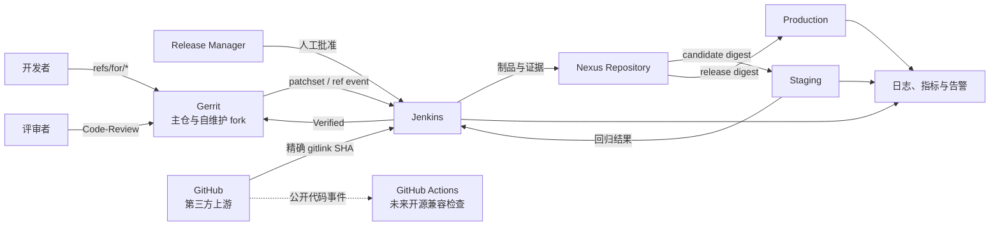
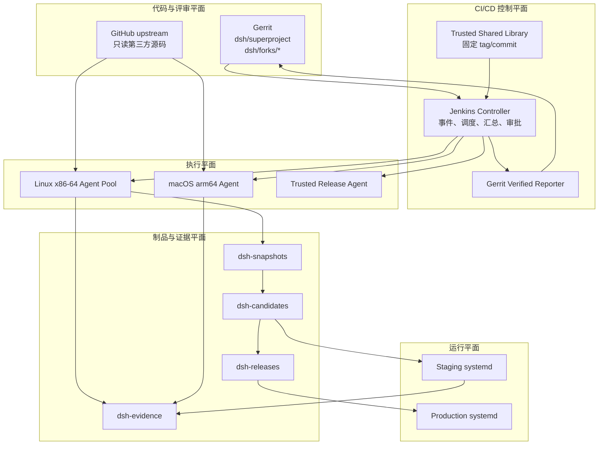
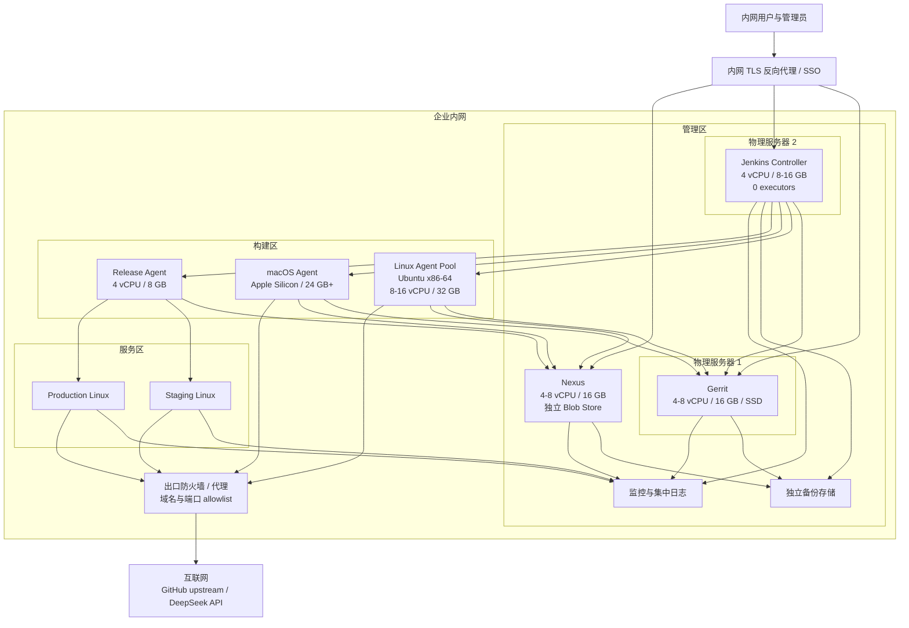
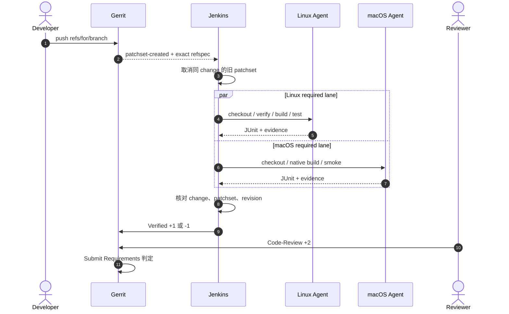
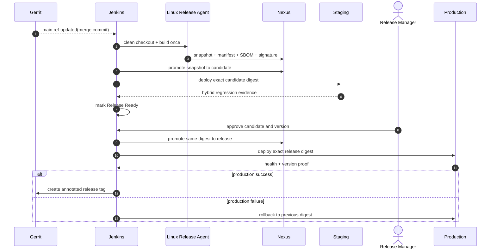
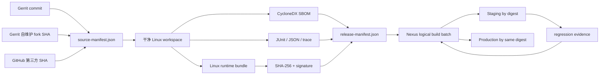

# DSH CI/CD 总体架构

| 属性 | 值 |
|---|---|
| 状态 | 已批准设计 |
| 版本 | 1.0 |
| 最后更新 | 2026-09-14 |
| 关联 ADR | [ADR-0001](adr/0001-gerrit-repository-boundary.md)、[ADR-0002](adr/0002-immutable-artifact-promotion.md)、[ADR-0003](adr/0003-hybrid-end-to-end-regression.md)、[ADR-0004](adr/0004-intranet-control-plane-and-data-residency.md) |

## 1. 摘要

DSH 采用 Gerrit 评审、Jenkins 编排和 Nexus 制品晋级的内网分层 CI/CD 架构。Gerrit 与 Jenkins Controller 分别运行在两台独立物理服务器；GitHub 保留第三方上游和未来开源通道；Jenkins 在 Linux x86-64 和 macOS arm64 上独立构建；Nexus 保存不可变制品及证据；staging 自动验证 candidate，production 只部署人工批准后的同一 digest。

该方案解决当前四个主要缺口：

- 只有单一 Linux 构建，无法证明 macOS arm64 可用；
- 根仓只做启动冒烟，没有覆盖核心和插件的用户旅程；
- 发布由 tag 触发后重新构建，缺少“构建一次、逐级晋级”；
- 生产部署同步源码并现场构建，发布内容难以精确复现。

## 2. 范围

### 2.1 包含

- `dsh` 超级仓库以及自维护 fork 的 Gerrit 评审和分支保护；
- 第三方 submodule 的来源、pin 和供应链校验；
- Jenkins 双平台 presubmit、main build、staging、release、rollback 和 nightly；
- Nexus snapshot、candidate、release 和 evidence 仓库；
- DSH Web、headless、核心功能和插件基本功能的发布回归；
- Ubuntu Linux x86-64 上的 systemd 部署、健康检查和回滚；
- 凭据、审计、备份、恢复、SLO 和迁移计划。
- 可连接互联网的内网边界、敏感数据本地留存和出站访问控制。

### 2.2 不包含

- 子插件自己的 npm publish 或上游 tag 发布；
- Kubernetes、容器编排或多地域生产集群；
- Windows 正式发布门禁；
- dsh-tui 构建、PTY 测试、独立 profile 和发布门禁；
- 对插件内部单元测试框架的统一改造；
- 将所有第三方 GitHub 仓库镜像到 Gerrit；
- 让 GitHub Actions 参与内部 Verified、发布审批、Nexus 晋级或生产部署；
- 通过 CI 自动批准代码评审或自动决定业务版本号。

## 3. 设计原则

1. **精确输入**：每次构建绑定主仓 commit、Gerrit patchset 和所有 gitlink SHA。
2. **构建一次**：staging 和 production 使用同一 SHA-256 制品，不在目标机重新编译。
3. **跨平台隔离**：Linux 与 macOS 只共享源码 SHA 和测试结论，不共享依赖目录或原生产物。
4. **人机分权**：Jenkins 决定 `Verified`，Reviewer 决定 `Code-Review`，Release Manager 决定生产晋级。
5. **用户旅程优先**：发布门禁必须观察用户可见结果，不以内部函数覆盖率替代。
6. **流水线即代码**：Jenkinsfile 负责编排；可复现的动作必须能从仓库脚本本地运行。
7. **默认拒绝**：缺少 pin、凭据、报告、必测用例或制品证明时失败，不得静默跳过。
8. **数据本地化**：源码、凭据、构建日志、制品、证据和用户数据默认只落在内网受控存储；互联网只作为受控外部依赖和服务通道。
9. **可回滚**：部署动作在改变流量前必须知道 `previous`，失败时自动恢复上一 digest。

## 4. 现状基线

### 4.1 仓库和构建

- `Makefile` 提供 `setup`、`dev`、`dev-tui`、`deploy`、`release` 等薄入口。
- `scripts/setup.sh` 根据各 submodule 的 lockfile 和 `packageManager` 选择 pnpm/npm，并为当前平台编译 harness 原生 Node-API 模块。
- `scripts/check-pins.sh` 是 branch/tag pin 清单和校验的单一事实源。
- `scripts/link-plugins.sh` 将可挂载 bundle 组合到 `dsh` profile；`dsh-tui` 使用独立 profile。

### 4.2 当前 CI 与发布

- `.github/workflows/verify.yaml` 在 Ubuntu 上执行 pin、ShellCheck、`make setup`、插件挂载和 Web HTTP 就绪检查，作为未来开源兼容入口保留。
- `.github/workflows/release.yaml` 在 tag 后重新构建并创建 GitHub Release；目标方案中它不得成为内部 release 的构建或授权入口。
- 当前没有 Gerrit 配置、Jenkinsfile、Nexus 制品或根仓用户旅程测试编排。

### 4.3 当前部署

- `scripts/deploy-remote.sh` 将源码和 submodule 内容 rsync 到目标主机；
- `deploy/remote-install.sh` 在目标主机安装依赖、构建、挂载插件并安装 systemd unit；
- 健康检查在目标机 loopback 访问 3080；
- 部署前复制整个目录作为单一快照，失败时恢复。

这些是迁移输入，而不是目标实现。

## 5. 系统上下文



GitHub Actions 与 Nexus、staging、production 之间不存在信任路径。未来开源同步只能发布已经批准公开的代码和公开测试，不同步内网日志、制品、凭据或用户数据。

## 6. 逻辑架构



### 6.1 组件职责

| 组件 | 职责 | 不负责 |
|---|---|---|
| Gerrit | patchset、评审、Submit Requirements、受保护分支 | 构建、发布审批 |
| Jenkins Controller | 事件、调度、汇总、人工 gate、审计链接 | 编译和测试执行 |
| Shared Library | 可信 Pipeline 原语、凭据边界、状态上报 | DSH 业务构建逻辑 |
| Linux Agent | Linux 构建、打包、headless/Web 测试 | macOS 产物、生产凭据 |
| macOS Agent | macOS 原生构建、headless 和平台冒烟 | Linux 发布包、部署、TUI feature |
| Release Agent | Nexus 晋级、staging/production 部署和回滚 | 运行未评审 patchset |
| Nexus | 不可变制品、证据、保留和访问控制 | 决定代码或业务是否可发布 |
| Staging | candidate 部署和完整发布回归 | 生产数据和生产密钥 |
| Production | 运行已批准 release digest | 构建或依赖下载 |

## 7. 物理拓扑



Gerrit 与 Jenkins Controller 必须是两台独立物理服务器，Controller 设置 `0 executors`，不承载构建。Nexus、Agent 和运行节点可按现有资源独立部署，但不得削弱图中的信任分区。所有入站管理面仅在内网开放；互联网访问通过出站 allowlist，外部响应在进入日志或 evidence 前脱敏。

资源是起步基线。正式容量以连续 30 次构建的 CPU、内存、磁盘和队列数据调整。

## 8. 控制流

### 8.1 Patchset



### 8.2 合入与发布



生产 tag 在生产部署成功后创建。candidate 以 commit/build ID 标识，不依赖提前存在的业务版本号。

## 9. 数据流



### 9.1 数据分类

| 数据 | 来源 | 保密级别 | 保存位置 |
|---|---|---|---|
| 源码、gitlink、构建日志 | Gerrit/GitHub/Jenkins | 内部 | Gerrit、Nexus evidence |
| 制品、SBOM、provenance | Linux Release Agent | 内部 | Nexus |
| 测试 fixture | 仓库 | 内部或公开 | Gerrit |
| Playwright auth state | staging 测试 | 机密、短期 | 单次 Jenkins workspace |
| API key、SSH key、签名 key | 管理员 | 机密 | Jenkins Credential/Vault |
| 用户会话与附件 | DSH runtime | 机密 | `/var/lib/dsh` 与受控备份 |

源码、构建日志、制品、测试证据、凭据以及用户会话/附件均以本地留存为默认策略。允许出网的数据只包括获取公开上游与依赖所需请求、经过最小化和脱敏的模型测试输入，以及显式批准的开源镜像内容。

测试证据不得包含模型推理全文、API key、认证 cookie、用户真实会话或生产附件。

## 10. 跨平台模型

Linux 与 macOS lane 必须各自在本机执行：

```text
checkout -> dependency restore -> frozen install -> native build -> tests
```

缓存键至少包含：

```text
os + architecture + Node exact version + package manager exact version + lockfile digest
```

禁止事项：

- 从 macOS 向 Linux 或反向复制 `node_modules`；
- 共享 `native/system/packages/*/bin/`；
- 用 Rosetta 结果代表 arm64 原生结果；
- 使用未带 lockfile digest 的可写共享缓存；
- 在 production 下载 `latest` 包或现场解析浮动依赖。

macOS 产物在第一阶段只作为兼容性证明；生产 Linux 包只能由受信任 Linux Release Agent 生成。

## 11. 可用性与失败模型

| 故障 | 预期行为 | 恢复 |
|---|---|---|
| Gerrit event 丢失 | ref reconciliation job 发现未构建 revision | 补触发对应 main/presubmit 构建 |
| Jenkins Controller 重启 | Pipeline 从持久状态恢复，不重复晋级 | 以 build ID 和 Nexus tag 幂等执行 |
| Agent 断线 | 当前 lane 失败，不能投 `Verified +1` | 基础设施重试一次或人工重跑 |
| GitHub 上游不可用 | 精确 SHA 拉取失败，presubmit 失败 | 使用只读代理缓存；不得换 SHA |
| Nexus 不可用 | 禁止 staging/production 部署 | 恢复 Nexus 后按原 digest 重试 |
| staging 回归失败 | candidate 保留，状态为 rejected | 修复后产生新 candidate |
| production 健康检查失败 | 自动切回 `previous` | 事件响应并保留失败证据 |
| 真实模型供应商异常 | 单独标记 provider/infra 失败 | 受限重试一次；不得把缺测视为通过 |

测试断言失败不自动转为成功。诊断重跑后通过仍标记 flaky，并阻断 release，直到确认原因。

## 12. 迁移与验收阶段


| 阶段 | 主要交付 | 完成条件 |
|---|---|---|
| P0 | 本文档集、ADR、根 `AGENTS.md` 导航 | 文档评审通过；无失效链接或未决占位符 |
| P1 | Gerrit 权限/Submit Requirements、Jenkins 双平台 presubmit | 内网主链稳定运行 2 周；旧 patchset 不误投票；GitHub Actions 结果不参与 Submit Requirement |
| P2 | headless、Playwright、catalog 和证据归档 | required 场景无 skip；Linux/macOS 门禁稳定 |
| P3 | Linux 运行包、SBOM、签名、Nexus 生命周期 | 无网络解包验证通过；制品无绝对路径或凭据 |
| P4 | staging 自动部署和混合模型回归 | 连续 10 个 candidate 成功；回滚演练通过 |
| P5 | production 人工审批、同 digest 部署 | 权限复核、备份恢复和灾备演练通过 |
| P6 | GitHub Actions 收敛为开源兼容 CI | Git/Gerrit + Jenkins 是唯一内部受控入口；GitHub 无内网凭据、无发布写权限、无双写 |

每个阶段可以独立回退。不得在 P3 完成前宣称实现了“构建一次、逐级晋级”。

## 13. 方案取舍

### 13.1 已选择：分层编排

Jenkinsfile 只描述 stages、parallel、timeout、credentials、approval 和 post actions；仓库脚本实现构建、测试、打包与部署。

优点：本地与 CI 入口一致、可测试、可替换 CI 控制器。代价是需要维护 Shared Library 和明确脚本契约。

### 13.2 未选择：单体 Jenkinsfile

初期文件少，但业务逻辑无法本地复现，凭据与流程耦合，子仓和主仓规则会快速膨胀。

### 13.3 未选择：所有仓库镜像 Gerrit

会增加第三方同步、权限和 provenance 成本，且没有改善当前主仓 pin 模型的核心问题。

### 13.4 暂不采用：Kubernetes

当前生产形态是单机 systemd，首期目标是可靠发布而非编排平台迁移。未来只有在多副本、滚动升级或自动伸缩成为真实需求时重新评估。

## 14. 风险与控制

| 风险 | 控制 |
|---|---|
| 自维护 fork 与 GitHub upstream 漂移 | 定时同步扫描；机器人只创建 Gerrit change；人工处理冲突 |
| branch pin 在上游推进 | manifest 固定 SHA；`check-pins.sh` 在评审时验证允许 ref；发布使用 gitlink SHA |
| profile symlink 带构建机绝对路径 | 打包时拒绝绝对链接和越界链接；无网络解包测试 |
| patchset 修改 Jenkinsfile 窃取密钥 | presubmit 无高权限凭据；release 使用受信任 Shared Library 和 main revision |
| 真实模型测试波动 | 只断言稳定不变量；限次、限时、限 token；失败分类但不静默放行 |
| staging 与 production 环境差异 | OS/Node/glibc 指纹校验；同一制品；季度恢复演练 |
| CI 执行时间过长 | presubmit 运行受影响子集；candidate/nightly 承担全量；以数据优化并行度 |
| 文档与实现漂移 | 文档链接、catalog 完整性和 Jenkins Configuration as Code 进入 presubmit |

## 15. 成功指标

- Presubmit P95 小于 30 分钟；
- candidate 构建加 staging 回归 P95 小于 60 分钟；
- required 用例 skip 数为 0；
- 发布制品、来源、测试和部署记录可追溯率为 100%；
- staging 与 production 的制品 SHA-256 一致率为 100%；
- 自动回滚恢复时间小于 5 分钟；
- 因跨平台复制依赖导致的发布失败数为 0。

指标阈值在收集 30 次有效运行后校准一次；校准只能通过本文评审更新，不能在 Jenkins UI 中静默改变。
