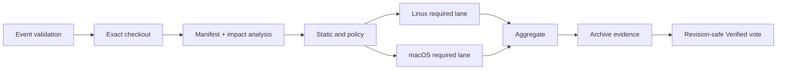

# Gerrit 与 Jenkins 工程设计

| 属性 | 值 |
|---|---|
| 状态 | 已批准设计 |
| 版本 | 1.0 |
| 最后更新 | 2026-09-14 |
| 上游设计 | [01-architecture.md](01-architecture.md) |

## 1. 目标

本设计确保每个 Gerrit patchset 在合入前得到精确、可撤销、可审计的验证，并确保只有受信任的 main revision 能进入制品和部署流程。

基础设施约束：Gerrit 和 Jenkins Controller 分别部署在两台独立的内网物理服务器，管理面不暴露公网。Jenkins Controller 配置 `0 executors`，构建只在 Agent 上执行；两台服务器之间使用内网 SSH/HTTPS 通信，并分别备份和监控。

GitHub Actions 只执行未来开源所需的公开兼容检查。它的成功或失败不映射 Gerrit `Verified`，不触发 main build，不访问 Nexus candidate/release、staging 或 production，也不持有任何内网凭据。内部发布状态只由 Gerrit revision、Jenkins build 和 Nexus manifest 共同确定。

## 2. Gerrit 项目模型

### 2.1 项目层级

```text
All-Projects
├── dsh
│   ├── dsh/superproject
│   └── dsh/forks/dsh-automation
└── platform
    ├── platform/jenkins-library
    ├── platform/jenkins-jcasc
    └── platform/gerrit-config
```

- `dsh/superproject` 的目标分支为 `main`。
- `dsh/forks/dsh-automation` 保留适配分支 `adapt/harness-0.1.5-rc.2`；后续适配分支沿用 `adapt/<harness-version>` 命名。
- `platform/*` 仅由平台管理员和指定 Reviewer 维护。
- 第三方 submodule 不在 Gerrit 建项目；其来源继续由 `.gitmodules` 和 gitlink SHA 表达。

### 2.2 分支和引用权限

| 引用 | Developer | Reviewer | Jenkins CI | Release Bot |
|---|---|---|---|---|
| `refs/for/*` | Push | Push | 不需要 | 不需要 |
| `refs/heads/*` | Read | Read | Read | 仅受控 tag 流程需要 Read |
| `refs/tags/v*` | Read | Read | Read | Create，不允许覆盖 |
| `refs/meta/config` | Read | 按管理员组评审 | Read | 无写权限 |
| `Verified` | 无投票权 | 无投票权 | `-1..+1` | 无投票权 |
| `Code-Review` | 按团队策略 | `-2..+2` | 无投票权 | 无投票权 |

受保护分支不授予普通用户直接 Push。紧急提交必须走独立 Break-glass 组，并生成审计事件和补测 change。

### 2.3 Submit Requirements

`Verified` 标签由 Jenkins 独占，使用 Submit Requirements 控制可提交性；不使用已弃用的 Prolog submit rule 或 label function 承载门禁逻辑。

建议父项目配置：

```ini
[label "Verified"]
  function = NoBlock
  value = -1 Fails
  value = 0 No score
  value = +1 Verified
  defaultValue = 0

[submit-requirement "Verified"]
  description = Required Jenkins presubmit passed for this patchset
  applicableIf = -branch:refs/meta/config
  submittableIf = label:Verified=MAX AND -label:Verified=MIN
  canOverrideInChildProjects = false

[submit-requirement "Code-Review"]
  description = Non-uploader approval and no veto are required
  applicableIf = -branch:refs/meta/config
  submittableIf = label:Code-Review=MAX,user=non_uploader AND -label:Code-Review=MIN
  canOverrideInChildProjects = false
```

`refs/meta/config` 使用单独的管理员规则，避免配置自身被普通业务门禁锁死。

## 3. Gerrit 事件模型

| 事件 | 过滤条件 | Jenkins Job | 结果 |
|---|---|---|---|
| `patchset-created` | dsh 主仓及自维护 fork；非删除 ref | `dsh-presubmit` / `fork-presubmit` | `Verified` 投票 |
| `comment-added` | `recheck` 命令或专用触发标签 | 对应 presubmit | 重跑相同 revision |
| `change-merged` / `ref-updated` | 受保护分支 | `dsh-main-build` | snapshot/candidate |
| tag ref update | 只由内网 Release Bot 产生 | `dsh-release-audit` | 校验 tag 与 deployment record |
| timer | 每晚 | `dsh-nightly` | 趋势与长耗时测试 |

Jenkins 与 Gerrit 建立受控 SSH event stream。另设每 10 分钟一次的 reconciliation：查询 main 最新 revision 与已处理 revision，补偿事件丢失；同一 commit 已在 Nexus 建立成功 manifest 时幂等退出。

## 4. 精确检出

### 4.1 Patchset

Presubmit 必须使用 Gerrit 事件给出的：

```text
GERRIT_PROJECT
GERRIT_CHANGE_NUMBER
GERRIT_PATCHSET_NUMBER
GERRIT_REFSPEC
GERRIT_PATCHSET_REVISION
```

检出契约：

1. 创建干净 workspace，不复用上一构建的 Git 工作树；
2. 从 Gerrit fetch 精确 `GERRIT_REFSPEC`；
3. checkout detached `GERRIT_PATCHSET_REVISION`；
4. 验证 `HEAD` 与事件 revision 完全相同；
5. 执行 `git submodule sync --recursive`；
6. 执行 `git submodule update --init --recursive --jobs <受控并发数>`；
7. 记录 `.gitmodules`、`git submodule status --recursive` 和所有 remote URL；
8. 拒绝 dirty、未初始化、冲突或偏离 gitlink 的 submodule。

### 4.2 Main build

Main build 不复用 presubmit workspace。它从 `ref-updated` 的 new revision 做全新检出，避免 presubmit 缓存或 patchset ref 影响发布输入。

### 4.3 自维护 fork

`.gitmodules` 中自维护 fork 的 `origin` 指向 Gerrit canonical URL，因此 `scripts/check-pins.sh` 对 branch pin 的 fetch 和比较以 Gerrit 为准。同步 GitHub upstream 的 Job 只创建 Gerrit change，不直接更新适配分支。

## 5. Jenkins Job 模型

### 5.1 Job 清单

| Job | 信任级别 | 触发 | 最大权限 | 典型时限 |
|---|---|---|---|---:|
| `dsh-presubmit` | 未受信任输入 | patchset | 源码只读、evidence 写 | 30 分钟 |
| `fork-presubmit` | 未受信任输入 | fork patchset | 源码只读、evidence 写 | 20 分钟 |
| `dsh-main-build` | 受信任 main | main ref update | candidate 写、签名请求 | 60 分钟 |
| `dsh-stage-deploy` | 受信任制品 | candidate | staging SSH、测试 API key | 60 分钟 |
| `dsh-release` | 人工审批 | 参数化 | release 晋级、production SSH、tag | 45 分钟 |
| `dsh-rollback` | 人工审批 | 参数化 | 指定环境回滚 | 10 分钟 |
| `dsh-nightly` | 受信任 main | cron | 测试服务凭据 | 120 分钟 |
| `fork-upstream-sync` | 受信任机器人 | cron/人工 | GitHub read、Gerrit refs/for push | 30 分钟 |

时限到达时必须终止子进程、收集日志并释放锁。

### 5.2 Presubmit stages



Linux required lane：

1. frozen install 和 Linux native build；
2. 受影响仓的 typecheck/lint/test；
3. profile composition 和 config contract；
4. headless Mock LLM 核心旅程；
5. 受影响 Web/插件的 Playwright 冒烟。

macOS required lane：

1. frozen install 和 macOS arm64 native build；
2. 受影响仓的关键测试；
3. headless Mock LLM 核心旅程；
4. profile 与临时目录清理冒烟。

汇总任务只有在全部 required lane 完成后投票。任何 required lane 为 failed、aborted、unstable、missing 或 skipped 时都不得投 `Verified +1`。

### 5.3 Main build stages

```text
checkout
  -> full source/pin validation
  -> Linux clean install/build/test
  -> full deterministic regression
  -> build relocatable runtime bundle
  -> offline unpack smoke
  -> SBOM/provenance/checksum/signature
  -> upload snapshot
  -> promote candidate
  -> trigger staging deploy
```

main build 不向 production 部署，也不创建正式 tag。

### 5.4 Release stages

```text
validate candidate state
  -> verify staging evidence
  -> input: Release Manager approval + version
  -> verify approver authorization
  -> promote exact digest to release
  -> production deploy
  -> production proof
  -> annotated tag
  -> release record and notification
```

审批必须有超时。超时、取消或审批者无权时保持 candidate，不改变 production。

## 6. 影响分析

Presubmit 可以按变更范围缩短时间，但 release candidate 始终执行全量门禁。

| 变更 | Presubmit 最小门禁 |
|---|---|
| `AGENTS.md`、纯文档 | 文档链接、格式、术语、Mermaid、policy；不跳过 manifest |
| `Makefile`、`scripts/**`、`deploy/**` | Linux/macOS 脚本检查、相关契约测试、组合冒烟 |
| `.gitmodules` 或任一当前范围 gitlink | 全量 pin、来源、受影响插件自测、组合回归 |
| `dsh-tui` gitlink | 只校验 gitlink/source/pin 的超级仓库结构完整性；不构建、不运行功能测试、不进入制品 |
| `patches/**` | 全量 profile dump 差异和组合回归 |
| harness gitlink | Linux/macOS 全量构建、核心 headless、Web、全部本期插件回归 |
| 单一插件 gitlink | 插件仓门禁、profile composition、该插件用户旅程、核心 smoke |
| `Jenkinsfile` 或 CI 配置 | Pipeline lint、凭据边界检查、dry-run；由受信任库执行 |
| 未识别路径 | 默认全量，不得默认跳过 |

影响分析输出 `impact-plan.json` 并进入 evidence。脚本无法解析时走全量门禁。

## 7. 并发、去重与幂等

- 调度键为 `project + change number + patchset number + revision`。
- 同一 change 新 patchset 到达时取消旧 patchset；不同 change 可以并行。
- 取消后仍可上传日志，但在投票前必须重新查询 Gerrit 当前 revision；过期结果不投票。
- staging 和 production 各有独立全局锁；同一环境一次只能有一个 deploy/rollback。
- Nexus logical build tag、目标 release digest 和 deployment ID 是幂等键。
- release tag 已存在时必须核对 tag commit、digest 和 manifest；任一不一致即失败，禁止覆盖。

## 8. 状态和投票

| Pipeline 结果 | Gerrit 动作 | 说明 |
|---|---|---|
| 全部 required 成功 | `Verified +1` | 附 Jenkins 与 evidence 链接 |
| 产品断言或构建失败 | `Verified -1` | 给出首个可执行失败摘要 |
| 基础设施失败 | `Verified -1` | 标记 `INFRA_FAILURE`，允许受限重跑 |
| 被新 patchset 取消 | 不投票 | 旧投票由新 patchset 自然不继承 |
| 手工取消 | `Verified -1` 或不投票 | 依据是否已开始执行；评论说明原因 |
| required 用例 skipped/missing | `Verified -1` | 标记 `INCOMPLETE_TEST_SET` |

评论不得粘贴大段日志或密钥；只提供摘要、失败阶段、重现命令和证据链接。

## 9. Pipeline 与脚本边界

根 `Jenkinsfile` 只允许包含：

- Shared Library 版本；
- agent label、stage、parallel、timeout、retry policy；
- credential binding；
- input approval；
- post cleanup、report 和 vote。

以下逻辑必须位于仓库脚本：

- pin 和来源验证；
- 包管理器选择、安装和构建；
- profile composition；
- 测试选择与运行；
- 制品打包和验证；
- manifest/SBOM 生成；
- 部署和回滚动作。

目标入口：

```make
ci-presubmit
ci-presubmit-linux
ci-presubmit-macos
ci-regression
ci-package-linux
ci-verify-artifact
ci-deploy
ci-rollback
```

这些目标落地前不得加入根 `AGENTS.md` 的“当前可执行命令”。

## 10. Shared Library

Shared Library 位于独立 Gerrit 项目 `platform/jenkins-library`，按 tag 或 commit 固定。它提供：

- Gerrit event/revision 校验；
- 同 change 旧构建取消；
- Agent workspace 生命周期；
- evidence 上传与链接；
- Gerrit 安全投票；
- Nexus promotion；
- 环境锁与人工审批；
- 通知、审计和统一错误分类。

它不得实现 DSH 包管理器选择、插件扫描或测试用例清单。

## 11. Jenkins 插件最小集

- Pipeline 与 Pipeline: Shared Groovy Libraries；
- Gerrit Trigger；
- Git；
- Credentials Binding；
- JUnit；
- Lockable Resources；
- Workspace Cleanup；
- Configuration as Code；
- Timestamper。

Nexus 交互优先调用受版本控制的 REST 客户端脚本，不依赖高权限、低可见度的 Jenkins 插件。插件升级先在测试 Controller 验证。

## 12. Agent 管理

### 12.1 Linux

- 使用固定 Ubuntu x86-64 镜像；release Agent 的 glibc 基线不得高于 production；
- 预装 `git`、`git-lfs`（若启用）、`cc`、Node headers、Corepack、`tar`、`zstd`、`curl` 和 SBOM 工具；
- 每次任务创建干净 workspace，结束后删除；
- 依赖缓存只读恢复、受控回填，按平台和 lockfile digest 隔离；
- presubmit 与 release 使用不同 label、网络策略和凭据。

### 12.2 macOS

- Apple Silicon 原生 Node、Xcode Command Line Tools；
- 一个 executor，避免多个原生构建争用机器；
- 使用专用非管理员账号；
- Jenkins workspace、Corepack cache 和临时目录受配额管理；
- 不保存 staging/production 或真实模型凭据。

### 12.3 工具链版本

仓库新增一个精确 Node 版本文件，Agent 镜像和 Pipeline 从该文件读取；各子仓 pnpm/npm 仍由其 `packageManager` 和 lockfile 决定。Node 版本升级必须同时通过双平台 candidate。

## 13. 失败处理

失败分类：

| 类别 | 示例 | 自动重试 |
|---|---|---|
| `PRODUCT_FAILURE` | 测试断言、编译、pin、配置不一致 | 否 |
| `TEST_FLAKE` | 相同输入首次失败、诊断重跑通过 | 否；阻断并建问题 |
| `PROVIDER_FAILURE` | 真实模型限流、上游 5xx | 最多一次 |
| `INFRA_FAILURE` | Agent 断线、Nexus 临时不可达 | 最多一次 |
| `SECURITY_FAILURE` | 密钥扫描、签名或来源失败 | 否，立即阻断 |
| `OPERATOR_CANCELLED` | 人工取消 | 否 |

重试必须复用同一 revision 和制品 digest，并保留首次失败证据。

## 14. Jenkins Configuration as Code

以下配置必须版本化：

- Controller 系统配置和安全域；
- Agent labels 和 executor 数；
- Shared Library 固定版本；
- Folder 与 Job DSL；
- credential ID、scope 和类型，但不包含 secret 值；
- Gerrit server、Nexus endpoint 和通知 endpoint；
- 全局 timeout、retention 和 lock 名称。

生产 Controller 上的 UI 修改只允许用于紧急恢复，恢复后必须在一个工作日内回写 JCasC 并重新部署。

## 15. 验收

Gerrit/Jenkins 设计完成的判据：

1. 新 patchset 同时触发 Linux 和 macOS required lane；
2. 新 patchset 会取消同 change 的旧构建，旧 revision 不会投票；
3. 任一 required 结果缺失时不能获得 `Verified +1`；
4. `Code-Review +2` 与 `Verified +1` 同时满足才可提交；
5. patchset Pipeline 无法读取 staging/production/签名凭据；
6. main 同一 commit 重复事件不会产生不同 candidate；
7. Jenkins 重启后不会重复晋级或重复部署；
8. JCasC 能从空 Controller 恢复 Job、Agent label 和权限骨架。
