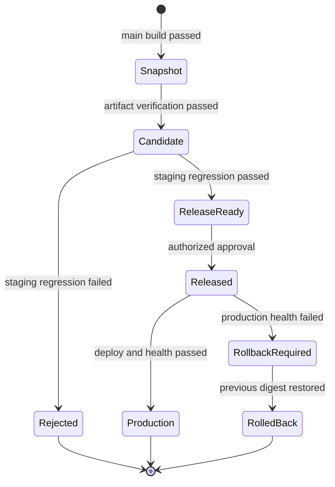

# 制品、Nexus 与发布设计

| 属性 | 值 |
|---|---|
| 状态 | 已批准设计 |
| 版本 | 1.0 |
| 最后更新 | 2026-09-14 |
| 关联 ADR | [ADR-0002](adr/0002-immutable-artifact-promotion.md) |

## 1. 发布不变量

1. 一个 candidate 对应一个主仓 commit、一个完整 submodule manifest 和一个 Linux 制品 digest。
2. staging 与 production 必须部署相同的 SHA-256；晋级不能重新构建、重新打包或重新解析依赖。
3. production 不运行 pnpm/npm install、编译器或网络依赖解析。
4. 正式 tag 只由 Release Bot 在生产部署成功后创建，且不得覆盖。
5. release 必须同时具备制品、manifest、SBOM、provenance、签名、测试证据和部署记录。
6. 任一证据缺失、签名错误或 required 测试未执行都阻断晋级。

## 2. Nexus 仓库模型

推荐使用 Nexus Repository Pro 的 Staging/Build Promotion。若部署 Nexus OSS，使用第 8 节的兼容流程。

| Hosted repository | 写入者 | 读取者 | 策略 |
|---|---|---|---|
| `dsh-snapshots` | main-build service | CI、Release Agent | 14 天清理；允许删除失败批次 |
| `dsh-candidates` | promotion service | staging、Release Manager | 90 天；禁止覆盖同名资产 |
| `dsh-releases` | release service | production、审计用户 | immutable；长期保留 |
| `dsh-evidence` | CI evidence writer | Reviewer、Release Manager | 180 天；按 build ID 索引 |
| `dsh-cache` | 代理服务 | 构建 Agent | 可重建；按容量清理 |

Nexus 中的 logical build tag：

```text
dsh-<12-char-main-sha>-<jenkins-build-number>
```

资产路径：

```text
com/deepseek/dsh/<full-main-sha>/<build-number>/<asset>
```

正式版本增加不可变索引：

```text
releases/<semver>/release-manifest.json
```

## 3. 制品集合

每个 logical build 是一个不可拆分的证据集合：

```text
dsh-<sha>-linux-x64.tar.zst
release-manifest.json
source-manifest.json
SHA256SUMS
SHA256SUMS.sig
sbom.cdx.json
provenance.intoto.jsonl
test-summary.json
licenses.json
```

### 3.1 Linux 运行包

```text
dsh-release/
├── runtime/
│   ├── bin/node
│   └── LICENSE
├── app/
│   ├── harness/
│   ├── plugins/
│   ├── patches/
│   ├── scripts/
│   └── deploy/
├── profile-template/
│   └── dsh/
├── bin/
│   ├── dsh-service
│   ├── render-profile
│   └── verify-release
└── metadata/
    ├── release-manifest.json
    ├── source-manifest.json
    ├── sbom.cdx.json
    └── provenance.intoto.jsonl
```

运行包包含 Linux x86-64 Agent 构建的依赖和原生模块，以及经版本固定的 Node Linux x64 runtime。它不包含开发机或 Jenkins 的 `.dsh`、用户数据、凭据、Git object database 和构建缓存。

### 3.2 macOS 输出

第一阶段不发布 macOS 服务器运行包。macOS lane 输出：

- build/test result；
- 工具链和原生模块指纹；
- JUnit、浏览器 trace 和日志摘要；
- 如果未来发布桌面包，则新增独立 ADR、签名与 notarization 设计。

macOS 结果不能替代 Linux release artifact，反之亦然。

### 3.3 组件准入与许可证边界

**一个组件进入 bundle 之前必须先过许可证准入**，而不是打包时才发现问题。

规则（按 copyleft 强度递减）：

| 组件许可证 | 可否进 bundle | 附加要求 |
| --- | --- | --- |
| MIT / Apache-2.0 / BSD / ISC | ✅ | 在 `licenses.json` 与制品内附许可证原文 |
| **AGPL-3.0 / GPL-3.0** | ⚠️ **默认不进** | 进则**整个制品按该 copyleft 许可分发**，须附全文、提供完整对应源码；AGPL 另触发 §13 网络服务源码义务 |
| 无许可证 / 自定义条款 | ❌ | 先确定许可证再登记 |

**为什么 AGPL 是"默认不进"而不是"看情况"**：AGPL-3.0 与 Apache-2.0 只**单向**兼容——
Apache-2.0 代码可以并入 AGPL 作品，**反之不行**（Apache-2.0 的专利与赔偿条款对 AGPL 构成附加限制）。
因此一旦任何 AGPL 组件进 bundle，**整个制品实际只能按 AGPL-3.0 分发**，
其中所有 Apache-2.0 组件也随之被 AGPL 覆盖。这不是可以"标注一下"绕过的事。

**当前状态**：`dsh-plugin-mineru`（AGPL-3.0）是唯一 copyleft 组件，已据此设为
`releaseScope: []` + `runtimeScope: excluded`——**不进制品、不进默认 profile，改为可选自装**。
其 `ciScope` 保留 `install`/`test`：**不随发布 ≠ 不验证**。

**机器强制（已生效，非设计）**：

| 检查 | 位置 |
| --- | --- |
| `license` 必填 + SPDX 受控词表（不含 `unknown`） | `scripts/check-components.mjs` |
| 组件目录声明 ↔ 组件自身 `package.json` 一致 | 同上 |
| `THIRD-PARTY-NOTICES.md` 未过期 | `scripts/gen-notices.mjs --check`，接入 `verify.yaml` 与 `release.yaml` |

> ⚠️ **边界说明**：上表三项**今天已经在跑**；而"制品里实际附了哪些许可证文件"属于
> §3.1 运行包的构建内容，**该构建尚未实现**（见 §14 迁移）。不要把已生效的目录校验
> 误当成制品合规已完成。

## 4. Source manifest

`source-manifest.json` 记录构建的完整输入：

```json
{
  "schemaVersion": 1,
  "superproject": {
    "project": "dsh/superproject",
    "commit": "<40-hex-commit>",
    "ref": "refs/heads/main"
  },
  "submodules": [
    {
      "path": "harness",
      "url": "https://github.com/deepseek-ai/deepseek-harness.git",
      "commit": "<40-hex-commit>",
      "pinKind": "tag",
      "allowedRef": "dsh-v0.1.5-rc.2",
      "authority": "github-upstream"
    },
    {
      "path": "plugins/dsh-automation",
      "url": "ssh://gerrit/dsh/forks/dsh-automation",
      "commit": "<40-hex-commit>",
      "pinKind": "branch",
      "allowedRef": "adapt/harness-0.1.5-rc.2",
      "authority": "gerrit-fork"
    }
  ]
}
```

尖括号字段表示运行时生成的数据，不是可接受的提交占位符。生成器必须验证 commit 是 40 位十六进制 SHA，并验证 submodule 集合与 `scripts/check-pins.sh --list` 完全一致。

## 5. Release manifest

`release-manifest.json` 是发布和部署的主索引，至少包含：

```json
{
  "schemaVersion": 1,
  "build": {
    "id": "dsh-<sha>-<build>",
    "jenkinsUrl": "https://jenkins.example/job/dsh-main-build/<build>/",
    "createdAt": "RFC3339 timestamp"
  },
  "source": {
    "manifestSha256": "<sha256>",
    "superprojectCommit": "<40-hex-commit>"
  },
  "platform": {
    "os": "linux",
    "architecture": "x86_64",
    "libc": "glibc",
    "nodeVersion": "value from repository toolchain pin",
    "nodeModuleAbi": "process.versions.modules"
  },
  "artifact": {
    "name": "dsh-<sha>-linux-x64.tar.zst",
    "sha256": "<sha256>",
    "size": 0
  },
  "evidence": {
    "sbomSha256": "<sha256>",
    "provenanceSha256": "<sha256>",
    "testSummarySha256": "<sha256>"
  },
  "promotion": {
    "state": "snapshot",
    "stagingDeploymentId": null,
    "productionDeploymentId": null
  }
}
```

正式 release 通过单独的签名 promotion record 关联版本号、批准人和部署记录；不得修改已签名 build manifest。

## 6. 构建指纹

构建时记录：

- Linux distribution 与版本；
- kernel、CPU architecture、glibc；
- Node 版本、Node module ABI、Corepack；
- 各仓实际 pnpm/npm 版本；
- lockfile SHA-256；
- C 编译器版本；
- Jenkins Agent image ID；
- 环境变量 allowlist 的名称，不记录 secret 值。

production 在解包前验证 architecture、glibc 兼容基线和制品内 Node runtime。平台不兼容时失败，不尝试现场重编译。

## 7. 构建和打包流程

```mermaid
flowchart LR
    A["clean main checkout"] --> B["pin/source validation"]
    B --> C["frozen install"]
    C --> D["Linux native build"]
    D --> E["deterministic regression"]
    E --> F["relocatable package root"]
    F --> G["symlink and secret scan"]
    G --> H["offline unpack smoke"]
    H --> I["SBOM + provenance"]
    I --> J["SHA-256 + signature"]
    J --> K["Nexus snapshot"]
```



### 7.1 可重定位检查

打包脚本必须：

1. 扫描所有 symlink；拒绝绝对链接、断链和解析后越过包根目录的链接；
2. 扫描文本文件中的 Jenkins workspace、用户 home 和构建临时目录；
3. 扫描 `.credentials.yaml`、SSH key、token、cookie、`.env` 和已知 secret pattern；
4. 校验 `profile-template` 不含用户会话、附件或运行态 ID；
5. 在另一个随机路径解包，以网络禁用模式完成 `verify-release`；
6. 运行 headless Mock LLM 冒烟，并证明进程无残留。

### 7.2 Reproducibility

目标是输入可重放和制品内容可解释，不承诺第一阶段达到逐字节 reproducible build。tar 元数据必须规范化：固定文件顺序、mtime、uid/gid 和 locale。若同一输入的 digest 不一致，provenance 必须能定位工具链或非确定性来源。

## 8. Nexus promotion

### 8.1 Nexus Pro

使用 component tag 标识 logical build，通过 Staging REST API 将整批资产从 snapshot 移动到 candidate，再从 candidate 移动到 release。操作前后都重新查询资产清单并核对 SHA-256。

### 8.2 Nexus OSS 兼容模式

若没有 Pro Staging：

1. 从源仓下载 logical build 的全部资产；
2. 与已签名 manifest 和 SHA256SUMS 核对；
3. 上传目标 hosted repository 的临时路径；
4. 从 Nexus 重新下载并核对 digest；
5. 原子发布版本索引；
6. 删除临时路径；源资产按保留策略处理。

即使使用 OSS，禁止调用 build 脚本产生“新 candidate”或“新 release”。

## 9. 生命周期状态机



状态变化写入 append-only promotion/deployment record。不能编辑历史状态来掩盖失败。

## 10. 版本与 tag

### 10.1 Candidate 标识

Candidate 在人工版本决策前用以下稳定 ID：

```text
<full-main-sha>.<jenkins-build-number>
```

### 10.2 正式版本

Release Manager 输入符合项目版本策略的 `vMAJOR.MINOR.PATCH[-PRERELEASE]`。Release Job 验证：

- tag 不存在；
- candidate 为 `ReleaseReady`；
- candidate commit 是 `main` 可达提交；
- staging 证据属于同一 digest；
- 批准者属于 Release Manager 组；
- 版本未在 Nexus release repository 使用。

### 10.3 Tag 顺序

1. candidate 晋级 release；
2. production 部署；
3. production health 和 version proof；
4. 创建指向主仓 commit 的 annotated tag；
5. tag annotation 包含 artifact digest 和 Nexus manifest URL；
6. 写 release record。

若生产部署失败，不创建 tag，release asset 保留并记录 `deployment-failed`。修复部署基础设施后可以用同一 digest 重试；代码或制品发生变化则必须产生新 candidate。

## 11. SBOM、许可证与 provenance

- SBOM 使用 CycloneDX JSON，覆盖 Node runtime、harness、全部插件、npm/pnpm 依赖和原生模块；
- `licenses.json` 汇总 package license、仓库 license 文件和人工 policy 结果；
- provenance 使用 in-toto statement，记录 builder identity、输入 commit、构建参数和产物 digest；
- SBOM 与 provenance 自身加入 SHA256SUMS 并签名；
- 严重漏洞或许可证策略失败阻断 candidate，例外必须有到期时间、责任人和审批记录。

## 12. 签名

推荐使用 KMS/Vault 托管的非导出签名密钥执行 blob signing。若初期只能使用 Jenkins secret file：

- 只挂载到 Trusted Release Agent；
- 临时文件权限为 0600；
- 签名后立即销毁 workspace；
- presubmit、普通 main build 和 macOS Agent 无法读取；
- 每季度轮换并验证旧制品仍可用历史公钥校验。

SHA-256 只证明内容一致，签名才证明发布者身份；两者都必须保留。

## 13. 发布门禁

Candidate 进入 `ReleaseReady` 前必须满足：

- Linux full build 和 deterministic regression 通过；
- macOS required lane 对同一 main commit 通过；
- offline unpack smoke 通过；
- staging 部署与 [04-test-strategy.md](04-test-strategy.md) required catalog 全部通过；
- 真实模型必测集合有结果且通过；
- SBOM、许可证、provenance、checksum 和 signature 完整；
- **许可证准入通过**（§3.3）：bundle 内无未登记的 copyleft 组件；若有 AGPL/GPL，
  必须已有明确的分发许可决策与源码提供方案，而不是"打包时才发现"；
- required 测试不存在 skipped、missing、flaky-green；
- 当前没有针对该 candidate 的未关闭 release blocker。

Production 发布还必须满足：

- Release Manager 人工批准；
- production 变更窗口和环境锁有效；
- `previous` digest 可用且回滚检查通过；
- 备份新鲜度满足 [06-security-and-operations.md](06-security-and-operations.md)；
- 下载和健康检查链路可用。

## 14. 与当前 `make release` 的迁移

当前 `make release` 会本地创建并推送 tag，目标模式与其不同。迁移顺序：

1. 在 Jenkins/Gerrit 仍未接管时保留当前行为；
2. P3 完成后新增 `make release-request`，只做本地预检并输出 candidate 请求，不持有 tag 权限；
3. P5 启用时将 `make release` 改为调用或提示使用 Jenkins 参数化 Release Job；
4. 从开发者组撤销 `refs/tags/v*` Create 权限；
5. GitHub Release 改由已验证 Gerrit tag 的镜像任务生成，或显式停用。

不得在中间状态同时允许本地 tag 和 Jenkins tag 两条权威路径。

## 15. 验收

1. staging 与 production deployment record 中的 artifact SHA-256 相同；
2. production 断网时仍能从已下载制品完成验证和启动，不运行包管理器；
3. 随机路径解包后不存在绝对 workspace link；
4. 从 release manifest 能追溯主仓和全部 submodule SHA；
5. Release Bot 之外的账号无法创建或覆盖正式 tag；
6. Nexus release asset 无法覆盖；
7. 缺少任一 required evidence 时 promotion 失败；
8. OSS 兼容流程与 Pro 流程都保持同一 digest 不变量。
