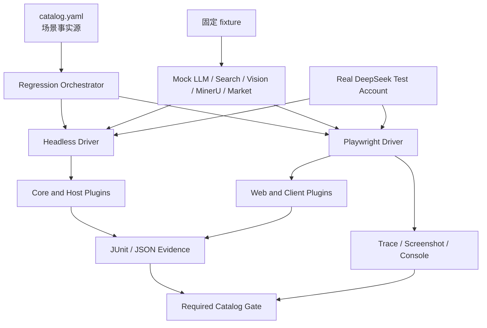

# 发布前自动化回归测试策略

| 属性 | 值 |
|---|---|
| 状态 | 已批准设计 |
| 版本 | 1.0 |
| 最后更新 | 2026-09-14 |
| 关联 ADR | [ADR-0003](adr/0003-hybrid-end-to-end-regression.md) |

## 1. 结论

DSH 必须补充超级仓库级自动化回归，并把它设为 candidate 晋级 release 的强制门禁。现有 submodule 单元测试、构建成功和 HTTP 端口就绪都不能证明终端用户能够完成基本任务。

发布回归使用两个驱动器：

1. `dsh-headless`：核心 Agent 闭环、工具、持久化及 Host 侧插件；
2. Playwright：Web 登录、多轮交互和客户端插件。

外部不确定性由 Mock LLM/Mock Services 控制；staging candidate 再用测试账号执行少量真实 DeepSeek 契约用例。

`dsh-tui` 是后期 feature，当前不属于本 CI/CD 范围；本策略不定义其构建、PTY 驱动、场景、制品或 required gate。Web 侧边栏中的终端能力仍属于插件回归，由 Playwright 从终端用户界面验证。

## 2. 测试目标

- 从用户入口启动实际发行 profile，而不是手工拼装内部类；
- 验证用户可见、模型可见或持久化结果；
- 证明核心与插件在同一个组合 profile 中没有覆盖、双挂载或配置漂移；
- 覆盖 Linux x86-64 和 macOS arm64 原生行为；
- 对失败提供可重放的输入、日志、trace 和 manifest；
- 确保 required 测试未发现、被跳过或无结果时失败。

## 3. 非目标

- 不替代 harness 和插件仓自己的单元、类型、lint 和仓级测试；
- 不追求 UI 像素级全量快照；
- 不在每个 patchset 上调用所有真实外部服务；
- 不比较大模型自然语言输出全文；
- 不使用生产账号、生产数据或真实用户 workspace。
- 不构建或验证 `dsh-tui` 及其独立 profile。

## 4. 测试架构



## 5. 测试级别

| 级别 | 内容 | 触发 | 平台 | 门禁 |
|---|---|---|---|---|
| R0 | pin、来源、lockfile、配置、secret/license、脚本 | 每个 patchset | Linux | 合入阻断 |
| R1 | 核心 headless Mock LLM 闭环 | 每个相关 patchset | Linux、macOS | 合入阻断 |
| R2 | 受影响 Web/插件冒烟 | 每个相关 patchset | Linux | 合入阻断 |
| R3 | 完整 deterministic release regression | 每个 candidate | staging/Linux；平台项加 macOS | 发布阻断 |
| R4 | 真实 DeepSeek 小集合 | 每个 candidate | staging/Linux | 发布阻断 |
| R5 | 长会话、压力、故障注入、更多真实 provider | nightly | Linux、macOS | 趋势；存在 blocker 时阻断发布 |
| R6 | 只读 post-deploy smoke | production deploy | Production Linux | 部署成功判据 |

## 6. Headless 方案

### 6.1 可用性

harness 当前提供：

```bash
cd harness
pnpm dsh --profile headless "run one task"
```

该模式不启动 GUI 或服务器，一次运行一个任务；成功退出码为 0，错误或中止为 1；最终答案写 stdout，推理和错误写 stderr。它适合 CI，但只覆盖一次性 Agent 任务。

现有 harness 测试已经包含：

- keyless Loader smoke，覆盖真实 Loader、Shell 工具和持久化；
- Mock/replay 驱动的 deterministic E2E；
- `DEEPSEEK_API_KEY` 存在时执行的真实模型文件修改场景。

根仓不复制这些实现，而是在发布 profile 上编排和补充组合回归。

### 6.2 `ci-headless` profile

新增测试专用 profile，要求：

- 从正式 `dsh-base`/headless 层派生；
- 挂载正式核心、工具和适用于 headless 的 Host 插件；
- 只替换 LLM 与外部服务为 test provider；
- 使用独立临时 `DSH_HOME` 和 workspace；
- 不改变生产默认 profile；
- 启动时输出 machine-readable profile manifest。

### 6.3 Headless 断言

每个场景同时检查：

- process exit code；
- stdout 最终结果；
- stderr 是否只含允许的 reasoning/error 格式；
- SessionEvent 中的 `turn/end`、tool call/result 和 assistant message；
- workspace 或持久化存储的外部结果；
- 子进程、端口、临时文件和 lock 是否清理；
- 日志中不存在 secret。

### 6.4 Headless 的边界

它不能验证：

- Web token/login、浏览器连接和多轮页面状态；
- client bundle 是否注入和渲染；
- 侧边栏、文件选择器、市场等 DOM 交互；
- 浏览器终端前后端的真实 shell 生命周期和终端控制序列。

这些场景必须由 Playwright 从用户界面驱动。独立 `dsh-tui` 的 TTY 行为不在本期范围。

## 7. Mock 服务

### 7.1 Mock LLM

优先复用 `harness` 的 `mock:llm` 和 loader/replay test-support。Mock LLM 必须支持：

- 固定文本 token 流；
- tool call 和 tool result round-trip；
- reasoning 增量；
- 可控 4xx/5xx、限流、断流、超时和重试；
- 多 Agent/团队所需的确定性响应序列；
- 每个请求唯一 scenario ID，便于验证调用次数和顺序。

### 7.2 其他 Mock

| 服务 | 最小能力 |
|---|---|
| MinerU | 接收固定 PDF，返回固定结构化解析；支持失败和超时 |
| Vision | 接收 fixture 图片，返回固定描述；支持 provider failover |
| Search | 固定查询返回 URL、标题、片段和引用；支持空结果/超时 |
| Market | 本地 registry、README 和测试插件包；禁止访问公网市场 |
| Clock | dsh-automation 可推进时间或显式触发 due task，不真实等待 |

Mock server 只监听 loopback 或隔离测试网络，使用 OS 分配端口，并向测试输出 endpoint manifest。

## 8. 核心用户旅程

| ID | 场景 | 驱动器 | 平台 | 关键断言 |
|---|---|---|---|---|
| CORE-001 | 冷启动和版本证明 | headless/Web | Linux、macOS | profile、commit、digest 正确；无启动错误 |
| CORE-002 | 创建一次性任务并完成 | headless mock | Linux、macOS | 流式事件、最终消息、exit 0 |
| CORE-003 | 文件读取、修改和复核 | headless mock | Linux、macOS | 外部进程读取的最终文件精确匹配 |
| CORE-004 | Shell 工具 round-trip | headless mock | Linux、macOS | 工具结果回到模型；无越权路径 |
| CORE-005 | 用户批准允许动作 | headless/Web | Linux | 动作只在批准后执行 |
| CORE-006 | 用户拒绝动作 | headless/Web | Linux | 动作未执行；状态可解释 |
| CORE-007 | 会话持久化和恢复 | headless/Web | Linux | 重启后历史与状态完整 |
| CORE-008 | 中止、超时和 provider 错误 | headless | Linux、macOS | exit 1；无悬挂进程；错误分类正确 |
| CORE-009 | Web 登录与多轮消息 | Playwright | Linux | 登录、发送、流式显示、follow-up、刷新恢复 |
| CORE-011 | profile 组合完整性 | contract | Linux | 插件清单、provider、关键 config 未被覆盖 |
| CORE-012 | 真实模型修改文件 | headless real | staging/Linux | 文件最终内容、工具调用、turn success |

## 9. 插件用户旅程

### 9.1 `dsh-web`

| ID | 场景 | 断言 |
|---|---|---|
| WEB-001 | 认证和应用启动 | 认证 gate 正常；主界面、API 和 client assets 可用 |
| WEB-002 | 新建多轮会话 | 两轮消息顺序、流式状态和最终文本正确 |
| WEB-003 | 刷新恢复 | 页面刷新后会话和 workspace 不丢失 |
| WEB-004 | 浏览器错误检查 | 无未允许 console error、page error 和失败请求 |

### 9.2 `dsh-better-sidebar`

| ID | 场景 | 断言 |
|---|---|---|
| SIDEBAR-001 | 打开侧边栏和 tab | 只挂载一个 sidebar；tab 可切换 |
| SIDEBAR-002 | Web 终端基本命令 | Playwright 打开终端并执行安全 `printf`；输出出现；终端可关闭且后端进程退出 |
| SIDEBAR-003 | 文件变更视图 | Agent 修改 fixture 后显示文件和 diff |
| SIDEBAR-004 | 与 dsh-web 聚合包共存 | `/sidebar/api` 无重复 route；启动无 double-mount |

### 9.3 `dsh-plugin-mineru`

| ID | 场景 | 断言 |
|---|---|---|
| MINERU-001 | 解析固定小型 PDF | mock 服务收到正确文件；结构化结果进入工具/会话 |
| MINERU-002 | 上游失败 | 用户得到可理解错误；临时文件清理；无无限重试 |

### 9.4 `modlens`

| ID | 场景 | 断言 |
|---|---|---|
| MODLENS-001 | 识别 fixture 图片 | 选定 mock engine；返回固定描述和元数据 |
| MODLENS-002 | provider failover | 主 provider 失败后只按配置选择允许的后备 |

### 9.5 `dsh-automation`

| ID | 场景 | 断言 |
|---|---|---|
| AUTO-001 | 创建一次性自动化 | Web/Agent 输入转换为正确 schedule 和任务 |
| AUTO-002 | 触发和隔离执行 | 测试时钟触发；新上下文运行；不继承未授权状态 |
| AUTO-003 | 历史和失败解释 | 成功、失败、耗时和原因可查询；重启后仍存在 |

### 9.6 `dsh-market`

| ID | 场景 | 断言 |
|---|---|---|
| MARKET-001 | 浏览本地 registry | 展示 fixture 插件和 README；无公网请求 |
| MARKET-002 | 安装本地测试插件 | 安装、重启、加载和卸载均成功 |
| MARKET-003 | 不兼容插件 | 明确拒绝并给出原因，不破坏现有 profile |

### 9.7 `dsh-agent-teams`

| ID | 场景 | 断言 |
|---|---|---|
| TEAM-001 | 创建团队和成员 | 工具注册、team state 和成员清单正确 |
| TEAM-002 | 消息与完成 | 成员收发消息、完成任务并聚合结果 |
| TEAM-003 | 失败和清理 | 成员失败可见；父任务结算；状态文件无损坏 |

### 9.8 `dsh-at-file`

| ID | 场景 | 断言 |
|---|---|---|
| ATFILE-001 | 选择文件引用 | 输入 `@` 后选择 fixture；消息携带 workspace 相对路径 |
| ATFILE-002 | Agent 读取引用 | Agent 通过工具读取目标文件并回答固定内容 |
| ATFILE-003 | 过滤规则 | 被忽略目录和文件不出现在候选中 |

### 9.9 `modsearch`

| ID | 场景 | 断言 |
|---|---|---|
| SEARCH-001 | 基本搜索 | mock 结果与引用进入模型上下文和最终回答 |
| SEARCH-002 | provider 选择 | profile 的 `searchProvider` 保持 `modsearch`，相关旁键不丢失 |
| SEARCH-003 | 空结果和超时 | 结果可解释；无无限等待或错误 provider 回退 |

插件新增、删除或变更用户可见能力时，必须更新本节和 `catalog.yaml`。

## 10. Playwright 设计

### 10.1 执行环境

- Presubmit：Linux Chromium headless，只运行受影响场景；
- Candidate：staging 上运行完整 Chromium；WebKit 执行核心 Web 场景；
- 共享状态的 project 设置 `workers=1`；只有每个 shard 拥有独立 `DSH_HOME`、workspace 和账号时才能并行；
- 浏览器版本由 lockfile 固定，Linux Agent 安装对应系统依赖。

### 10.2 认证

- setup project 通过受控测试接口或真实登录流程创建一次性测试身份；
- auth state 写在当前 Playwright output directory，不写入仓库；
- 各修改服务端状态的测试使用不同 workspace/identity；
- 任务结束销毁 auth state；evidence 收集器拒绝上传 cookie/header；
- production post-deploy smoke 不保存可复用认证状态。

### 10.3 定位和断言

- 优先 role、label、accessible name；必要时使用稳定 `data-testid`；
- 禁止依赖 CSS 层级、随机 class、文本生成内容全文和固定 sleep；
- 使用 web-first assertion 等待可观察状态；
- 每个场景检查 `pageerror`、console error、失败 network request 和未处理 rejection；
- 动态端口由 test stack manifest 传递，不硬编码 3080。

### 10.4 失败证据

- `trace: retain-on-failure`；
- screenshot 只在失败时；
- video 只对难以从 trace 还原的 candidate 场景启用；
- 保存浏览器 console、网络失败摘要、DSH server log 和 scenario manifest；
- trace 上传前执行 secret/cookie 检查。

Playwright 官方说明 CI 默认可 headless 执行，并建议对共享资源场景降低 worker 数；trace 可保留 DOM、网络和动作证据。参见 [Playwright CI](https://playwright.dev/docs/ci) 和 [Trace Viewer](https://playwright.dev/docs/trace-viewer)。

## 11. 延后 feature 边界

`dsh-tui` 不进入当前 catalog、Jenkins required lane、candidate 制品或 release evidence。未来启用该 feature 时必须先形成独立设计评审，至少补充真实 PTY 驱动、Linux/macOS 终端恢复、会话兼容、失败证据和资源清理，再通过新 ADR 将其纳入本策略；不得仅因 submodule 已存在就被 `make setup` 隐式带入门禁。

## 12. 真实模型通道

### 12.1 Candidate 必测集合

| ID | 任务 | 稳定断言 |
|---|---|---|
| REAL-001 | 读取并精确修改一个临时文件 | 文件字节精确匹配；工具调用存在；turn success |
| REAL-002 | 读取两个小文件并回答结构化值 | 值可机器解析；未读取 workspace 外路径 |
| REAL-003 | Web 提交短问题并收到流式回答 | 至少一个流式增量；最终消息非空；会话持久化 |

### 12.2 安全和成本

- 使用独立 DeepSeek 测试账号和 project；
- `DEEPSEEK_API_KEY` 只在 staging test stage 注入；
- 每 candidate 3–5 个短任务；
- 每任务设置 120 秒以内超时、最大 token 和累计预算；
- prompt 和 fixture 不含源码 secret、个人信息或生产数据；
- reasoning stderr 不上传长期 evidence，只保存脱敏统计；
- candidate 缺少 key 时失败为 `INCOMPLETE_TEST_SET`，不得 `skipIf` 后通过。

### 12.3 断言策略

不比较完整回答文本。断言工具调用、最终文件/状态、事件顺序、完成原因、首 token/完成时限和 token 上限。

## 13. 隔离与清理

每个 scenario 分配：

```text
RUN_ID
DSH_HOME=<temp>/home
WORKSPACE=<temp>/workspace
MOCK_ENDPOINTS=<temp>/endpoints.json
PORT=OS-assigned
IDENTITY=scenario-specific
```

禁止复用仓库根 `.dsh`。测试完成后必须检查：

- 子进程全部退出；
- 监听端口释放；
- lockfile 和临时目录可删除；
- submodule 和根工作区未变脏；
- 没有新增真实用户配置；
- evidence 中没有凭据。

任一清理检查失败，scenario 失败。

## 14. Catalog 单一事实源

目标文件：`tests/release-regression/catalog.yaml`。

```yaml
schemaVersion: 1
scenarios:
  - id: CORE-003
    title: headless file tool round trip
    owner: harness-core
    level: R1
    driver: headless
    platforms: [linux-x64, macos-arm64]
    provider: mock
    timeoutSeconds: 90
    requiredFor: [presubmit-core, candidate]
    command: tests/release-regression/headless/core-file-tool.sh
    evidence: [junit, session-events, process-log]
```

校验器必须拒绝：

- 重复 ID；
- required scenario 无 command；
- 未知 platform/driver/provider；
- timeout 缺失或超过策略；
- catalog required ID 未出现在测试结果；
- 结果为 skipped、missing 或 flaky-green；
- 插件清单与 catalog owner 不一致。

## 15. 结果模型

每个场景输出 machine-readable JSON 和 JUnit：

```json
{
  "schemaVersion": 1,
  "scenarioId": "CORE-003",
  "status": "passed",
  "classification": "PRODUCT",
  "revision": "<40-hex-commit>",
  "artifactSha256": null,
  "platform": "linux-x64",
  "provider": "mock",
  "startedAt": "RFC3339 timestamp",
  "durationMs": 0,
  "evidence": []
}
```

允许状态：`passed`、`failed`、`skipped`、`missing`、`aborted`、`flaky-green`。只有 `passed` 满足 required gate。

## 16. Flake 策略

- 产品断言失败不自动重试；
- Playwright 可进行一次诊断重跑以生成 trace，但首次失败即将最终状态标为 `flaky-green` 或 `failed`；
- provider/infra 失败最多自动重试一次，复用相同 revision、fixture 和 artifact digest；
- 任何重试都保留首次证据；
- required 场景 `flaky-green` 阻断 release；
- 连续 30 次均通过后才能把已修复 flake 关闭；
- 禁止通过扩大 timeout、固定 sleep 或长期 quarantine 掩盖缺陷。

## 17. 性能与趋势

用户要求以功能为主，因此第一阶段性能指标只观测不阻断：

- 冷启动时间；
- 首 token 时间；
- 完成时间；
- 峰值 RSS；
- Web 关键资源加载时间；

收集 30 个有效 candidate 后建立 p50/p95 基线。出现超过 p95 20% 的持续回归时升级为 release blocker；阈值变更必须评审。

## 18. Evidence 与保留

成功场景保存精简结果、JUnit、版本和耗时。失败场景额外保存：

- DSH process log；
- session event 摘要；
- mock request/response ID；
- Playwright trace、截图和失败请求；
- 浏览器终端日志；
- workspace diff；
- 进程和端口清理报告。

Presubmit evidence 保留 30 天，candidate/release evidence 保留 180 天，正式 release summary 长期保留。

## 19. 工程目录

```text
tests/release-regression/
├── catalog.yaml
├── fixtures/
├── mock-services/
├── headless/
├── web/
└── contracts/

scripts/ci/
├── test-presubmit.sh
├── test-release-regression.sh
├── start-test-stack.sh
├── collect-evidence.sh
└── assert-cleanup.sh
```

测试脚本可在本地和 Jenkins 使用相同命令。Jenkins 只通过环境变量提供 run ID、临时目录、endpoint 和 credential reference。

## 20. 落地顺序

1. 建立 catalog schema、结果模型、隔离和 cleanup guard；
2. 接入现有 harness keyless headless 测试，完成 CORE-001 至 CORE-008；
3. 建立 Playwright test stack，完成 WEB-001/002 和 CORE-009；
4. 按风险优先加入 automation、agent-teams、at-file、search、vision、MinerU、market、sidebar；
5. 在 staging 启用 REAL-001，再扩到 REAL-002/003；
6. 连续稳定后把 full catalog 设为 release required。

## 21. 验收

1. required catalog 中所有场景均产生 `passed` 结果；
2. 缺 key、测试发现失败或显式 skip 会阻断 candidate；
3. 测试不读取当前用户 `.dsh`；
4. Linux/macOS 原生构建和 headless 场景分别执行；
5. Web 失败可从 trace、console、network 和服务日志还原；
6. 真实模型用例只比较稳定不变量，并受超时/token/预算约束；
7. 每个已发布插件至少有一个实际主功能用户旅程；
8. 测试结束无残留进程、端口、临时凭据或 dirty submodule。
