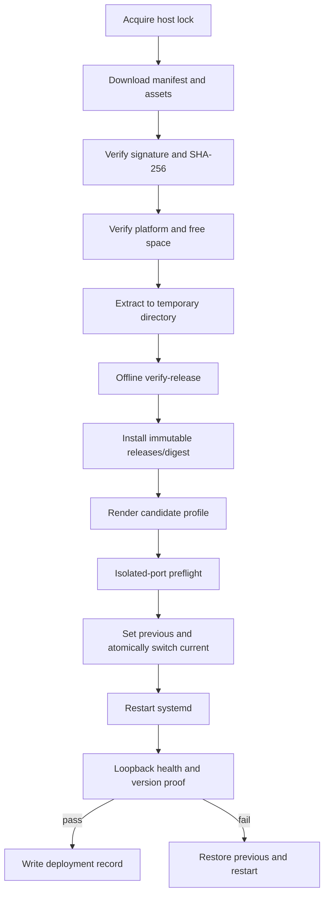

# Staging 与 Production 部署手册

| 属性 | 值 |
|---|---|
| 状态 | 目标运行手册；P3-P5 实施后生效 |
| 版本 | 1.0 |
| 最后更新 | 2026-09-14 |
| 制品规范 | [03-artifact-and-release.md](03-artifact-and-release.md) |

## 1. 适用范围

本手册定义 Nexus 不可变 Linux 制品通过 SSH/systemd 部署到 staging 和 production 的标准动作。当前 `make deploy` 的源码 rsync/目标机构建路径在迁移完成前仍按 [docs/deploy.md](../deploy.md) 执行，不能与本手册的制品路径混用。

## 2. 环境模型

| 环境 | 触发 | 输入 | 回归 | 权限 |
|---|---|---|---|---|
| staging | candidate 创建后自动 | Nexus candidate digest | 完整 deterministic + 真实模型小集合 | Stage Deploy Service |
| production | Release Manager 人工批准 | Nexus release digest | 只读 smoke + version proof | Production Deploy Service |

环境 inventory 版本化保存主机别名、角色、端口、部署路径和策略，不保存 IP 机密、用户名密码、token 或 SSH 私钥。真实 endpoint 通过 Jenkins managed configuration 或受控 DNS 提供。

## 3. 目标主机布局

```text
/opt/dsh/
├── releases/
│   └── <artifact-sha256>/
├── current -> releases/<digest>
└── previous -> releases/<digest>

/var/lib/dsh/
├── profiles/
├── sessions/
├── attachments/
├── storages/
└── runtime/

/srv/dsh-workspaces/
/etc/dsh/dsh.env
/var/log/dsh/
/run/lock/dsh-deploy.lock
```

- `/opt/dsh/releases/*` 只读，只保存可重建的应用制品；
- `/var/lib/dsh` 保存用户和插件持久状态，不随应用回滚整体覆盖；
- `/srv/dsh-workspaces` 是 coding tools 允许操作的工作区根；
- `/etc/dsh/dsh.env` 只保存非敏感配置和 secret reference；
- 运行用户为非登录系统账号 `dsh`，不使用 root 运行 Agent 或终端插件。

## 4. 主机前置条件

### 4.1 操作系统

- Ubuntu Linux x86-64，版本和 glibc 不低于 release builder 的兼容基线；
- systemd、curl、tar、zstd、sha256sum、flock；
- 到 Nexus 443 和必要模型/API endpoint 的受控出站访问；
- 从 Trusted Release Agent 接收 SSH 的入站规则；
- 时间同步和统一时区记录；
- 足够容纳当前、previous、一个临时 release 和状态备份的磁盘空间。

目标机不要求安装 Node、pnpm、npm、Corepack、C 编译器或 Node headers；这些不再参与生产部署。

### 4.2 账号和权限

| 账号 | 权限 |
|---|---|
| `dsh` | 读取 `/opt/dsh/current`；写 `/var/lib/dsh`、workspace 和日志；无 sudo |
| deploy service | 下载/验证制品；受限 sudo 执行 dsh deploy commands 和 systemctl dsh |
| SRE | 人工诊断和 break-glass；操作有审计 |

deploy service 的 sudoers 规则必须列出固定脚本绝对路径，禁止通配任意 shell。

## 5. Systemd 目标配置

```ini
[Unit]
Description=DeepSeek Harness Web
After=network-online.target
Wants=network-online.target

[Service]
Type=simple
User=dsh
Group=dsh
WorkingDirectory=/srv/dsh-workspaces
EnvironmentFile=/etc/dsh/dsh.env
Environment=DSH_HOME=/var/lib/dsh
ExecStart=/opt/dsh/current/bin/dsh-service --profile dsh --no-open
Restart=on-failure
RestartSec=3
TimeoutStopSec=30
NoNewPrivileges=true
PrivateTmp=true
ProtectSystem=strict
ProtectHome=true
ReadWritePaths=/var/lib/dsh /srv/dsh-workspaces /var/log/dsh
CapabilityBoundingSet=

[Install]
WantedBy=multi-user.target
```

这是目标模板。正式落地前必须用完整插件组合验证 hardening 选项；若某插件需要额外路径，只能增加精确 `ReadWritePaths`，不能关闭整个保护面。

## 6. 部署输入

Release Job 向部署脚本传递：

```text
ENVIRONMENT=staging|production
ARTIFACT_DIGEST=<sha256>
NEXUS_MANIFEST_URL=<https-url>
DEPLOYMENT_ID=<immutable-id>
JENKINS_BUILD_URL=<https-url>
```

脚本从 credential binding 获取 Nexus read token 和 SSH identity。secret 不作为命令行参数，避免出现在进程列表。

## 7. 部署前检查

Trusted Release Agent 必须确认：

1. 环境锁可获得；
2. digest 格式正确且在允许的 Nexus repository；
3. staging 只接受 candidate；production 只接受 release；
4. production 输入拥有 `ReleaseReady` evidence 和授权审批；
5. inventory 中每台主机可达且身份指纹匹配；
6. Nexus、磁盘、systemd 和 loopback 健康检查工具可用；
7. 当前 `current` 和 `previous` 链接合法；
8. 最近一次状态备份满足新鲜度策略；
9. 没有另一 deployment/rollback 在执行；
10. manifest 的 platform 与目标主机一致。

任一检查失败时不得改变 `current`。

## 8. 单机部署算法



详细步骤：

1. `flock` 获取 `/run/lock/dsh-deploy.lock`；
2. 下载 manifest、SHA256SUMS、signature 和运行包到 root-owned 临时目录；
3. 验证签名，再验证每个文件 SHA-256；
4. 比较 manifest 的 architecture、libc 和 Node ABI；
5. 解包到 `/opt/dsh/releases/.incoming-<deployment-id>`；
6. 执行包内 `verify-release`，禁止网络访问；
7. 校验 symlink、文件权限和 secret scan 结果；
8. 重命名为 `/opt/dsh/releases/<digest>` 并设为只读；
9. 从 profile template 渲染候选 profile，运行 isolated-port preflight；
10. 将当前有效 digest 写入 `previous`；
11. 通过同目录临时 symlink + rename 原子替换 `current`；
12. `systemctl restart dsh`；
13. 在主机 loopback 运行健康检查和版本证明；
14. 成功后写 append-only deployment record；失败则执行第 11 节回滚；
15. 释放锁，按策略清理旧 incoming 和历史 release。

同一 digest 已部署且 health 正常时幂等成功，不重启服务。

## 9. 多主机策略

第一阶段使用 serial rollout：

1. inventory 顺序选择一台 canary；
2. canary 部署、健康检查和短 smoke；
3. 其余主机逐台部署；
4. 任一主机失败，停止后续主机；
5. 已更新主机回滚到各自 previous；
6. 记录部分部署事件，不把环境标为成功。

`maxUnavailable=1`。没有负载均衡摘流能力时，production 必须在维护窗口执行。

## 10. 健康检查

### 10.1 当前兼容检查

在专用健康接口落地前：

- `systemctl is-active dsh` 必须成功；
- loopback `http://127.0.0.1:3080/` 返回 200、303 或 401 可证明 Web/auth gate 已响应；
- 进程 command 必须来自 `/opt/dsh/current`；
- 当前 digest 文件与 deployment 输入一致；
- 日志中不得出现 startup error、unhandled rejection、duplicate route 或 missing module。

HTTP 200/303/401 只能证明就绪，不能证明版本；必须结合 digest 文件。

### 10.2 目标诊断契约

P3 应提供仅 loopback 可访问的等价诊断：

```json
{
  "status": "ok",
  "commit": "<main-commit>",
  "artifactSha256": "<digest>",
  "profile": "dsh",
  "plugins": {},
  "startedAt": "RFC3339 timestamp"
}
```

如果不能安全增加 HTTP endpoint，则由 `dsh-service --diagnose-json` 或独立只读诊断脚本提供同一数据。

## 11. 自动回滚

触发条件：

- systemd 启动失败；
- 60 秒内健康检查不通过；
- version proof 与输入 digest 不一致；
- startup log 出现阻断模式；
- canary 的只读 smoke 失败。

动作：

1. 保留失败 release 目录和日志；
2. 原子将 `current` 指回 `previous`；
3. 恢复 previous 对应 profile/config snapshot；
4. `systemctl restart dsh`；
5. 对 previous 执行健康和 version proof；
6. 写 `rolled-back` deployment record；
7. Jenkins 标记失败并通知 SRE/Release Manager。

自动回滚不整体恢复 `/var/lib/dsh`，避免覆盖发布期间产生的新会话和附件。

## 12. 状态和 schema 迁移

发布若改变持久化 schema，必须在 manifest 声明：

```text
stateSchemaBefore
stateSchemaAfter
backwardCompatible
migrationCommand
rollbackCommand
```

- `backwardCompatible=true`：应用回滚不恢复用户数据，只恢复 profile/config；
- `backwardCompatible=false`：production 发布前必须完成一致性状态快照和恢复演练，并由 Release Manager 二次确认；
- destructive migration 不允许在服务启动时隐式执行；
- migration 必须幂等、可观察，并拥有单独 timeout。

## 13. Staging 流程

```text
candidate created
  -> automatic deploy
  -> current-compatible health
  -> full deterministic catalog
  -> real DeepSeek required set
  -> evidence upload
  -> ReleaseReady or Rejected
```

每次 candidate 使用隔离测试 workspace 和身份。测试完成清理测试数据，但保留 deployment/test record。staging 不接收生产数据备份。

## 14. Production 流程

Release Manager 在 Jenkins 中选择 candidate 和版本，检查：

- staging required catalog 全绿；
- artifact digest、commit 和 submodule manifest；
- SBOM、许可证和安全结果；
- 当前 production 状态与 previous；
- 状态 schema 兼容性；
- 变更窗口和告警静默策略。

审批后 Jenkins 晋级同一 digest 并部署。production 只运行：

- systemd/loopback health；
- version proof；
- 一个不写用户数据、不调用真实模型的只读 smoke。

完整功能回归只在 staging 执行，避免 production 测试污染。

## 15. 人工回滚

目标命令在 P4 落地后为：

```text
make ci-rollback ENVIRONMENT=production DIGEST=<known-good-digest>
```

命令只允许从 Trusted Release Agent 执行。操作员必须提供 incident/change ticket，脚本验证目标 digest 曾在该环境成功部署且签名有效。

人工回滚不创建新制品或 tag。完成后必须运行 version proof、记录操作者和原因。

## 16. Break-glass

仅当 Jenkins 不可用且恢复时间超过业务容忍度时使用：

1. 两名授权人员确认 incident；
2. 从 Nexus release repository 选择已签名 digest；
3. 使用受控 bastion 和短期凭据执行同一个 `deploy-release.sh`，不手工复制文件；
4. 保存命令输出、digest、目标主机和操作者；
5. Jenkins 恢复后导入 deployment record；
6. 一个工作日内完成复盘和权限回收。

Break-glass 不允许部署 candidate、未签名文件或本地工作区内容。

## 17. 清理策略

- 始终保留 `current`、`previous` 和最近一个额外成功 release；
- 正在被 symlink 或 deployment record 引用的目录不得删除；
- `.incoming-*` 超过 24 小时且无活动锁时清理；
- 用户状态按数据保留策略处理，不随 release 清理；
- Nexus release 不因目标机清理而删除。

## 18. 当前路径迁移

从源码部署迁移到制品部署：

1. 保持当前 production 不变，在 staging 建新目录布局；
2. 用当前稳定 commit 生成第一个制品；
3. 对比源码部署和制品部署的 profile dump、插件清单、用户回归；
4. 验证状态目录迁移和非 root 运行；
5. staging 连续 10 个 candidate 成功；
6. production 维护窗口完成首次切换；
7. 保留旧 `/opt/dsh` 快照到两个成功 release 后；
8. 冻结并最终移除目标机构建路径。

首次切换失败时恢复当前源码部署快照，不在现场修补新制品。

## 19. 部署记录

每台主机写入并上传：

```json
{
  "schemaVersion": 1,
  "deploymentId": "immutable-id",
  "environment": "staging",
  "hostAlias": "staging-01",
  "artifactSha256": "<digest>",
  "previousSha256": "<digest>",
  "status": "succeeded",
  "startedAt": "RFC3339 timestamp",
  "finishedAt": "RFC3339 timestamp",
  "jenkinsUrl": "https://jenkins.example/job/name/build/"
}
```

记录不包含 IP、secret、用户数据或完整环境变量。

## 20. 验收

1. 目标机无 Node/pnpm/编译器也可部署和启动；
2. staging 与 production 使用同一 artifact digest；
3. 失败在 5 分钟内恢复 previous；
4. 回滚不覆盖新会话和附件；
5. 并发 deploy/rollback 被环境和主机锁阻止；
6. 非 root `dsh` 用户能完成核心和插件用户旅程；
7. deployment record 能追溯 Jenkins、Nexus、commit、digest 和审批；
8. Break-glass 只能使用已签名 release，并完成事后导入和复盘。
