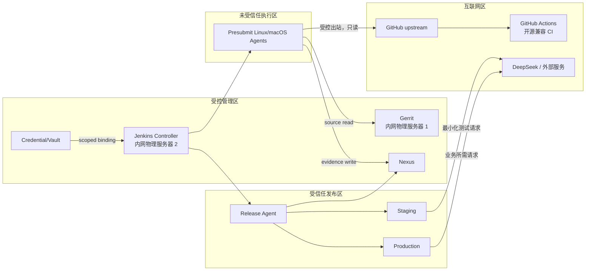

# 安全、可观测性与运维设计

| 属性 | 值 |
|---|---|
| 状态 | 已批准设计 |
| 版本 | 1.0 |
| 最后更新 | 2026-09-14 |
| 上游设计 | [01-architecture.md](01-architecture.md) |

## 1. 安全目标

- 未评审 patchset 不能读取发布、生产、签名或真实模型凭据；
- 只有满足 Gerrit 人工和自动门禁的 commit 才能进入 main；
- 只有签名、可追溯、在 staging 验证过的同一 digest 才能进入 production；
- 构建和测试不读取开发者或生产用户数据；
- 环境虽可访问互联网，但源码、凭据、日志、制品、证据和用户数据默认不离开内网；
- 每次投票、晋级、部署、回滚和 break-glass 都能追溯身份、输入和结果；
- Gerrit、Jenkins、Nexus 和 DSH 的备份可以在既定 RPO/RTO 内恢复。

## 2. 威胁模型

| 威胁 | 入口 | 主要控制 |
|---|---|---|
| 恶意 patchset 窃取 secret | Jenkinsfile、测试、构建脚本 | presubmit 无高权限凭据；release 从 trusted main/library 运行 |
| Submodule 替换攻击 | `.gitmodules`、gitlink | URL allowlist、SHA pin、ref policy、source manifest |
| 依赖供应链污染 | npm/pnpm 下载 | frozen lockfile、Nexus proxy、SBOM、漏洞/许可证扫描 |
| 跨平台原生产物污染 | 缓存、artifact | OS/arch/Node/lockfile cache key；禁止共享 node_modules |
| 制品替换 | Nexus 或网络 | TLS、SHA-256、签名、immutable repository、重新下载校验 |
| 旧 Jenkins 结果误投票 | 并发 patchset | revision-safe vote、旧构建取消、投票前查询当前 revision |
| 未验证 candidate 上生产 | 人工误操作 | repository ACL、ReleaseReady state、审批和环境锁 |
| DSH 以 root 运行扩大影响 | systemd、终端/Agent 工具 | 非 root 服务账号、workspace 边界、systemd hardening |
| 测试泄漏认证或推理 | trace、日志、artifact | evidence allowlist、脱敏、短期 auth state、secret scan |
| CI 数据意外外传 | GitHub Actions、SaaS、artifact/cache、出站 API | 本地驻留、出站 allowlist、合成 fixture、外部系统禁用内网凭据 |
| 回滚覆盖用户新数据 | 整目录快照 | 应用/配置与持久状态分离；只回滚 app/profile |
| 管理平台不可恢复 | 配置漂移、备份损坏 | JCasC、Gerrit config in Git、一致备份、季度恢复演练 |

## 3. 信任分区



未受信任区不允许路由到 staging/production 管理网，也不能读取 Vault/Nexus release write endpoint。GitHub Actions 不得建立到受控管理区或受信任发布区的入站连接。

## 4. 网络策略

| 源 | 目标 | 允许 | 限制 |
|---|---|---|---|
| 用户 | Gerrit/Jenkins/Nexus proxy | HTTPS 443 | SSO、MFA、审计 |
| Developer/Jenkins | Gerrit | SSH 29418/HTTPS 443 | 项目级权限 |
| Presubmit Agent | Gerrit/GitHub/Nexus proxy | 443/29418 | 只读源码；不能访问部署网 |
| macOS Agent | 同上 | 443/29418 | 无 staging/production 路由 |
| Main Build Agent | Gerrit/GitHub/Nexus candidate | 443/29418 | 不能访问 production |
| Release Agent | Nexus/staging/production | 443/22 | allowlist host；禁止任意互联网 |
| Staging | Nexus、测试 provider | 443 | 使用测试账号和 egress allowlist |
| Production | Nexus、正式 provider | 443 | 最小 egress；无构建 registry 写权限 |

Gerrit/Jenkins/Nexus 管理端口不直接暴露公网。Gerrit 与 Jenkins 分属两台内网物理服务器；不得为了简化部署将二者合并到同一宿主机。TLS certificate、SSH host key 和 service endpoint 由配置管理维护。

互联网连通采用默认拒绝的出站策略：按源节点、目标域名/IP、端口和用途建立 allowlist，经代理时记录元数据但不记录 secret 或用户正文。GitHub Actions 只接收显式批准的开源镜像内容，不允许通过 artifact、cache、日志或 workflow secret 回传内网数据。

### 4.1 数据驻留与出网控制

必须留在内网的资产包括：

- Gerrit 仓库、review/NoteDB 与自维护 fork；
- Jenkins 配置、console log、JUnit/trace 和构建元数据；
- Nexus runtime bundle、SBOM、provenance、签名和发布证据；
- Credential/Vault 数据、SSH key、模型 key 和认证状态；
- staging/production 用户会话、附件、workspace 与插件状态；
- 备份、恢复快照、审计日志和安全事件材料。

允许出网的数据必须满足数据最小化：公开 Git SHA/依赖下载请求、经过批准的开源源码，以及测试/业务实际需要的外部 API 请求。自动化回归只使用合成 fixture；真实 DeepSeek 测试不得发送真实用户输入、附件、内部源码或构建日志。所有外部响应落盘前执行 secret/PII 检查与保留策略。

任何新增 SaaS、云制品仓或外部可观测性后端都属于数据边界变更，必须先完成安全评审和 ADR，不得仅通过 Jenkins 插件启用。

## 5. 身份与 RBAC

### 5.1 Gerrit

- Developer：上传 patchset、评论；不能直接更新受保护分支或 tag；
- Reviewer：`Code-Review`；不能投 `Verified`；
- Jenkins CI：Service User，只能读源码、评论和投 `Verified -1..+1`；
- Release Bot：只能创建符合 `refs/tags/v*` 的新 tag，不能 force update；
- Project Owner：维护权限和 Submit Requirements，不自动拥有 production deploy 权限。

### 5.2 Jenkins

- Viewer：读取构建和报告；
- Developer：重跑自己的 presubmit，不运行 release/rollback；
- Release Manager：执行 release approval，不管理 Jenkins；
- SRE：部署/回滚和 incident 操作；
- CI Administrator：JCasC、插件、Agent；不能单独批准业务发布；
- Security Administrator：credential 和权限审计。

### 5.3 Nexus

- `ci-evidence-writer`：只写 `dsh-evidence`；
- `main-build-writer`：写 snapshot/candidate，不能写 release；
- `stage-reader`：只读 candidate；
- `release-promoter`：从 Release Agent 晋级 release；
- `prod-reader`：只读 release；
- 管理账号不用于 Pipeline。

## 6. 凭据清单

| Credential ID | 使用者 | Scope | 生命周期 |
|---|---|---|---|
| `gerrit-ci-ssh` | Jenkins/Gerrit reporter | CI folder | 每 90 天轮换 |
| `github-upstream-read` | 构建/同步 Job | source folder | 只读；每 90 天复核 |
| `nexus-evidence-write` | presubmit | presubmit folder | 仅 evidence |
| `nexus-candidate-write` | main build | main folder | snapshot/candidate |
| `nexus-release-promote` | release | release folder | 人工 gate 后绑定 |
| `nexus-release-read` | production | deploy folder/host | 只读 |
| `deepseek-staging-key` | staging regression | staging folder | 预算限制；每 90 天轮换 |
| `staging-deploy-ssh` | Release Agent | staging folder | 受限 sudo |
| `production-deploy-ssh` | Release Agent | production folder | 受限 sudo；MFA 审批 |
| `artifact-signing-key` | signing step | release folder/Vault | 非导出优先；季度复核 |

Credential ID 可以版本化，secret value 不得进入 Git、JCasC、Job 参数、命令行或 evidence。

## 7. Secret 处理

- 使用 Jenkins credential binding 或企业 Vault；
- Shell step 禁止 `set -x` 包围 secret 使用区；
- secret 通过临时文件或受控环境变量传递，不作为 CLI 参数；
- 临时文件模式 0600，结束后销毁；
- Pipeline 日志、Playwright trace、浏览器终端日志和 manifest 执行 secret scan；
- 发现泄漏立即停止发布、撤销 credential、保全审计证据并进入 incident 流程；
- 测试不得读取仓库根现有 `.dsh` 或用户 home credential。

## 8. 供应链安全

### 8.1 源码

- `.gitmodules` URL 使用 allowlist；协议和 host 变化触发安全评审；
- 所有 submodule 记录精确 SHA；
- tag pin 比较剥离 annotated tag 后的 commit；
- branch pin 必须证明 gitlink commit 等于允许的 Gerrit/GitHub ref；
- 自维护 fork 的 upstream sync 只能创建 Gerrit change。

### 8.2 依赖

- pnpm 使用 `--frozen-lockfile`，npm 使用 `npm ci`；无 lockfile 的 release build 失败；
- 各仓 package manager 版本按自身声明解析，不强行统一；
- Nexus proxy 作为依赖下载入口并记录 checksum；
- install scripts 默认最小授权，原生构建依赖使用 allowlist；
- lockfile 或 build policy 变化进入高风险评审。

### 8.3 制品

- Linux Agent 原生构建；
- 生成 CycloneDX SBOM、license report 和 in-toto provenance；
- 运行包、元数据和证据都有 SHA-256；
- 签名身份独立于普通 build credential；
- Nexus release repository 禁止覆盖；
- production 重新验证签名和 digest。

## 9. 审计事件

至少记录：

- Gerrit patchset、review、submit、权限和 config 变化；
- Jenkins build trigger、revision、Agent、stage、retry、approval 和 result；
- Credential 使用的 ID、Job、时间和主体，不记录 secret；
- Nexus upload、promotion、download、delete 和 ACL 变化；
- staging/production deployment、rollback、health 和 version proof；
- break-glass 的批准人、命令、digest、主机和复盘链接。

所有事件使用 UTC RFC3339 时间，并携带 `change/patchset/commit/build/deployment` 关联 ID。

## 10. 日志与证据

### 10.1 日志分类

| 日志 | 保留 | 访问 |
|---|---:|---|
| Presubmit console/JUnit | 30 天 | 开发团队 |
| Candidate build/regression | 180 天 | 开发、QA、Release Manager |
| Release/deployment summary | 长期 | Release、SRE、审计 |
| Production service logs | 90 天或合规要求 | SRE、安全 |
| Security/audit events | 至少 1 年 | 安全、审计 |

### 10.2 结构化字段

```text
timestamp
service
environment
project
change
patchset
commit
buildId
artifactSha256
deploymentId
scenarioId
classification
result
```

日志不得包含完整 API key、cookie、Authorization header、SSH private key、模型 reasoning 全文或真实用户内容。

## 11. 指标

### 11.1 CI

- queue wait、executor utilization；
- presubmit duration p50/p95；
- lane success/failure/aborted；
- flake、infra retry、provider retry；
- old patchset cancellation latency；
- required scenario missing/skip count。

### 11.2 Release

- candidate build duration；
- staging regression duration/success rate；
- promotion lead time；
- staging/production digest mismatch count；
- deployment success、rollback rate、MTTR；
- release evidence completeness。

### 11.3 运行

- process uptime/restart；
- health latency/status；
- startup duration；
- error/unhandled rejection；
- 磁盘容量和状态备份新鲜度；
- 真实模型错误率、限流和预算使用。

## 12. SLO 与告警

| SLO | 目标 | 告警 |
|---|---:|---|
| Presubmit P95 | < 30 分钟 | 连续 1 小时超标 |
| Candidate + staging P95 | < 60 分钟 | 连续 3 次超标 |
| Required skip/missing | 0 | 任意一次立即告警 |
| 制品可追溯率 | 100% | 任一 manifest/evidence 缺失 |
| staging/prod digest 一致 | 100% | 任一 mismatch 立即阻断 |
| 自动回滚恢复 | < 5 分钟 | 超时升级 SRE |
| 备份成功 | 100% daily | 最近 24 小时无成功备份 |

初始阈值在 30 次有效运行后评审校准，不允许只在监控 UI 中改变。

## 13. 告警路由

| 事件 | 接收者 | 紧急度 |
|---|---|---|
| 单个 presubmit 产品失败 | change owner | 普通 |
| CI 基础设施连续失败 | CI Administrator | 高 |
| Candidate 回归失败 | change owner、QA、Release Manager | 高 |
| Secret/signature/source 失败 | Security、CI Administrator | 严重 |
| Production 部署或回滚失败 | SRE、Release Manager | 严重 |
| 备份失败或恢复演练失败 | SRE、Security | 严重 |

普通成功构建不发送广播通知，避免告警疲劳。

## 14. 备份与恢复

### 14.1 Gerrit

- 每日备份 Git repositories、`refs/meta/config`、NoteDB 和站点配置；
- 索引视为可重建，但保存版本和重建步骤；
- 备份加密并存放在独立故障域；
- 每季度从备份恢复到隔离环境并验证 change、review、权限和 Git refs。

### 14.2 Jenkins

- Job/JCasC/Shared Library 以 Git 为主事实源；
- 每日备份 controller identity、credential store、plugin/version 清单和必要 build metadata；
- workspace 和依赖缓存不备份；
- 恢复后先禁用 trigger，验证权限和 credential，再恢复事件消费。

### 14.3 Nexus

- 数据库与 Blob Store 做一致时间点备份；
- 每日增量、每周全量，备份加密；
- 每季度验证随机 release 的 manifest、signature、digest 和下载；
- 恢复演练必须证明 release immutable policy 和 ACL 仍有效。

### 14.4 DSH runtime

- `/var/lib/dsh` 按业务 RPO 备份，production 至少每日；
- 发布前对不向后兼容 schema 迁移执行一致性快照；
- release app 目录不备份，可从 Nexus 重建；
- 恢复测试验证会话、附件、workspace metadata 和 plugin state。

## 15. RPO/RTO

| 系统 | RPO | RTO |
|---|---:|---:|
| Gerrit | 24 小时以内；关键变更后即时 | 4 小时 |
| Jenkins Controller | 24 小时以内 | 4 小时 |
| Nexus release | 24 小时以内；发布后即时 | 4 小时 |
| Production DSH state | 24 小时以内或业务另行收紧 | 4 小时 |
| 单次应用发布回滚 | 不丢持久状态 | 5 分钟 |

若业务对会话数据要求更严格，应先提高 runtime state RPO，再扩大生产用户范围。

## 16. 漏洞和补丁

- 每周扫描 Jenkins/Gerrit/Nexus/Agent image 和制品依赖；
- Critical 可利用漏洞 24 小时内制定处置并启用临时控制；
- High 级 7 天内完成修复或书面例外；
- 平台升级先在隔离环境恢复备份并执行 smoke；
- Jenkins 插件只安装最小集，版本固定，删除长期未使用插件；
- Node、pnpm/npm、Playwright 浏览器或 compiler 升级必须通过双平台 candidate。

## 17. 容量和清理

- Jenkins workspace 构建后清理；失败证据先上传；
- Presubmit 不长期保存完整 node_modules；
- Nexus snapshot 14 天、candidate 90 天、evidence 180 天、release 长期；
- Agent cache 按平台/版本分区并设容量上限；
- 磁盘 70% warning、85% critical；
- production 至少保留 current、previous 和一个额外成功 release。

## 18. 运维例行工作

| 频率 | 工作 |
|---|---|
| 每日 | 检查备份、队列、failed candidate、磁盘和证书告警 |
| 每周 | 漏洞、插件更新、flake 和 nightly 趋势审阅 |
| 每月 | 权限差异、credential 使用、Nexus 清理和容量复核 |
| 每季度 | Gerrit/Jenkins/Nexus 恢复演练、生产回滚演练、签名验证 |
| 每半年 | 全量权限再认证、威胁模型和 ADR 复核 |

## 19. 事件响应

### 19.1 发布失败

1. 停止后续 rollout；
2. 自动或人工回滚 previous；
3. 验证 health 和用户基本路径；
4. 保全制品、日志、manifest 和 deployment record；
5. 分类为产品、基础设施、供应商或安全事件；
6. 在 Gerrit change 和事件系统关联；
7. 修复后生成新 candidate；只有纯部署基础设施故障可复用原 digest。

### 19.2 Credential 泄漏

1. 立即撤销/轮换；
2. 停止可能使用该 credential 的 Job；
3. 限制并保全日志访问；
4. 搜索 Gerrit、Jenkins、Nexus、trace 和制品；
5. 评估外部调用和数据影响；
6. 恢复凭据后执行最小验证；
7. 完成根因、影响和预防措施。

### 19.3 制品完整性失败

1. 禁止该 logical build 所有 promotion/deploy；
2. 不从另一个位置临时替换同名文件；
3. 验证 Nexus audit、签名 key 和 builder；
4. 从原 commit 在干净 Release Agent 生成新 build ID；
5. 安全团队确认前不恢复自动发布。

## 20. 验收

1. patchset 进程无法访问 release/staging/production credential；
2. Gerrit、Jenkins、Nexus 权限与本文矩阵一致；
3. 生产 DSH 使用非 root 账号运行；
4. release 可验证签名、digest、SBOM 和 provenance；
5. 日志、trace 和 transcript 的 secret scan 有自动门禁；
6. 管理系统和 runtime backup 在隔离环境完成恢复演练；
7. break-glass 有双人确认、短期权限和事后审计；
8. SLO、告警、保留和容量策略均由版本化配置表达。
9. Gerrit 与 Jenkins Controller 在两台内网物理服务器运行，外部无法访问管理端口；
10. 数据驻留审计证明敏感数据未进入 GitHub Actions、外部 artifact/cache 或未批准的 SaaS。
