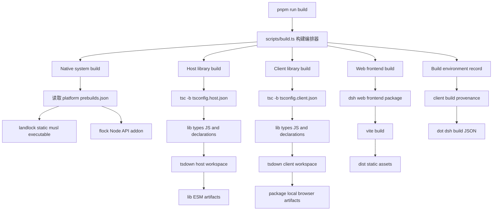

# DeepSeek Harness 构建过程与运行前静态分析

> [!NOTE]
> 本文档当前聚焦于：
>
> 1. `make setup` 中 Harness 和插件的准备、安装与构建过程；
> 2. Harness 的 Native、Host、Client、Web 构建构成；
> 3. TypeScript 增量编译机制；
> 4. `source-build`、Git submodule 污染和供应链风险；
> 5. 为后续分析 `make dev` 后台进程启动、Web 加载和 Host/Client 交互链路建立静态分析框架。
>
> 当前版本仅对已有内容重新组织和格式化。需要新增源码分析或扩写的部分以“待补充”章节表示，本轮不展开。

> [!WARNING]
> 本文中的数量、版本、文件大小和构建行为必须绑定到具体 commit、构建日志和工作目录快照。
>
> `280 个 workspace package`、`267 个含 lib/ 的包`、`293 个 .tsbuildinfo`、Host `226 references`、Client `68 references` 等数据，不应被视为仓库固定规格。

---

## 目录

1. [分析目标与范围](#1-分析目标与范围)
2. [证据基线与事实边界](#2-证据基线与事实边界)
3. [顶层工程与组件准备模型](#3-顶层工程与组件准备模型)
4. [`source-build` 与 submodule 告警](#4-source-build-与-submodule-告警)
5. [TypeScript 编译器的安装来源](#5-typescript-编译器的安装来源)
6. [Harness 总体构建过程](#6-harness-总体构建过程)
7. [Harness 编译输入](#7-harness-编译输入)
8. [Harness 构建流水线](#8-harness-构建流水线)
9. [Harness 构建产物](#9-harness-构建产物)
10. [Web 前端构建结果](#10-web-前端构建结果)
11. [插件和 submodule 构建](#11-插件和-submodule-构建)
12. [主要大体量产物](#12-主要大体量产物)
13. [Client 构建记录的含义](#13-client-构建记录的含义)
14. [增量编译机制](#14-增量编译机制)
15. [与 Makefile、CMake 的区别和联系](#15-与-makefilecmake-的区别和联系)
16. [构建告警与风险归档](#16-构建告警与风险归档)
17. [本次构建结论](#17-本次构建结论)
18. [`make dev` 静态启动链路分析](#18-make-dev-静态启动链路分析待补充)
19. [后台进程和进程拓扑](#19-后台进程和进程拓扑待补充)
20. [网页加载与 Host/Client 交互](#20-网页加载与-hostclient-交互待补充)
21. [组件装载与插件生命周期](#21-组件装载与插件生命周期待补充)
22. [待核验事项](#22-待核验事项)
23. [关键证据索引](#23-关键证据索引)
24. [名词、术语和缩略语](#24-名词术语和缩略语)

---

# 第一部分：分析范围与证据基线

## 1. 分析目标与范围

本文基于：

- `log/setup-20260915T110859Z-258716.log`
- `log/link-plugins-20260915T111629Z-328055.log`
- `log/dev-20260915T132106Z-971922.log`
- 顶层工程脚本
- Harness 构建源码
- Harness Host、Client、Web 和 Agent 相关源码

分析目标包括：

1. 分析 Harness 仓库的构建过程；
2. 分析整个 `make dev` 命令执行时，后台进程启动和网页全链路交互之前的准备过程；
3. 从静态角度分析 DeepSeek Harness 的构成；
4. 初步确认加载、启动和交互过程使用的主要组件；
5. 建立后续 Host、Client、Web、Gateway、Session Controller 和 Agent Loop 动态分析的基础。

当前已经完成的部分主要是：

- `make setup` 中 Harness 的依赖安装和构建；
- Harness Native、Host、Client 和 Web 构建；
- 顶层插件的独立构建；
- TypeScript 增量编译机制；
- 构建告警和发布风险归档。

以下内容尚未展开：

- `make dev` 完整命令调用链；
- 后台进程树和进程间关系；
- `dsh web` 的服务启动；
- 浏览器首屏加载；
- `__DSH_BOOT__` 注入；
- Client plugin loader；
- WebSocket、SSE 或其他传输链路；
- Gateway、Session Controller 和 Agent Loop 的交互。

## 2. 证据基线与事实边界

### 2.1 归档基线

- 构建对象：`oh-my-dsh` 超级工程及其 Git submodules
- 核心 Harness commit：`fb2c4b9e698e30edb738bca4cf0618587db7d203`
- 构建宿主：Linux x64，glibc
- Harness 包管理器：`pnpm@11.7.0`
- Harness 打包器：`tsdown v0.22.2`
- Harness 打包后端：`rolldown v1.1.1`
- Harness Web 构建器：`vite v6.4.3`
- 上游仓库默认分支：**`master`**（非 `main`；源码《Run from source》= `pnpm install → pnpm run build → pnpm dsh web`）
- 上游仓库：`github.com/deepseek-ai/deepseek-harness`（MIT，Everything is a Plugin，Powered by Cordis）
- 安装模式：Harness 明确为 `nonfrozen`
- 构建结果：Harness、Web 前端及日志中实际执行的插件构建均成功；存在若干兼容性、依赖打包、产物污染和供应链告警

本文只将日志中可直接证明的数量作为确定值。

此前提到的：

- `280 个 workspace package`
- `267 个含 lib/ 的包`
- `293 个 .tsbuildinfo`
- Host `226 references`
- Client `68 references`

未在本次日志中重新统计，因此不作为本次构建的直接日志结论。

### 2.2 证据强度约定

| 标记     | 含义                                               |
| :------- | :------------------------------------------------- |
| 日志确认 | 构建日志直接打印了命令、输出或结果                 |
| 源码确认 | 从绑定 commit 的源码调用链或配置中确认             |
| 现场快照 | 来自特定工作目录扫描、mtime、文件 hash 或 Git 状态 |
| 推断     | 根据日志和源码推导，但缺少动态 trace               |
| 待核验   | 当前材料不足，需要补充源码、日志或运行时采样       |

### 2.3 当前分析边界

> [!IMPORTANT]
> 本文当前主要完成“构建完成之前”的分析。
>
> `make dev` 启动后的进程拓扑、网络监听、页面加载、Client plugin 注入、Gateway 通信和 Agent 执行链路，将在后续章节补充。

---

# 第二部分：顶层工程与组件准备

### 2.4 上游与外部权威来源

本文引用的权威来源（均于 2026-09-16 抓取并核验）：

| # | 来源 | URL | 与本文档的关系 |
| :- | :- | :- | :- |
| 1 | DeepSeek Harness 官方仓库（GitHub） | <https://github.com/deepseek-ai/deepseek-harness> | “Everything is a Plugin”，Powered by **Cordis**；MIT；默认分支 **master**；Run from source = `pnpm install → pnpm run build → pnpm dsh web` |
| 2 | 官方文档站 | <https://deepseek-harness.github.io/deepseek-harness/> | 架构（`/en/reference/`）、插件教程（`/en/develop/basic/`） |
| 3 | rolldown 官方 | <https://rolldown.rs/> | tsdown 的打包后端：Rust 实现、Rollup 兼容 API、esbuild 特性对等（VoidZero Inc.） |
| 4 | Vite 官方 Build | <https://vite.dev/guide/build.html> | `vite build` 以 `<root>/index.html` 为入口，产出可静态托管的 bundle；非浏览器库可直接用 tsdown/rolldown |
| 5 | TypeScript 官方 Project References | <https://www.typescriptlang.org/docs/handbook/project-references.html> | `tsc -b`、composite、incremental、`.tsbuildinfo`、solution（`files:[]` + references）模式 |
| 6 | pnpm 官方 Motivation | <https://pnpm.io/motivation> | 符号链接 node_modules、内容寻址 store、三阶段安装 |
| 7 | tsx（TypeScript Execute） | <https://tsx.is/> | dev 期把 `.ts` 按需转译再交 Node ESM loader（对应 `node --import tsx/esm`） |

> 标 `[验]` 的事实均在本机实测；涉及版本的结论以 `package.json` / lockfile 与日志为准。

## 3. 顶层工程与组件准备模型

### 3.1 超级工程组件输入

顶层工程通过 Git submodule 固定 Harness 和 10 个插件组件，共校验 **11 个组件**，并确认与 `.gitmodules` 双向一致。

| 组件路径                             | 仓库                                                    | 固定 commit                                  |
| :----------------------------------- | :------------------------------------------------------ | :------------------------------------------- |
| `harness`                          | `https://github.com/deepseek-ai/deepseek-harness.git` | `fb2c4b9e698e30edb738bca4cf0618587db7d203` |
| `plugins/dsh-agent-teams`          | `https://github.com/NanmiCoder/dsh-agent-teams.git`   | `2e59da17918558cfa3bf91d30d40f737509cca0c` |
| `plugins/dsh-at-file`              | `https://github.com/FSMargoo/dsh-at-file.git`         | `da602d1a8f1b417b8a1d8d4059e0f4cb1c353524` |
| `plugins/dsh-automation`           | `https://github.com/michaelyaoxxx/dsh-automation.git` | `a2f60c11410935c6af23d682f1f383c9a4ffb3d0` |
| `plugins/dsh-better-sidebar`       | `https://github.com/omdsh-dev/DSH-better-sidebar.git` | `146840bb4f1b67e9b9ab8c556355613b20bd20e3` |
| `plugins/dsh-market`               | `https://github.com/dsh-market/dsh-market.git`        | `1664caec99219b4902f1686e2e34614815d38346` |
| `plugins/dsh-tui`                  | `https://github.com/ccch1mneyyy/dsh-TUI.git`          | `78081cebde1ee1b47a561ef57c04f128c5623476` |
| `plugins/dsh-web`                  | `https://github.com/zhu1090093659/dsh-web.git`        | `3e011bb9a0d3ce30ed8f008b5ebd2f1ec37a7770` |
| `plugins/loongsuite-observability` | `https://github.com/loongsuite/dsh-plugin.git`        | `f216a4989dae0f5d96a231355557abd0623edf1c` |
| `plugins/modlens`                  | `https://github.com/liustack/modlens.git`             | `a1923d016c2b617ccd1d6ef3f9e9368622841e67` |
| `plugins/modsearch`                | `https://github.com/liustack/modsearch.git`           | `7c164513d6ba824d294bcf43df9485ada3beff19` |

`plugins/dsh-tui` 还包含三级嵌套 submodule：

| 嵌套路径                                              | 仓库                                                 | 固定 commit                                  |
| :---------------------------------------------------- | :--------------------------------------------------- | :------------------------------------------- |
| `plugins/dsh-tui/dsh-auth`                          | `https://github.com/ccch1mneyyy/dsh-auth.git`      | `cc6ec5224b62b6e6508c0109ef19e93b0a5c0a0e` |
| `plugins/dsh-tui/dsh-ecosystem-spec`                | `https://github.com/T-Auto/dsh-ecosystem-spec.git` | `d28c267fe7fd775428ec2dccd65b0b7efd4dacee` |
| `plugins/dsh-tui/vendor/dsh-std`                    | `https://github.com/Yan-Zero/dsh-std.git`          | `614dfa1ac168db79fcf4577cf0ebb34e2e3b944b` |
| `plugins/dsh-tui/dsh-ecosystem-spec/vendor/dsh-std` | `https://github.com/Yan-Zero/dsh-std.git`          | `614dfa1ac168db79fcf4577cf0ebb34e2e3b944b` |

### 3.2 `prepareMode`

`source-build` 是组件准备模式 `prepareMode` 的四种取值之一。模型定义见：

- `docs/cicd/adr/0005-component-catalog-lifecycle.md` 第 41–48 行

| `prepareMode`      | 动作                                                            | 含义                                             |
| :------------------- | :-------------------------------------------------------------- | :----------------------------------------------- |
| `source-build`     | 安装依赖 →**执行 build** → 验证输出                     | 供应链政策：**现场编译**，不信任预编译产物 |
| `tracked-prebuilt` | 安装运行依赖 →**验证所有提交产物的跟踪状态** → 不 build | 使用提交仓库里的预编译产物                       |
| `install-only`     | 安装依赖，无 build                                              | 无需编译但需要安装的运行时组件                   |
| `none`             | 不准备                                                          | 排除的组件，完全不准备                           |

当前 11 个组件的实际分布：

- **source-build ×8**
  - `harness`
  - `dsh-web`
  - `dsh-better-sidebar`
  - `modlens`
  - `dsh-market`
  - `dsh-agent-teams`
  - `modsearch`
  - `loongsuite-observability`
- **tracked-prebuilt ×2**
  - `dsh-automation`
  - `dsh-at-file`
- **none ×1**
  - `dsh-tui`
  - `runtimeScope: excluded`
- `install-only`
  - 当前目录中没有组件使用

`install-only` 模式本身用于消除“`no-build` 被迫等于 excluded”的歧义。

一句话：

> `source-build` 是“源码重建”这一种供应链姿态，和“用提交的预编译产物（`tracked-prebuilt`）”、“只装依赖（`install-only`）”、“完全不准备（`none`）”是并列的选择。

## 4. `source-build` 与 submodule 告警

### 4.1 原始告警

```shell
⚠️  组件 modlens 是 source-build，但入口 dsh/index.js, dsh/client.js 已被 git 跟踪——构建可能弄脏 submodule，进而触发部署的快照保真检查
⚠️  组件 dsh-market 是 source-build，但入口 client/client.js 已被 git 跟踪——构建可能弄脏 submodule，进而触发部署的快照保真检查
⚠️  组件 modsearch 是 source-build，但入口 dsh/index.js, dsh/client.js 已被 git 跟踪——构建可能弄脏 submodule，进而触发部署的快照保真检查
```

### 4.2 告警来源

它们来自 `scripts/check-components.mjs` 的 **materialized 阶段**校验：

- `checkMaterialized()` 第 356–361 行

这是 `make setup` 里的“组件目录校验”步骤打印的。

日志里出现两次：

1. 一次普通校验；
2. 一次 `--require-materialized` 严格模式。

### 4.3 完整判断逻辑

> 组件是 `source-build`，需要现场编译；但它声明的入口，也就是 `main`、`types` 或无通配符 `exports` 目标中的构建产物，已经被 Git 跟踪。构建会向这些路径重新写文件。只要源码重建结果和提交产物不是逐字节一致，Git 就会将 submodule 标记为 dirty，进而触发部署阶段的快照保真检查。

三个组件命中的路径：

| 组件           | 被跟踪的构建产物入口                |
| :------------- | :---------------------------------- |
| `modlens`    | `dsh/index.js`、`dsh/client.js` |
| `modsearch`  | `dsh/index.js`、`dsh/client.js` |
| `dsh-market` | `client/client.js`                |

### 4.4 规则设计

两个关键设计见：

- `ADR-0005` 第 97–113 行
- `config/README.md` 第 158–170 行

#### 只报警告，不阻断

该逻辑不调用 `fail()`，因此不影响退出码。

理由是：

- 这是运维后果；
- 不是 schema 矛盾；
- 本仓可以出于供应链政策选择源码重建；
- 即使子仓提交了构建产物，也不禁止源码重建；
- 告警只是让风险可见。

#### 构建入口边界

入口只计算“构建产物”，即 `BUILDABLE_ENTRY`。

排除：

- `package.json`
- `cordis.patch.yml`
- 其他人工维护文件

原因是构建不会写入这些文件。如果算入，会对不会弄脏 submodule 的组件产生误报。

#### 不能只检查 `main`

`dsh-market` 的：

- `main`：`lib/index.js`
- `exports["./client"]`：`./client/client.js`

`main` 没有被跟踪，但 `exports["./client"]` 对应的 `client/client.js` 被跟踪。

如果只检查 `main`，会漏掉该情况。

> [!NOTE]
> `docs/remediation-plan.md` 第 321 行明确写着这三条警告是预期的，不是缺陷。

## 5. TypeScript 编译器的安装来源

### 5.1 `./node_modules/typescript/bin/tsc` 是什么

它是 TypeScript 编译器 `tsc`。

当前分析记录中的版本为：

```text
TypeScript 6.0.3
```

它不是单独安装的系统工具，而是 Harness 声明的 `devDependency`：

```json
"typescript": "^6.0.3"
```

声明位置：

- `harness/package.json` 第 221 行

### 5.2 pnpm 安装布局

安装后的路径：

```text
harness/node_modules/typescript
```

是 pnpm symlink，指向：

```text
harness/node_modules/.pnpm/typescript@6.0.3/node_modules/typescript
```

### 5.3 安装时间

现场记录：

- `harness/node_modules/typescript` mtime：
  - `2026-09-15 19:11:22 +0800`
- setup 日志开始时间：
  - `2026-09-15 11:08:59Z`
  - 本地时间 `2026-09-15 19:08:59 +0800`

因此它在本次 `make setup` 运行期间落地。

之后 9 月 16 日的 dev 日志只是运行，没有重装。

### 5.4 安装调用链

```text
make setup
    |
    v
scripts/setup.sh
    |
    v
prepare-executor.sh
    |
    v
prepare_component(harness, source-build, nonfrozen)
    |
    +--> 安装依赖
    |
    +--> 构建 harness
```

具体过程：

1. `make setup` 调用 `scripts/setup.sh`；
2. Harness 是：
   - `runtimeScope=required`
   - `prepareMode=source-build`
3. Harness 进入 `prepare-executor.sh` 的准备链路；
4. 日志第 71 行进入：
   - `安装依赖: harness（nonfrozen）`
5. `prepare_component` 调用 `pe_install harness`；
6. 安装期间设置 `CI=true`；
7. `pe_install` 检查到 Harness 存在 `pnpm-lock.yaml`；
8. 实际执行：
   - `pnpm install --frozen-lockfile`
9. Harness 声明：
   - `packageManager: "pnpm@11.7.0"`
10. Corepack 按该字段解析 pnpm pin；
11. 在 Harness 目录执行安装；
12. TypeScript 作为 Harness 的 devDependency 被安装。

日志中的“`nonfrozen`”是 `setup.sh` 传入的策略字符串。

当前分析认为，Harness 因存在 lockfile，实际执行了：

```shell
cd harness
pnpm install --frozen-lockfile
```

### 5.5 编译器使用位置

它被 Harness 的 `build:lib:host` 脚本调用：

```shell
node --max-old-space-size=4096 ./node_modules/typescript/bin/tsc -b tsconfig.host.json && tsdown --env.DSH_BUILD_FACE host
```

它属于 gitignored 的构建环境依赖，不在仓库中。

fresh clone 后需要运行安装或 `make setup` 才会出现。

---

# 第三部分：Harness 构建过程

## 6. Harness 总体构建过程

### 6.1 分析日志范围

本节主要对应：

```text
log/setup-20260915T110859Z-258716.log
```

日志范围：

```text
第 71 行到第 4040 行
```

关键源码：

- `scripts/build.ts`
- `native/system/scripts/build.ts`
- `tsconfig.base.json`
- `tsconfig.host.json`
- `tsconfig.client.json`
- `tsdown.config.ts`

### 6.2 顶层调用链

```text
make setup
    |
    v
bash scripts/setup.sh
    |
    v
prepare-executor.sh
    |
    v
prepare_component(harness, source-build, nonfrozen)
    |
    +--> 安装依赖: harness
    |       |
    |       +--> pnpm install
    |
    +--> 构建: harness
            |
            +--> pnpm build
                    |
                    +--> tsx scripts/build.ts
```

这段是 `make setup` 准备阶段中 Harness 的一次全量构建，从安装依赖到输出构建记录。

### 6.3 `scripts/build.ts`

`scripts/build.ts` 是命令式编排器，不是 Makefile。

源码第 44–46 行按顺序运行构建阶段：

| 步骤                    | 命令                                                     | 职责                                        |
| :---------------------- | :------------------------------------------------------- | :------------------------------------------ |
| `build:native-system` | `tsx native/system/scripts/build.ts --host-addon-only` | 为本机平台编译原生 addon                    |
| `build:lib`           | `build:lib:host && build:lib:client`                   | TS 类型检查、emit 和 ESM/CJS Bundle         |
| `build:web`           | Web frontend 的`vite build`                            | 浏览器静态产物                              |
| 收尾                    | `writeClientBuildRecord`                               | 记录 Client artifact 和 public build values |

最终日志：

```text
recorded 234 client artifact(s) with 2 public value(s)
```

### 6.4 构建阶段划分

本质上可划分为五类阶段：

```text
1. 原生 C 构建
2. TypeScript 类型检查与 emit
3. tsdown / Rolldown Bundle
4. Vite Web production build
5. Client build environment / artifact record
```

更准确地说：

- 这是构建编排中的五类阶段；
- 不一定是严格线性；
- 不是每次调用都一定执行全部阶段；
- 根 `build` 的实际入口是 `tsx scripts/build.ts`；
- `scripts/build.ts` 根据 profile 和参数编排具体过程。

### 6.5 构建总览



### 6.6 日志中的警告性质

以下日志项属于警告，不是本轮构建错误：

- `[PLUGIN_TIMINGS]`
- `noExternal is deprecated`
- `external is deprecated`
- `inlineDynamicImports is deprecated`
- `Some chunks are larger than 500 kB`
- `Unsupported platform`
- `INEFFECTIVE_DYNAMIC_IMPORT`

本轮构建中：

- 各阶段最终打印 `Build complete`；
- Vite production build 完成；
- Client artifact record 正常生成；
- 因此本轮属于成功构建。

## 7. Harness 编译输入

### 7.1 编译输入总表

| 类别                | 实际输入                                                                                                                                      |
| :------------------ | :-------------------------------------------------------------------------------------------------------------------------------------------- |
| 原生 C 源码         | `native/system/packages/entry/src/main.c` 和 `native/system/packages/entry/src/flock.c`                                                   |
| 原生构建元数据      | 各平台包的`prebuilds.json` 是 `native/system/scripts/build.ts` 的直接构建输入                                                             |
| 平台约束            | 平台包`package.json` 中的 `os`、`cpu`、`libc`                                                                                         |
| TypeScript/TSX 源码 | Host/Client solution tsconfig 引用的`vendor/*`、`packages/*/*`、`apps/cli`、`apps/desktop`、`apps/desktop-host` 和 Client UI 等源码 |
| TypeScript 工程图   | `tsconfig.host.json` 和 `tsconfig.client.json` 驱动两棵 project-reference 构建图                                                          |
| TypeScript 中间产物 | 主要为`lib/types/**/*.js`                                                                                                                   |
| 直接源码入口特例    | `dsh-experimental-webworker-runtime` 的部分构建直接使用 `src/index.ts`、`src/client/index.ts` 和 `src/worker.ts`                      |
| 打包配置            | 根`tsdown.config.ts` 和各 package/app 的局部 `tsdown.config.ts`                                                                           |
| Web 输入            | `apps/web` 前端源码、Vite 配置、Harness Client bundles、CSS、字体、代码高亮语言模块及 preview worker/bootstrap                              |
| 依赖输入            | `package.json`、`pnpm-workspace.yaml`、`pnpm-lock.yaml` 和安装后的依赖闭包                                                              |
| 原生工具链          | Node.js、Node development headers、`cc`、`musl-gcc`                                                                                       |
| TS/Web 工具链       | `pnpm@11.7.0`、TypeScript、`tsx`、`tsdown v0.22.2`、`rolldown v1.1.1`、Vite `v6.4.3`、Typert generator plugin                       |

### 7.2 Native 输入

`native/system/scripts/build.ts` 读取各 platform package 的 `prebuilds.json`。

`prebuilds.json` 声明：

- 目标平台；
- binary kind；
- 输出路径；
- Node-API 版本；
- libc。

C 源码：

- `main.c`
  - 用于 `landlock-run`
- `flock.c`
  - 用于 Node-API addon

原生工具链参数包括：

```text
-std=c11
-O2
-Wall
-Wextra
-Werror
-fPIC
-fvisibility=hidden
-DNAPI_VERSION=8
```

Node 头文件来自运行中 Node 对应的：

```text
../include/node
```

Linux 工具链：

- glibc：`cc`
- musl：`musl-gcc`

macOS 工具链：

```text
cc -bundle -undefined dynamic_lookup
```

编译过程先写临时目录，再通过原子 rename 放置最终产物，以避免并发读取到不完整文件。

> [!IMPORTANT]
> “只构建本机 libc 匹配的 Node-API 项”只适用于本次使用的 `--host-addon-only` 路径，不能推广到完整原生构建模式。

### 7.3 TypeScript 工程输入

Host 和 Client 分别使用：

```shell
tsc -b tsconfig.host.json
tsc -b tsconfig.client.json
```

这是两棵 project-reference 图。

聚合根采用 solution-style tsconfig：

- `files: []`
- 根配置本身不直接 emit；
- 通过 `references` 调度 composite projects。

各 package 通常继承：

```text
tsconfig.base.json
```

并启用：

- `composite`
- `incremental`
- `outDir: lib/types`

典型 emit：

- `*.js`
- `*.js.map`
- `*.d.ts`
- 增量状态文件

Host 和 Client 分开构建的原因，是两面需要 merge Cordis Context，同一个 TypeScript program 不能同时看到两边。

### 7.4 tsdown 输入

tsdown 的主要输入来自：

```text
lib/types/**/*.js
```

例如：

- `lib/types/bin.js`
- `lib/types/index.js`
- `lib/types/invariant.js`
- `lib/types/startup.js`
- `lib/types/worker.js`

但不能将所有 tsdown 输入概括为 `lib/types/*.js`。

明确特例：

- `dsh-experimental-webworker-runtime`
  - `src/index.ts`
  - `src/client/index.ts`
  - `src/worker.ts`

Host 和 Client 的 workspace 范围、默认入口和 package-local override 不相同。

Client 默认 entry 可能为空，需要由 package-local 配置提供。

## 8. Harness 构建流水线

### 8.1 实际构建顺序

| 顺序 | 命令                                                      | 作用                                                  |
| ---: | :-------------------------------------------------------- | :---------------------------------------------------- |
|    1 | `tsx scripts/build.ts`                                  | Harness 顶层构建编排                                  |
|    2 | `tsx native/system/scripts/build.ts --host-addon-only`  | 构建当前宿主匹配的 Node-API addon                     |
|    3 | `tsc -b tsconfig.host.json`                             | Host project-reference 类型检查与 emit                |
|    4 | `tsdown --env.DSH_BUILD_FACE host`                      | Host workspace 打包                                   |
|    5 | `tsc -b tsconfig.client.json`                           | Client project-reference 类型检查与 emit              |
|    6 | `tsdown --env.DSH_BUILD_FACE client`                    | Client workspace、Client loader 和 UI bundles 打包    |
|    7 | `pnpm --filter @deepseek-ai/dsh-web-frontend run build` | 调用`apps/web` 的 Vite production build             |
|    8 | Client artifact recorder                                  | 写入 Client artifact 与 public build value 的构建记录 |

### 8.2 TypeScript emit 层

`tsc -b` 不只是类型检查。

它还可能生成：

- JavaScript；
- 类型声明；
- sourcemap；
- `.tsbuildinfo`。

因此“类型层”名称不完整，更准确的名称是：

> TypeScript 类型检查、工程调度和 emit 层。

### 8.3 tsdown / Rolldown 层

tsdown 使用 Rolldown 后端。

根 `tsdown.config.ts`：

- 根据 `DSH_BUILD_FACE` 选择 Host 或 Client；
- 枚举对应 workspace；
- 配置默认 entry；
- 指向 `lib/types` 或 package-local entry；
- `dts: false`
  - 声明文件由 TypeScript 生成；
- `clean: false`
  - 默认不清空所有输出目录。

各 package 可以通过本地 `tsdown.config.ts` 覆盖：

- entry；
- format；
- platform；
- target；
- code splitting；
- external / bundle policy；
- CSS；
- Worker；
- Electron preload；
- CLI shebang。

典型输出：

- ESM；
- CJS；
- IIFE；
- Worker bundle；
- hashed chunks；
- CSS；
- sourcemap。

### 8.4 Vite Web 层

Web 构建命令：

```shell
pnpm --filter @deepseek-ai/dsh-web-frontend run build
```

实际 package path：

```text
apps/web
```

执行：

```shell
vite build
```

输出：

```text
apps/web/dist
```

### 8.5 构建记录层

最终日志：

```text
build: recorded 234 client artifact(s) with 2 public value(s)
```

该阶段更接近：

- Client build environment；
- 构建版本来源；
- 构建 provenance；
- Harness Client artifact record。

不能简单等价为整个超级工程的全量产物清单。

## 9. Harness 构建产物

### 9.1 构建产物总表

| 阶段            | 产物                                                                                             | 本次日志证据与说明                                           |
| :-------------- | :----------------------------------------------------------------------------------------------- | :----------------------------------------------------------- |
| Native          | `native/system/packages/linux-x64/bin/glibc/system.node`                                       | 日志明确显示`build: built linux-x64/bin/glibc/system.node` |
| TypeScript emit | `lib/types/**/*.js` 及配置启用时的声明文件和 sourcemap                                         | tsdown 日志大量显示`entry: lib/types/*.js`                 |
| Host ESM        | `lib/index.js`、`lib/invariant.js`、`lib/startup.js`、`lib/bin.js`、`lib/runner.js` 等 | 多数 Host package target 为 ES2024                           |
| Host CJS 特例   | `preload.cjs`、`preload-app.cjs`、`worker.cjs`                                             | Electron preload、Node worker 和线程隔离场景                 |
| 双格式模块      | `vendor/schemastery/lib/index.mjs` 和 `index.cjs`                                            | ESM/CJS 两套输出                                             |
| Hashed chunks   | `profile-boot-Dk-7KqJc.js`、`plugin-Ddi42qoW.js`、`repository-Lozj5Dm5.js` 等              | 多入口共享和 code splitting                                  |
| CSS             | `base.css`、`boot-page.module.css` 和多个 `*.module.css`                                   | package-local 配置生成                                       |
| Client loader   | `packages/*/*/lib/client.js` 和 `client.js.map`                                              | 多数`/client` 构建在日志中标记为 CJS                       |
| Web Worker      | `dsh-experimental-webworker-runtime/lib/worker.js` 和 map                                      | Worker target 为 ES2022                                      |
| Web 前端        | `apps/web/dist/**/*`                                                                           | Vite production build                                        |
| Client 构建记录 | Client artifact record                                                                           | 记录 234 个 Client artifacts 和 2 个 public values           |

### 9.2 Native 产物边界

本次执行：

```shell
tsx native/system/scripts/build.ts --host-addon-only
```

本轮只确认生成：

```text
native/system/packages/linux-x64/bin/glibc/system.node
```

本次日志没有证明同时构建：

- `landlock-run`
- musl addon
- 其他平台预构建产物

### 9.3 `lib/bin.js` 的归属

本次日志中至少有两个 package 生成并设置了 `lib/bin.js` 的执行权限：

| Package                                            | 打包入口                                     | 输出                          | 日志证据                                                             |
| :------------------------------------------------- | :------------------------------------------- | :---------------------------- | :------------------------------------------------------------------- |
| `@deepseek-ai/dsh`                               | `lib/types/bin.js`                         | `apps/cli/lib/bin.js`       | `Granting execute permission to lib/bin.js`；9.16 kB，gzip 3.18 kB |
| `@deepseek-ai/dsh-experimental-webworker-packer` | `lib/types/index.js`、`lib/types/bin.js` | 对应 package 的`lib/bin.js` | `Granting execute permission to lib/bin.js`；3.20 kB，gzip 1.44 kB |

因此：

- `lib/bin.js` 不是仓库级全局唯一文件；
- 它是相对于各 package 工作目录的输出路径；
- 不是所有 package 的默认产物；
- 执行权限由 tsdown 的 shebang/CLI 后处理完成。

### 9.4 模块格式边界

Harness Client 构建中大量生成：

```text
client.js
```

其中很多在日志中标记为 CJS loader bundle。

因此不能仅根据 `.js` 扩展名判断：

- ESM；
- CJS；
- 浏览器运行语义；
- Node.js 运行语义。

应同时检查：

- package `type`；
- tsdown `format`；
- package-local config；
- runtime loader。

## 10. Web 前端构建结果

### 10.1 Package 和目录映射

Package name：

```text
@deepseek-ai/dsh-web-frontend
```

Repository path：

```text
apps/web
```

Output path：

```text
apps/web/dist
```

### 10.2 Vite 构建结果

| 指标                  |      数值 |
| :-------------------- | --------: |
| Vite 版本             | `6.4.3` |
| 转换模块数            |       349 |
| 构建耗时              |    4.02 s |
| Client artifact 数    |       234 |
| Public build value 数 |         2 |

### 10.3 主要输出类型

- `dist/index.html`
- `dist/assets/*.js`
- `dist/assets/*.css`
- `dist/assets/fonts/*`
- `dist/assets/langs/*`
- `dist/preview/worker-*.js`
- `dist/preview/bootstrap-*.js`
- 对应 sourcemap

### 10.4 日志路径和磁盘路径

日志中的 `dist/**` 相对于：

```text
apps/web
```

真实落点：

```text
<repo>/harness/apps/web/dist/**
```

| 日志路径                        | 真实磁盘位置                                  | 日志证据    |
| :------------------------------ | :-------------------------------------------- | :---------- |
| `dist/index.html`             | `harness/apps/web/dist/index.html`，0.68 kB | L3945       |
| `dist/assets/*.js`、`*.css` | `harness/apps/web/dist/assets/`             | L3941–4040 |
| `dist/assets/fonts/*`         | `harness/apps/web/dist/assets/fonts/`       | 同上        |
| `dist/assets/langs/*`         | `harness/apps/web/dist/assets/langs/`       | 同上        |
| `dist/preview/*`              | `harness/apps/web/dist/preview/`            | 同上        |

### 10.5 Web 伺服边界

`apps/cli` 中的 `dsh web` 将：

```text
apps/web/dist/
```

作为静态站点伺服。

裸 `vite serve` 会被：

```text
apps/web/vite.config.ts
```

中的 `rejectStandaloneServe` 拒绝。

缺少 `__DSH_BOOT__` 注入时，独立伺服没有完整运行意义。

> [!TODO] Todo
> 后续需要结合 `apps/cli`、`apps/web/vite.config.ts` 和 `apps/web/src`，分析 `__DSH_BOOT__` 的生成、注入和消费过程。

---

# 第四部分：插件和 submodule 构建

## 11. 插件和 submodule 构建

### 11.1 构建方式

顶层超级工程没有将所有插件统一纳入 Harness workspace。

各组件采用：

- 独立安装；
- 独立构建；
- 独立 pnpm/npm 版本；
- 独立 TypeScript；
- 独立 tsdown/Rolldown；
- 独立 Vite；
- 独立 source-build 或 tracked-prebuilt 策略。

### 11.2 组件构建策略及结果

| 组件                                 | 安装/构建策略                                                                                              | 本次结果                                |
| :----------------------------------- | :--------------------------------------------------------------------------------------------------------- | :-------------------------------------- |
| `harness`                          | `pnpm@11.7.0`，nonfrozen install，源码构建                                                               | 成功                                    |
| `plugins/dsh-web`                  | `pnpm@11.24.0`，执行 `pnpm -r build`                                                                   | 成功；Scope 为 20/21 workspace projects |
| `plugins/dsh-better-sidebar`       | `pnpm@11.8.0`，清理 `lib/` 后执行 `tsc` 和 tsdown                                                    | 成功                                    |
| `plugins/modlens`                  | 无`packageManager`，使用 Harness pin 的 `pnpm@11.7.0`；安装使用 `--frozen-lockfile --ignore-scripts` | Vite 构建成功                           |
| `plugins/dsh-automation`           | `pnpm@10.32.1`，`prepareMode=tracked-prebuilt`                                                         | 跳过源码构建                            |
| `plugins/dsh-market`               | 使用 npm 和`package-lock.json`                                                                           | TypeScript + tsdown 构建成功            |
| `plugins/dsh-agent-teams`          | 因旧式 overrides，使用`pnpm@10.33.0`                                                                     | TypeScript + tsdown 构建成功            |
| `plugins/dsh-at-file`              | `prepareMode=tracked-prebuilt`                                                                           | 跳过源码构建                            |
| `plugins/modsearch`                | 使用 Harness pin 的`pnpm@11.7.0`；安装使用 `--frozen-lockfile --ignore-scripts`                        | Vite 构建成功                           |
| `plugins/loongsuite-observability` | `pnpm@10.28.2`，执行 `tsc -p tsconfig.build.json`                                                      | 成功                                    |
| `plugins/dsh-tui`                  | `runtimeScope=excluded`                                                                                  | 未进入本次运行时部署构建                |

顶层日志将组件阶段标记为 `nonfrozen`，但部分无 `packageManager` 的子仓实际安装命令仍使用：

```shell
--frozen-lockfile --ignore-scripts
```

因此不能将整个超级工程统一描述为：

- frozen；
- nonfrozen。

必须按组件记录。

### 11.3 `plugins/dsh-web`

使用：

- `tsdown v0.22.2`
- `rolldown v1.1.5`

主要产物：

- Host/registration ESM：
  - `lib/index.js`
  - `lib/invariant.js`
- Client CJS：
  - `lib/client.js`
  - `lib/client.js.map`
- CLI ESM：
  - `lib/cli.mjs`
  - hashed chunks
- 聚合入口：
  - `dsh-web-all/lib/client.js`
- Live2D IIFE：
  - `dsh-pet/lib/live2d-vendor.js`

### 11.4 `plugins/dsh-better-sidebar`

使用：

- `tsdown v0.22.14`
- `rolldown v1.2.5`
- Host target：ES2024
- Client chunk target：Node 20.0.0
- 构建前显式删除 `lib/`

### 11.5 其他插件

| 组件                                 | 主要产物                |   Raw size |  Gzip size |
| :----------------------------------- | :---------------------- | ---------: | ---------: |
| `plugins/modlens`                  | `dist/main.js`        |  200.62 kB |   51.34 kB |
| `plugins/modsearch`                | `dist/main.js`        |  122.18 kB |   32.39 kB |
| `plugins/dsh-market`               | `client/client.js`    |  567.56 kB |  124.63 kB |
| `plugins/dsh-agent-teams`          | `lib/client.js`       |  197.75 kB |   42.95 kB |
| `plugins/loongsuite-observability` | TypeScript build output | 日志未报告 | 日志未报告 |

## 12. 主要大体量产物

### 12.1 Harness Host、Worker 和工具 Bundle

| Package/文件                                         |  Raw size | Gzip size | 说明                                     |
| :--------------------------------------------------- | --------: | --------: | :--------------------------------------- |
| `dsh-tool-cordis/lib/index.js`                     | 500.90 kB | 110.10 kB | 单文件 Host/tool bundle                  |
| `dsh-experimental-webworker-runtime/lib/worker.js` | 705.27 kB | 163.75 kB | 内联 Buffer、stream、hash、parser 等依赖 |
| `dsh-session-persistence-jsonl/lib/worker.cjs`     | 465.45 kB | 112.19 kB | CJS worker                               |
| `dsh-experimental-inspector/lib/worker.js`         | 261.63 kB |  55.24 kB | Inspector worker                         |
| `dsh-typert-generator/lib/index.js`                | 198.73 kB |  45.57 kB | Typert generator                         |

### 12.2 Harness Client Bundle

| Package/文件                                            |  Raw size |  Gzip size | 主要内联依赖或说明                                    |
| :------------------------------------------------------ | --------: | ---------: | :---------------------------------------------------- |
| `dsh-client-ui-sidebar-documentpreview/lib/client.js` |   6.89 MB | 日志未给出 | 内联`pdfjs-dist` 和 `clsx`；连同 map 总计 8.48 MB |
| `dsh-client-ui-conversation/lib/client.js`            | 647.08 kB |  162.01 kB | 内联 Lexical 和多个`@lexical/*`                     |
| `dsh-client-ui-trajectory/lib/client.js`              | 392.78 kB |   81.55 kB | 内联 TanStack virtual 和`diff`                      |
| `dsh-client-ui-chat/lib/client.js`                    | 370.02 kB |   83.26 kB | Client CJS bundle                                     |
| `dsh-api-remotes/lib/client.js`                       | 329.87 kB |   41.49 kB | 日志提示内联`zod`                                   |
| `dsh-cordis-client-runner/lib/client.js`              | 262.52 kB |   48.92 kB | Cordis Client runtime                                 |
| `dsh-client-connection/lib/client.js`                 | 221.77 kB |   55.65 kB | Client connection runtime                             |

### 12.3 Vite Web chunks

| 文件                                   |  Raw size |  Gzip size |   Sourcemap |
| :------------------------------------- | --------: | ---------: | ----------: |
| `dist/assets/vendor-CCJJTK99.js`     | 740.58 kB |  179.52 kB | 2,509.98 kB |
| `dist/assets/langs/cpp-DIPi6g--.js`  | 637.59 kB |   47.26 kB |   831.50 kB |
| `dist/assets/index-BKQ_L1z6.js`      | 555.96 kB |  192.29 kB | 1,466.84 kB |
| `dist/assets/langs/ruby-5eNB0pDK.js` | 425.79 kB |   41.34 kB |   579.27 kB |
| `dist/preview/worker-C8-_ANaz.js`    | 295.41 kB | 日志未给出 |  日志未给出 |

Vite 已报告多个 minified chunk 超过 500 kB。

raw/gzip size 是输出文件尺寸，不等价于：

- JavaScript 解析后内存；
- 运行时堆占用；
- 完整首屏传输量；
- 初始化 CPU 开销。

### 12.4 `plugins/dsh-web` 大体量产物

| Package/文件                        |  Raw size |  Gzip size | 说明                                         |
| :---------------------------------- | --------: | ---------: | :------------------------------------------- |
| `dsh-web-all/lib/client.js`       |   2.43 MB | 日志未给出 | 聚合 Client bundle；与 map 合计 6.23 MB      |
| `dsh-ssh/lib/client.js`           | 808.64 kB |  167.63 kB | 内联`@xterm/xterm` 和 `@xterm/addon-fit` |
| `dsh-pet/lib/live2d-vendor.js`    | 780.38 kB |  213.58 kB | IIFE；内联 Pixi/Live2D 相关依赖              |
| `skin-center/lib/index.js`        | 357.82 kB |   96.87 kB | 存在 ineffective dynamic import 告警         |
| `dsh-remote-web-ui/lib/client.js` | 242.01 kB |   59.90 kB | 内联`clsx` 和 `qrcode.react`             |
| `dsh-task-board/lib/client.js`    | 213.50 kB |   50.08 kB | Client CJS                                   |
| `dsh-pet/lib/client.js`           | 163.56 kB |   41.60 kB | Client CJS                                   |

### 12.5 `plugins/dsh-better-sidebar` 大体量产物

| 文件                       |  Raw size |  Gzip size | 说明                                                             |
| :------------------------- | --------: | ---------: | :--------------------------------------------------------------- |
| `lib/client-mermaid.js`  |   7.02 MB | 日志未给出 | 与 map 合计 19.19 MB；内联 Mermaid、D3、Cytoscape、KaTeX 等依赖  |
| `lib/client-editor.js`   |   2.10 MB | 日志未给出 | 与 map 合计 5.77 MB；内联 CodeMirror、多语言 parser 和 DOMPurify |
| `lib/client-registry.js` | 924.38 kB |  234.59 kB | map 为 7.53 MB                                                   |
| `lib/client.js`          | 924.17 kB |  234.56 kB | map 为 7.53 MB                                                   |
| `lib/client-locale.js`   | 705.88 kB |  199.16 kB | Client locale chunk                                              |
| `lib/client-terminal.js` | 548.28 kB |  125.53 kB | 内联 Xterm                                                       |
| `lib/index.js`           | 190.76 kB |   55.24 kB | Host ESM                                                         |

## 13. Client 构建记录的含义

Harness 最终报告：

```text
build: recorded 234 client artifact(s) with 2 public value(s)
```

该数值表示 Harness 自身 Client artifact recorder 所记录的产物数量。

它不是：

- 整个 `oh-my-dsh` 超级工程的全部文件数；
- 11 个顶层 submodule 的全部输出数；
- 所有 `lib/`、`dist/`、Native addon 和 sourcemap 的总数；
- 后续独立构建的社区插件产物数量。

后续组件，例如：

- `plugins/dsh-web`
- `dsh-better-sidebar`
- `modlens`
- `dsh-market`

是在 Harness artifact record 生成之后继续构建，因此不应计入这 234 个 Harness Client artifacts。

---

# 第五部分：增量编译

## 14. 增量编译机制

### 14.1 是否支持增量编译

**结论：支持，但需要分层看。**

- TypeScript 编译层由 `tsc -b` 提供真正的、基于工程依赖图和类型签名的增量构建。
- tsdown 打包层会重新执行匹配到的 Bundle task；当前日志不能证明其实现了“只重建发生变化的 package”。
- Native、Vite 和插件子仓分别使用各自的构建机制，不能统一归类为 TypeScript 语义增量。
- 因此更准确的表述是：该构建系统包含 TypeScript 语义增量能力，但整条超级工程流水线并非端到端语义增量。

### 14.2 分层增量机制

| 层级                  | 增量机制                                                                       | 本次日志能够证明的内容                                 | 证据边界                                      |
| :-------------------- | :----------------------------------------------------------------------------- | :----------------------------------------------------- | :-------------------------------------------- |
| `tsc -b`            | 基于 project references；使用`.tsbuildinfo` 保存文件版本、声明签名和依赖状态 | 实际执行 Host 和 Client build mode                     | 没有`--verbose`，看不到具体 skip 和 rebuild |
| TypeScript 跨工程传播 | `references` 定义工程级 DAG；工程内部 import 图由编译器分析                  | 采用 Host/Client solution-style tsconfig               | 无法仅凭普通日志确认下游 skip                 |
| `.tsbuildinfo`      | 保存版本、签名和构建状态                                                       | 现场扫描曾看到 293 个文件                              | 不是本次日志直接输出，不等于 293 个 package   |
| tsdown                | 对 entry 执行 ESM/CJS/IIFE/Worker Bundle                                       | Host 和 Client 均执行；Client 出现`Cleaning 5 files` | `clean:false` 不证明 package-level cache    |
| Vite Web              | 对模块图执行 production bundle                                                 | 本次转换 349 个模块并生成`dist`                      | 未证明跨进程持久化 Bundle cache               |
| Native C/Node-API     | 由原生脚本驱动                                                                 | 本轮生成 glibc`system.node`                          | 未显示 object reuse、ccache 或 mtime skip     |
| 插件子仓              | 各自使用`tsc`、tsdown、Vite 或预构建                                         | 部分源码构建，部分跳过                                 | 不存在统一增量协议                            |
| 清理/强制重建         | `tsc -b --force`；清理脚本删除生成目录和状态                                 | `dsh-better-sidebar` 显式删除 `lib/`               | 仓库级 clean 范围需看脚本                     |

### 14.3 为什么称 `tsc -b` 为语义级增量

Make 最基本的增量判断通常是：

1. 目标文件是否存在；
2. prerequisite 的 mtime 是否新于 target；
3. 如果是，则执行对应 recipe。

`tsc -b` 不只看源文件是否变化，还保存和比较 TypeScript 编译状态，特别是文件版本与声明签名。

示例：

```text
A source implementation changed
        |
        v
A public declaration signature changed?
        |
   +----+----+
   |         |
  No        Yes
   |         |
B may      B becomes
remain     affected
up-to-date
```

如果工程 A 的实现变化没有改变其对外可见的类型声明，工程 B 通常不需要因为该实现变化而重新进行完整类型检查或 emit。

但需要注意：

- 这一能力属于 `tsc -b`；
- 不代表 tsdown、Vite、Native 或插件构建一定跳过；
- Bundle 是否需要重建还取决于运行时代码，而不仅是 `.d.ts`。

```text
A implementation changed
    |
    +--> A declaration signature unchanged
    |        |
    |        +--> TypeScript downstream B may remain up-to-date
    |
    +--> A runtime JavaScript changed
             |
             +--> Bundle containing A may still need to rebuild
```

### 14.4 本次日志是否证明增量命中

**不能仅靠当前日志给出强结论。**

日志中有两组明显不同的完成时间：

- Host face 中大量 task 在约 8.1～8.5 秒完成；
- Client face 中部分重叠 task 在约 1.1～1.3 秒完成。

这可能受益于：

- 已生成的 `lib/types`；
- 操作系统 page cache；
- Node 模块已加载或文件已热缓存；
- `.tsbuildinfo`；
- Rolldown/tsdown 进程内或文件级复用；
- Host 和 Client 入口集合不同；
- Host 和 Client 工作量不同。

但不能直接推导出：

- tsdown 只重建了变化的 package；
- 第二轮命中了完整增量缓存；
- 单包构建时间从 8 秒降到 1 秒。

原因是日志中的 `Build complete in ...` 来自并行 task，Host/Client 又是不同构建面，不是完全相同输入的严格 A/B 重复构建。

### 14.5 增量构建验证建议

```shell
# 查看 TypeScript 对每个 project 的判定
pnpm exec tsc -b tsconfig.host.json --verbose
pnpm exec tsc -b tsconfig.client.json --verbose

# 完全不修改源码，再执行一次
/usr/bin/time -v pnpm run build:lib:host
/usr/bin/time -v pnpm run build:lib:client

# 修改一个只影响实现、不改变公开类型的文件，再执行
/usr/bin/time -v pnpm run build:lib:host

# 修改公开类型，再执行，观察受影响引用子图
/usr/bin/time -v pnpm run build:lib:host
```

建议记录：

- `tsc -b --verbose` 中 up-to-date/out-of-date project 数量；
- `.tsbuildinfo` 的 mtime 和 hash；
- `lib/types` 中实际变化的文件；
- 最终 `lib` 中实际变化的文件；
- tsdown/Rolldown metafile 或 trace；
- wall time；
- CPU time；
- major/minor page fault；
- 峰值 RSS。

---

# 第六部分：与传统构建系统的关系

## 15. 与 Makefile、CMake 的区别和联系

### 15.1 概念联系

三者都围绕同一个核心问题：

> 建立目标和依赖关系，并在输入变化后只执行必要的构建动作。

概念映射：

| 当前构建系统                                                       | Make/CMake 世界中的近似角色                                              |
| :----------------------------------------------------------------- | :----------------------------------------------------------------------- |
| `tsconfig.host.json`、`tsconfig.client.json` 的 `references` | 工程级 target dependency DAG                                             |
| 工程内部 TypeScript import 图                                      | C/C++ source/include dependency graph                                    |
| `.tsbuildinfo`                                                   | 编译器增量状态数据库；近似 Ninja deps/log 加编译器语义状态，但不严格等价 |
| `tsc -b`                                                         | 编译器内建 build orchestrator                                            |
| tsdown                                                             | Bundle/转译阶段；流水线位置近似链接器，但功能和语义不同                  |
| Vite                                                               | Web module bundler 和资源 pipeline                                       |
| Native build script                                                | C/Node-API 子构建规则                                                    |
| 顶层`Makefile`                                                   | 超级工程统一命令入口或薄包装                                             |
| 清理脚本                                                           | `make clean` 或 CMake build-directory cleanup                          |

### 15.2 核心区别

| 维度       | Makefile                                               | CMake                                    | `tsx scripts + tsc -b + tsdown + Vite`                            |
| :--------- | :----------------------------------------------------- | :--------------------------------------- | :------------------------------------------------------------------ |
| 定位       | 通用规则执行器                                         | 构建系统生成器                           | TypeScript/Node/Web monorepo 组合式构建系统                         |
| 依赖图来源 | 开发者声明 prerequisite；头文件依赖通常由 depfile 生成 | `CMakeLists.txt` 声明 target           | `tsconfig references` 加编译器和 bundler 自动模块图               |
| 增量判定   | 默认主要基于 mtime                                     | 由 Ninja/Make/MSBuild 后端执行           | `tsc -b` 使用 `.tsbuildinfo` 和类型签名                         |
| 增量粒度   | 规则 target                                            | 通常逐 translation unit 和 target        | TypeScript 工程级、文件级和签名级；Bundle 常以 package/entry 为边界 |
| 配置入口   | `Makefile`                                           | `CMakeLists.txt`、toolchain 和 options | `package.json`、tsconfig、tsdown config、Vite config 和 tsx 脚本  |
| 中间状态   | target、mtime、depfile、stamp                          | build dir、CMake cache、deps/log、object | `.tsbuildinfo`、`lib/types`、`lib`、`dist` 和工具缓存       |
| 语言模型   | 语言无关，不理解类型语义                               | 强于 C/C++ target 和 toolchain           | 理解 TypeScript module/type system                                  |
| 跨平台能力 | 取决于 shell 和规则                                    | CMake 强项                               | Node/TS 层跨平台，Native 需单独处理 OS/CPU/libc                     |
| 事实源     | Make rules                                             | CMake target declarations                | manifest、tsconfig references 和 package-local bundler config       |

### 15.3 根目录 Makefile 的角色

从当前日志看，根目录 Makefile 更接近统一操作入口，而不是具体增量判定引擎。

```text
make setup / make dev
          |
          v
顶层 Shell/Node 编排脚本
          |
          +--> submodule 校验与初始化
          +--> Harness install/build
          +--> 插件独立 install/build
          +--> tracked-prebuilt 组件跳过
          +--> 最终启动命令
```

真正负责构建判定的是：

- `tsc -b`
  - TypeScript 工程 DAG、语义增量和 emit
- tsdown/Rolldown
  - package entry Bundle、格式转换和 code splitting
- Vite
  - Web module graph 和静态资源构建
- Native build script
  - Node-API addon
- 插件自身构建器
  - `tsc`
  - tsdown
  - Vite
  - tracked prebuilt

因此不能简单说：

> `scripts/build.ts` 就是 Makefile。

更准确地说：

> `scripts/build.ts` 承担了 Make recipe/orchestrator 的部分职责，而 `tsc -b`、tsdown、Vite 和插件构建器分别维护各自领域内的依赖图与增量状态。

### 15.4 为什么不直接使用 Make/CMake 管理全部 TypeScript 构建

如果使用 Make 手写一套 TypeScript 文件依赖规则，会形成两套依赖事实源：

```text
TypeScript import/references graph
              +
Makefile prerequisite graph
```

两者漂移可能导致：

- 修改源码但 Make 未触发必要构建；
- Make 触发过多无效重建；
- 新增 project reference 后忘记同步 Makefile；
- `.d.ts` 传播关系与运行时代码打包关系混淆；
- Host、Client、Worker 和 Web entry 边界不一致。

让 TypeScript 编译器处理类型依赖图、让 bundler 处理运行时 module graph，通常比 Make 复制这些关系更可靠。

但 Make/CMake 仍有价值：

- Make 适合统一顶层入口；
- CMake 适合复杂 Native addon、多平台工具链和交叉编译；
- Ninja 适合大规模细粒度并行调度；
- ccache/sccache 适合 Native 编译缓存；
- 顶层系统可负责跨语言 artifact DAG、发布、测试和部署。

如果 Native 子系统扩大，可以采用：

```text
Top-level Make/Task runner
          |
          +--> tsc -b          TypeScript semantic build
          +--> tsdown/Vite     JS/Web bundling
          +--> CMake + Ninja   Native multi-platform build
                    |
                    +--> ccache/sccache
```

### 15.5 一句话总结

> 该仓库的 TypeScript 层由 `tsc -b
