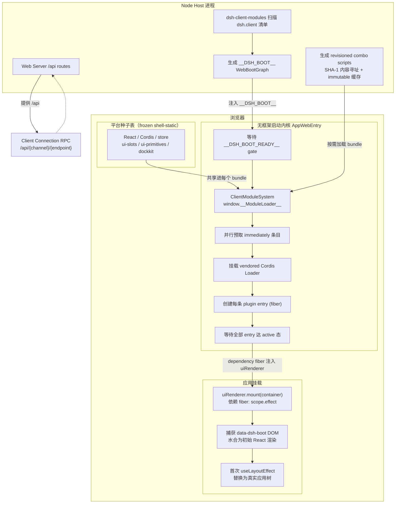
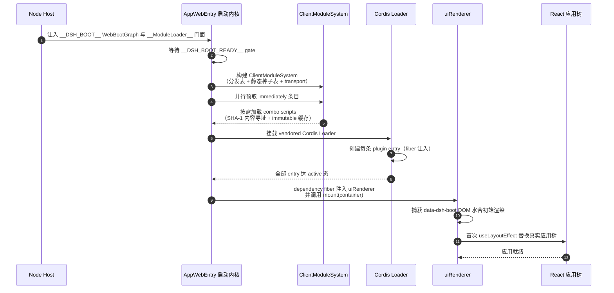
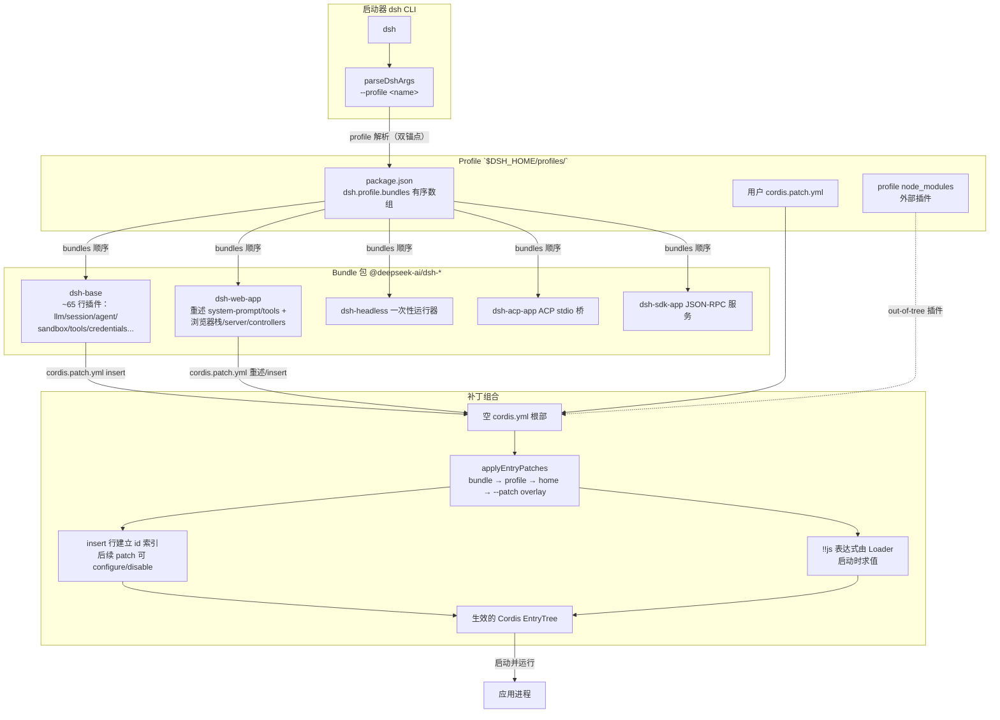
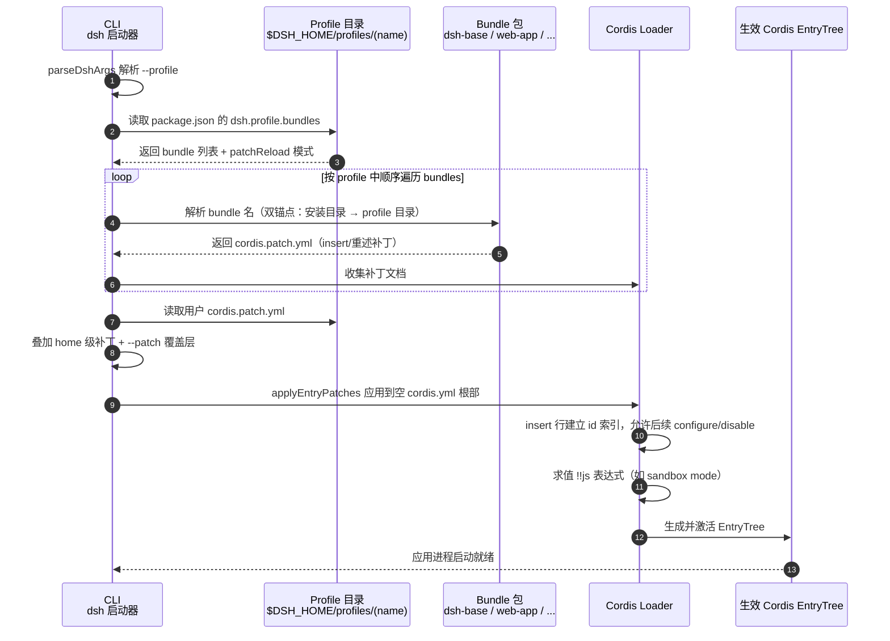
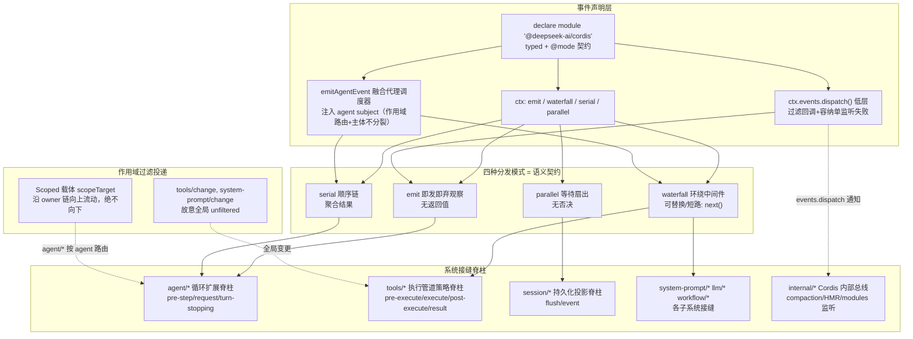
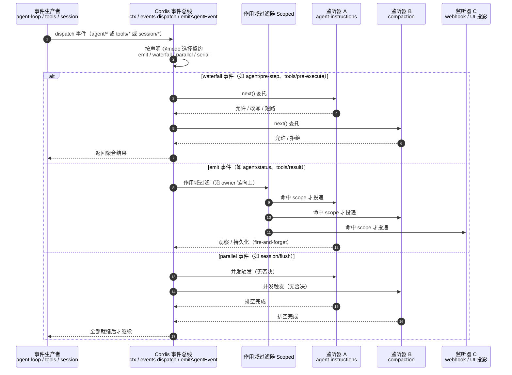
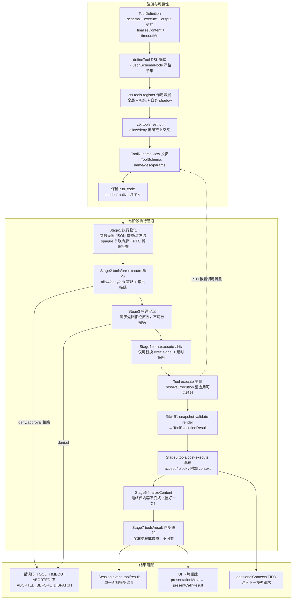
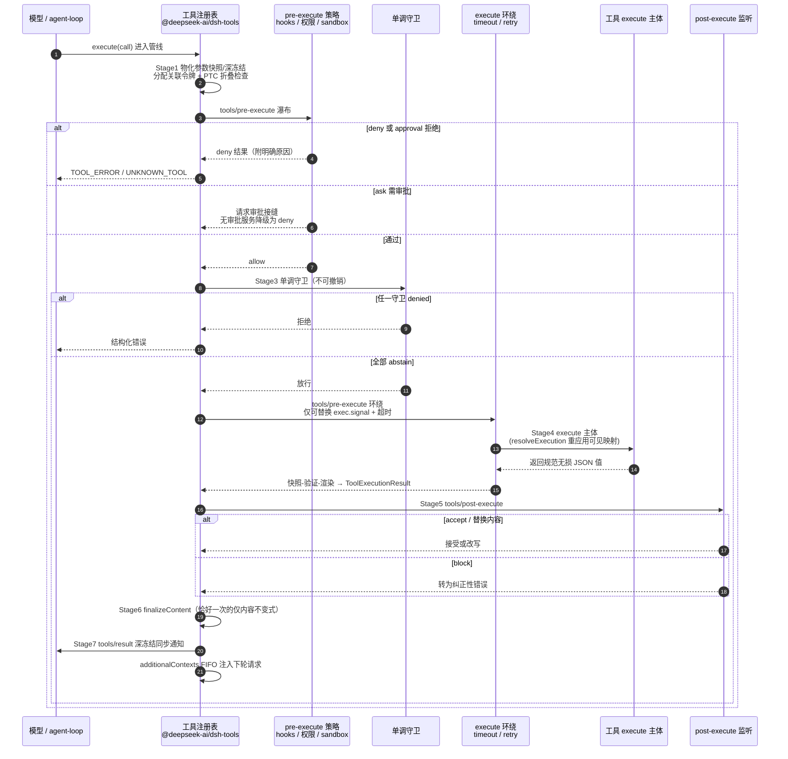
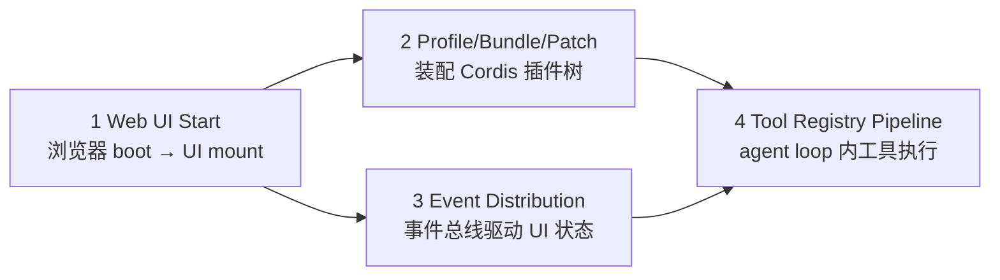

# deepseek-harness 关键路径流程图

> 生成日期：2026-09-16
> 依据：`packages/client/web/src/boot.ts`、`.zread/wiki` 架构文档（web-client-architecture / microkernel-design / event-producer-consumer-matrix / tool-registry-and-execution-pipeline）

---

## 1. Web UI 启动流程（Web UI Start）

> 依据：`docs/30-web-client-architecture.md`、`packages/client/web/src/boot.ts`
> 关键点：Host 注入 `WebBootGraph`（`window.__DSH_BOOT__`）→ 无框架启动内核 → 懒加载模块系统 → Cordis 插件激活 → UI Renderer 水合交接。

### 1.2 时序图（Web UI Start Sequence）

---

## 2. Profile / Bundle / Patch 集成流程

> 依据：`docs/7-microkernel-design-profiles-bundles-and-composition.md`
> 关键点：三层模型 —— **profile**（运行什么）、**bundle**（如何分发/修补）、**组合后的 Cordis 树**（用哪些插件）；`applyEntryPatches` 将各层补丁按序叠到空根部。

> 说明：bundle 可声明 `patchReload`（`live` 热重组 / `startup` 启动时一次性应用）；`web` profile 为 `live`，`headless/acp/sdk/sdk-minimal` 为 `startup`。
> 组合顺序：空入口表 → 各 bundle 按 profile 中顺序 → profile 的 `cordis.patch.yml` → home 级 → `--patch` 覆盖层。某一行的插入会建立 id 索引，同层后续 patch 可配置或禁用该行。

### 2.2 时序图（Profile / Bundle / Patch Composition Sequence）

---

## 3. 事件分发流程（Event Distribution）

> 依据：`docs/9-event-producer-consumer-matrix.md`
> 关键点：一套词汇、三种分发面（`ctx` / `ctx.events.dispatch()` / `emitAgentEvent` 融合调度器）；四种分发模式（emit / waterfall / parallel / serial）；**作用域过滤**使一个逻辑事件多对多路由。

> 事件清单速览（部分）：
> - **agent 生命周族**：`agent/created`、`agent/status`（emit）、`agent/pre-step`（waterfall）、`agent/request`（waterfall）、`agent/turn-stopping`（serial）
> - **tool 门控链**：`tools/pre-execute`、`tools/execute`、`tools/post-execute`（waterfall）、`tools/result`（emit）、`tools/change`（全局）
> - **session 持久化**：`session/event` 追加流、`session/flush`（parallel）
> - **llm**：`llm/stream`（waterfall），重试/重放/路由
> - **框架内部**：`internal/dispatch`、`internal/plugin`、`internal/service`、`internal/status`

### 3.2 时序图（Event Dispatch Sequence）

---

## 4. 工具注册与执行管道（Tool Registry & Execution Pipeline）

> 依据：`docs/13-tool-registry-and-execution-pipeline.md`、`packages/core/tools/src/index.ts`
> 关键点：注册表（`@deepseek-ai/dsh-tools`）为中央权威；`ToolDefinition`（作者视角）→ `ToolSchema`（模型视角，仅 name/description/parameters）；作用域可见性解析；七阶段流水线。

> 说明：
> - 无论入口路径（原生 loop / API 代理 / PTC 桥）都走同一七阶段管线；有序策略阶段串行，环绕调度/主体对并行调用可重叠。
> - 取消为协作式：主体调用前取消 → `ABORTED_BEFORE_DISPATCH`；主体启动后 → `ABORTED`（仅替换成功结局）。
> - PTC 模式（`ptc` presentation）：模型直接调用除 `run_code` 外工具 → `UNKNOWN_TOOL` 错误并给出替代路由提示。

### 4.2 时序图（Tool Registry Execution Pipeline Sequence）

---

## 附录：四条关键路径的关系

1. **Web UI Start** 提供前端与浏览端运行时；
2. **Profile/Bundle/Patch** 决定 Host 端装配哪些插件层（含 `dsh-base` 里注册的工具）。
3. 运行后，**Event Distribution** 广播 agent/session/tool 事件驱动 UI 增量与持久化；
4. 每一轮 agent loop 内模型请求触发 **Tool Registry** 七阶段执行管道。
