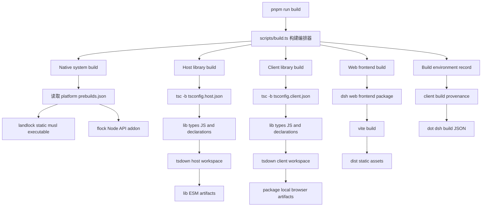

# DSH（DeepSeek Harness）工作原理 Deep-Dive

> 本文面向 **C/C++ 背景、无 TypeScript 经验** 的开发者，从源码 + 真实日志出发，
> 讲清楚 DSH 的「编译 → bundle/profile 装配 → TS 送进 V8 → 一次 UI↔LLM 往返」全链路。
>
> - 证据纪律：文内 `[S]` = 已读源码锚定；`[I]` = 架构级推理（个别细节未逐行读，已标注）；
>   日志引用均来自本仓 `log/` 下真实产物（2026-09-15 Linux x86-64 实测）。
> - 适用 pin：harness `dsh-v0.1.5-rc.2`。

## 目录

0. [它到底是什么：宿主进程 + 动态装配的一棵树](#0-它到底是什么)
1. [TS 到 V8：谁在翻译、怎么翻译](#1-ts-到-v8谁在翻译怎么翻译)
2. [`make setup` 逐段分解](#2-make-setup-逐段分解)
3. [`make link-plugins` 逐段分解](#3-make-link-plugins-逐段分解)
4. [`make dev` / boot 逐段分解](#4-make-dev--boot-逐段分解)
5. [一次 UI→LLM→回：消息往返全链路](#5-一次-uillm回消息往返全链路)
6. [补充：不应被忽略的关键流程](#6-补充不应被忽略的关键流程)
7. [给 C/C++ 开发者的心智地图与词汇表](#7-给-cc-开发者的心智地图与词汇表)

---

## 0. 它到底是什么

DSH（DeepSeek Harness）不是「一个程序」，而是**一个宿主 Node 进程里，按配置树动态装配起来的一**
**组插件（cordis module）**。把它拆成四块：

```
┌─ 宿主进程（node，一个由 bash 拉起的进程；V8 引擎只执行 JS）
│   ├─ cordis        —— 依赖注入容器 + Fiber 生命周期（“插件的 OS”）
│   ├─ profile       —— 一棵配置树：
│   │                   dsh.profile.bundles(层顺序) + cordis.patch.yml
│   │                   + $DSH_HOME/cordis.patch.yml + --patch 覆盖层
│   ├─ loader/include/group —— 把配置树里的 entry（包名 + inject + config）
│   │                           逐个 import 并按依赖就绪顺序 apply
│   └─ webserver     —— 绑 127.0.0.1:3080，serve index.html + __DSH_BOOT__ 注入
│                        + /api/*（含 WebSocket 路 /api/remote.mux）
└─ 浏览器 web 前端 —— 也是 cordis 客户端树：__DSH_BOOT__（BootManifest）
        → client module system → uiRenderer 挂壳
```

### 给 C/C++ 开发者的第一口心智

| DSH 概念                          | C/C++ 里的类比                                  |
| --------------------------------- | ----------------------------------------------- |
| cordis Context / 插件树           | DI 框架 + 运行时动态加载器                      |
| profile                           | 链接脚本 / 配置文件（决定把哪些模块拼起来）     |
| 插件（bundle）                    | 可动态 loading 的共享库（.so/dll）              |
| `dsh.bundle.patch` / `inject` | 模块的“导出符号 + 依赖符号表”声明             |
| loader entry                      | 链接器从符号表解析出的一块可执行单元            |
| `make setup`                    | 拿到源码、装工具链、编译出所有 .so（vram）      |
| `make link-plugins`             | 把编译好的 .so 注册进“可加载清单”             |
| `make dev`（boot）              | 加载器按清单把 .so 动态链接成最终可执行树并运行 |
| turn / step / tool call           | 任务调度的一次循环 / 一次迭代 / 一次系统调用    |
| SSE / WebSocket                   | 流式 stdout 回给调用方                          |

**一句话**：你用 `make setup/link/dev` 做的，是「备料 → 登记 → 动态链接并运行」三步，而整个产品逻辑都在这棵树里。

---

## 1. TS 到 V8：谁在翻译、怎么翻译

### 1.1 事实地基：V8 只吃 JavaScript

V8（Google 的 JS 引擎，Node 的内核）只执行 **ECMAScript**。TypeScript 里的类型注解、`interface`、
泛型、`enum` 在运行前必须被**擦掉**（type erasure）并**降级**成普通 JS。所以“把 TS 送给 V8”
不是一步，而是一条**合署工具链**：

| 工具             | 干什么                                                                                      | 真实日志证据（log/setup-20260915T110859Z-258716.log）                                                          |
| ---------------- | ------------------------------------------------------------------------------------------- | -------------------------------------------------------------------------------------------------------------- |
| **tsc**    | 编译期：类型检查 +`.ts → .js`（擦类型）+ 产 `.d.ts` + `.tsbuildinfo`（增量缓存）     | `node --max-old-space-size=4096 ./node_modules/typescript/bin/tsc -b tsconfig.host.json`                     |
| **tsdown** | 把成百上千个`.js` 模块按包**打包**成单文件（bundle），tree-shake / 代码分割，出 CJS | `ℹ [@deepseek-ai/dsh-experimental-webworker-runtime] [CJS] 2 files, total: …`；`✔ Build complete in …` |
| **vite**   | 打**前端资源**（给浏览器用的最终 bundle）                                             | `vite v6.4.3 building for production…`；`build: recorded 234 client artifact(s)`                          |
| **tsx**    | **开发期**按需转译：对 `.ts` 在“导入时”用 esbuild 转成 JS 再交给 Node             | `pnpm dsh` = `node --import tsx/esm apps/cli/src/bin.ts`                                                   |

### 1.2 合并后的管道（以 harness 的 `pnpm build` 为例，见 `harness/scripts/build.ts`）

`build.ts main()` 依次跑三件事（每步一个 `spawnSync pnpm run …`）：

```
build:native-system  → tsx native/system/scripts/build.ts --host-addon-only
                       （编 C 原生插件 .node，见 §1.4）
build:lib            → build:lib:host = tsc -b tsconfig.host.json && tsdown --env.DSH_BUILD_FACE host
                       build:lib:client = tsc -b tsconfig.client.json && tsdown --env.DSH_BUILD_FACE client
                       （TS 编译 + 打包成 CJS，host/client 两面）
build:web            → pnpm --filter @deepseek-ai/dsh-web-frontend run build（vite）
写记录              → writeClientBuildRecord：产 build record（234 artifacts + 环境值），
                      供后续 boot 把 manifest 注入 __DSH_BOOT__
```

对照日志（setup 日志第 71–76 行附近 + Build complete 段）：
`==> 构建: harness` → `$ tsx scripts/build.ts` → `$ tsx native/system/scripts/build.ts --host-addon-only` →
`build: built linux-x64/bin/glibc/system.node` → `$ pnpm run build:lib:host && pnpm run build:lib:client` → … →
`vite build` → `build: recorded 234 client artifact(s) with 2 public value(s)`。

### 1.3 两条运行形态：dev（tsx 转译）vs 产物（lib/ 纯 JS）

- **dev / 源码运行**：`pnpm dsh` 走 `node --import tsx/esm apps/cli/src/bin.ts`。Node 的 **ESM loader
  管线**里，tsx 注册了 `resolve`/`load` hook：遇到 `.ts` 就当场转译成 JS，然后**同一个 ESM loader
  把 JS 交给 V8**。所以 bin.ts 这类入口**不需要先 tsc 也能跑**——这就是“源码即运行”。
  代价：每次启动按需转译，较慢；但它保证了 dev 与源码一致。
- **产物运行**：`tsc/tsdown` 产出的 `packages/*/lib/*.js`、`apps/cli/lib` 已是**纯 JS**，生产/部署直接加载，
  不经过 tsx，也不需要类型检查。两种形态的代码路径可以不同（这正是 B10 那条“解析面不止一个”教训的土壤）。

### 1.4 V8 与 Node 运行时（C/C++ 视角）

```
node 进程
 ├─ V8    ：JS 源码 → Parser(AST) → Ignition 字节码(解释执行) → TurboFan JIT(热点编译成机器码)
 ├─ libuv ：事件循环 / 线程池（异步 IO 的真正执行者）
 ├─ node:* 内建模块（fs/http/zlib/crypto…，C++ 实现，稳定 ABI）
 └─ N-API ：原生插件与 V8 之间的稳定 C ABI（macOS 上即 node_api.h）
```

给 C/C++ 的对位：

- **tsc ≈ 编译（.o = lib/*.js）**：类型擦除 + 降级。
- **tsdown ≈ 链接**：把一堆 .js 揉成一个 CJS 模块文件 + source map（对应你的符号表/重定位）。
- **tsx ≈ “解释执行源文件”**：像 gdb 直接跑没编的 .c（背后是 esbuild 转译，进 V8 前已是 JS）。
- **Ignition/TurboFan ≈ 解释器 + JIT**：先字节码解释，跑热了编成机器码。
- **N-API `.node` ≈ 共享库**：JS 侧通过稳定 ABI 调 C 函数。

### 1.5 原生插件（本仓真实例子：flock / landlock-run）

`harness/native/system/scripts/build.ts`：

- 读取各 `native/system/packages/<name>/prebuilds.json` 的平台/二进制声明；
- **flock**（Node-API 8）：`cc -std=c11 -O2 … -fPIC -shared -DNAPI_VERSION=8 -I<node>/include/node`
  → `linux-x64/bin/glibc/system.node`（日志 `build: built linux-x64/bin/glibc/system.node`）。
  它提供文件锁等系统能力，JS 侧经 N-API 调用。
- **landlock-run**：静态 musl 可执行（需 musl-gcc），不是 .node。
- 头文件相对 `process.execPath` 解析（`dirname(execPath)/../include/node`）——setup.sh 第 30–33 行前置校验的就是它，
  缺了就报“Node-API headers missing”。

> **一句话**：TS→JS 是“编译时/导入时”做的，V8 永远只看到 JS；原生能力通过 N-API 的 C 函数补上。

---

## 2. `make setup` 逐段分解

> 依据：`scripts/setup.sh`（工具链/子模块/pnpm 解析/计划）→ `scripts/prepare-executor.sh`（准备动作唯一实现）→
> `config/components.json`（谁参与，唯一事实源）+ 日志 `log/setup-20260915T110859Z-258716.log`（4989 行，2026-09-15 Linux x86-64 实测）。
> 它回答“这 11 个仓库的源码怎么被拉下来、怎么编译出来”。

### 阶段 1：工具链前置校验（setup.sh 第 11–33 行）

依次硬性检查，缺一个就给出可执行处置后 `exit 1`：

1. `node` 存在，且 `^22.19 || >=24`（`node -e` 判 `process.versions.node`，23 不满足）。
2. `corepack` 存在（Node ≥25 不再自带，需 `npm i -g corepack`）。
3. `cc` 存在（macOS `xcode-select --install`；Debian/Ubuntu `build-essential`）。
4. Node 开发头文件存在：`dirname(execPath)/../include/node/node_api.h`（fnm/nvm 自带；发行版包另装 nodejs-dev）。

> 这四条对应第 1.4/1.5 章：harness 的 `build:native-system` 要 `cc` + node_api.h 才能编 `.node` 原生插件。

### 阶段 2：submodule 递归拉取/更新（setup.sh 第 35–42 行）

```sh
mkdir -p plugins
.git submodule sync --recursive   # 把 .gitmodules 的 URL 同步进 .git/config
```

**先 sync 再 update**：若某 submodule 的 URL 刚在 .gitmodules 改过（本仓 dsh-automation 改指过 fork），update 会先拿旧 URL 拉取而失败。
日志证据（开头几行）：`Submodule 'harness' (https://…) registered` → `Cloning into '…'` → `Submodule path '…': checked out '…'`。
结果：**全部 submodule（含嵌套）停在 pin commit（detached HEAD）**。

### 阶段 3：各仓 pnpm 版本解析（setup.sh 第 44–94 行）

关键函数：

- `expected_pnpm(dir)`：读该仓 `package.json.packageManager`（不硬编码版本，随 pin 漂移）。
- `actual_pnpm(dir)`：在仓内跑 `pnpm --version`（容忍失败返回空串）。
- `check_pnpm(dir)`：期望=实际（剥掉 `+sha512` hash 后缀）。
- `verify_all_pnpm()`：遍历 `harness plugins/*/`，任一不匹配 → 尝试 `corepack enable` 再验；
  失败则给出「网络不可达 / COREPACK_HOME 不可写 / shim 未优先」的排查提示。

日志证据（第 46–56 行）：`==> harness 使用 pnpm@11.7.0`、`plugins/dsh-automation 使用 pnpm@10.32.1`、
`plugins/loongsuite-observability 使用 pnpm@10.28.2` —— **每个仓解析到自己声明的 pnpm**，这正是“不依赖全局 pnpm”的核心。

### 阶段 4：组件目录校验 + 生成准备计划（setup.sh 第 209–305 行）

1. `node scripts/check-components.mjs`：与 `.gitmodules` **双向集合校验** + license 词表 + 与子仓 `package.json` 的 license 声明核对。
2. `node scripts/check-components.mjs --require-materialized`：**严格模式**——子仓未初始化即失败（fail-closed）。
3. `node scripts/check-components.mjs --plan prepare`：按具名选择器 `prepare`（= `runtimeScope: required`）
   输出 `<path>\t<prepareMode>` 计划；dsh-tui（`runtimeScope: excluded`）不在计划里。
4. **空计划断言**（fail-closed）：计划为空直接报错退出（防止“目录写错导致一个都不装”被当成成功）。

日志证据：`✓ 组件目录校验通过：11 个组件，与 .gitmodules 双向一致`（license 11 一致；materialized 10 已验；dsh-tui excluded）。

### 阶段 5：逐个组件准备（prepare-executor.sh `prepare_component`）

`setup.sh` source 了 `scripts/prepare-executor.sh`，并注入两个**环境策略钩子**（B11 里说的“唯一该有差异”）：

- `pe_install <rel> <frozen|nonfrozen>`（setup.sh 254–272）：
  - **harness** → `local CI=true; export CI`：以「submodule 无 hooks」为由跳过 lefthook postinstall（该钩子在 harness 作为 submodule 时必然失败）。
  - **插件** → `local TMPDIR=/tmp; export TMPDIR`：绕某插件的 unix socket 长路径（macOS 的 sun_path 104 字节限制；Linux 本来就是 /tmp）。
  - 有 `pnpm-lock.yaml` → `install --frozen-lockfile`；只有 `package-lock.json` → `npm ci`；都没有 → 非冻结 `pnpm install` + 告警。
- `pe_run_build <rel>`：非 harness 时同样设 `TMPDIR=/tmp`；对 `source-build` 组件执行 `pnpm run build`。

`prepare_component`（prepare-executor.sh 18–48）按 `prepareMode` 四值派发：
`none` 跳过 / `install-only` 只装 / `source-build` 装+构建 / `tracked-prebuilt` 只装运行依赖、**不构建**
（入口跟踪状态由 `check-components.mjs` 校验，不在这里重复实现）。

底层安装函数（setup.sh）：`plugin_install`（含 `has_build_policy` 判定；无 build 政策加 `--ignore-scripts`；
被 pnpm 拦 `ERR_PNPM_IGNORED_BUILDS` 时重试；`overrides` 写在 package.json（pnpm≤10 位置）的仓走 legacy `pnpm@10.33.0`）。

### 阶段 5 日志走读（真实顺序，setup 日志）

```
==> 安装依赖: harness（nonfrozen）
==> 构建: harness
$ tsx scripts/build.ts
$ tsx native/system/scripts/build.ts --host-addon-only
build: built linux-x64/bin/glibc/system.node
$ pnpm run build:lib:host && pnpm run build:lib:client
$ tsc -b tsconfig.host.json / tsdown --env.DSH_BUILD_FACE host   # 反复 Build complete × N 包
… vite build → build: recorded 234 client artifact(s) with 2 public value(s)
==> 安装依赖: plugins/dsh-web（nonfrozen）      # 16 家族包并行 build
==> 安装依赖: plugins/dsh-better-sidebar …
==> plugins/dsh-market 使用 npm（package-lock.json）…
==> plugins/dsh-agent-teams overrides 写在 package.json…经 pnpm@10.33.0 执行
==> 跳过构建: plugins/dsh-automation/…（tracked-prebuilt）
setup 完成。运行 make dev 启动 DSH Web。
```

**阶段 5 结论**：setup 把每个仓“准备好”（源码在 pin + 依赖装好 + 需要构建的构建完），但**不装配 profile**。

---

## 3. `make link-plugins` 逐段分解

> 依据：`scripts/link-plugins.sh` + `apps/cli/src/plugin.ts`（`dsh plugin` 转发器）+ 日志
> `log/link-plugins-20260915T111629Z-328055.log`（122 行）。它回答“源码插件怎么被登记进 profile 的 bundles 层”。

### 阶段 1：排除集（link-plugins.sh 40–47 行）

`node scripts/check-components.mjs --list runtime:excluded` → SKIP_MOUNT。
日志第 2 行：`==> 跳过挂载: plugins/dsh-tui（runtimeScope=excluded，原因见 config/components.json）`。

> ⚠️ 这里的**判据是 `runtimeScope=excluded`**，不是 `prepareMode=none`；查询失败必须 exit（fail-closed，曾用 `|| true` 退化成空排除集把 web 环境弄坏）。

### 阶段 2：前置 + corepack 锚点（link-plugins.sh 53–76 行）

- 检查 `harness/package.json` 与 `harness/node_modules` 存在（没构建就先 `make setup`）。
- 在 `$DSH_HOME/package.json` 写 `packageManager` **锚点**：`dsh plugin` 在 profile 目录里 spawn `pnpm`，
  corepack 向上找不到 package.json 会回落 latest（坏版本），锚点钉住 harness 自己用的 pnpm 版本。
- `export COREPACK_DEFAULT_TO_LATEST=0`：宁可报错也不回落 latest。

### 阶段 3：候选收集与“是否可挂载”判定

遍历 `plugins/*` 根 + `packages/*` 子包；`own_patch(dir, …子包…)`（一个 node 脚本）判：
`dsh.bundle.patch` 声明存在，且 patch 文件落在**该包自己目录内**、且不落在任意子包目录内。
dsh-web 根包的 patch 指向 `packages/dsh-web-all/cordis.patch.yml`（包外）→ 根包不是挂载入口，其聚合包 `@linxin666/dsh-web-all` 才是。

### 阶段 4：逐一 `dsh plugin --profile dsh add link:<绝对路径>`

这是**真正把插件装进 profile** 的一步，链路过 `apps/cli/src/plugin.ts`：

1. `runPlugin(profile, args)`（plugin.ts 120–163）：`resolveProfileDir` 找 `.dsh/profiles/dsh/`；首用则 `initProfile`（模板 bundles/patchReload）。
2. `anchorPathSpec(arg, cwd)`（104–112）：把相对路径 spec（`.`/`..`）锚到**调用方目录**，防 `add .` 把 profile 自己 link 进去；`link:`/`file:` 前缀保留。
3. `spawnSync('pnpm', ['add','link:/abs/…'], { cwd: profileDir })`：pnpm 以 `link:` 协议装成**符号链接**（改源码即时生效）。
4. `reconcilePlugins(before, dir)`（59–91）：**按已装状态对账**——对每个已装依赖 `exportsPatch(name, dir)`（`resolveBundleDir` 找到包 + 读 `manifest.dsh.bundle.patch`），
   声明了 `dsh.bundle` 的 → append 进 `dsh.profile.bundles`；声明没了/被删的 → 从 bundles 移出；模板 bundle（dsh-base 等）不受影响。

日志证据：每条 `==> link <name> <- <路径>` → `$ dsh plugin --profile dsh add link:…` → `+ <name> link:/abs/…` → `Done in …ms using pnpm v11.7.0`。
共 10 条（agent-teams / at-file / automation / better-sidebar / market / session-id / web-all / loongsuite / modlens / modsearch）。

### 阶段 5：家族成员跳过

`DEP_NAMES` 收集所有候选的 dependencies/peerDependencies/optionalDependencies 包名；
同仓 workspace 子包若被某个**已挂载的聚合包**引用 → 不单独挂载（聚合包 link: 会经其 node_modules 带出本地构建）。
日志 121 行：`跳过 16 个家族成员…`。

### 阶段 6：合并托管 patches

`node scripts/merge-profile-patch.mjs "$DSH_HOME/profiles/dsh"`：把 `patches/*.yml`（禁用插件/注入/补旁键）幂等合并进 profile 的 `cordis.patch.yml`。
日志 119 行：`已合并 patches/*.yml → …/profiles/dsh/cordis.patch.yml`。

> ⚠️ patch 的 `config`/`inject` 是**整表替换**非深合并——这正是 modsearch 曾整表替换 web 行配置、要靠
> `restore-web-fetch-provider.yml` 补旁键的坑（见 §6.2）。

### 阶段 7：保证 web 宿主在 bundles 里

node 小脚本把 `@deepseek-ai/dsh-web-app` splice 到 `dsh-base` 之后（缺失时组合树没有 webserver，boot 完不绑 3080）。
日志 120 行：`已确保宿主 bundle @deepseek-ai/dsh-web-app 在 profile bundles（base 之后）`。

**完成标志**：日志 122 行 `完成: 已挂载 10 个 bundle 到 profile dsh（DSH_HOME=…/.dsh）`。

---

## 4. `make dev` / boot 逐段分解

> 依据：Makefile `dev` 目标 + `apps/cli/src/bin.ts`/`args.ts` + `apps/cli/src/profile-boot.ts` +
> `packages/boot/app-boot/src/index.ts` + `packages/client/web/src/boot.ts` + dev 日志样本
> `log/dev-20260915T111700Z-sample.log`（即为 2026-09-15 实测 boot：`dsh web: http://127.0.0.1:3080/?token=…`）。

### 阶段 0：Makefile dev 到底跑了什么

```sh
mkdir -p log
{ bash scripts/link-plugins.sh && \
  cd harness && DSH_HOME="$(CURDIR)/.dsh" CI=true pnpm dsh --profile dsh --no-open; } 2>&1 | tee log/dev-*.log
```

先 **link-plugins**（保证挂载最新），再以 `DSH_HOME=./.dsh` 启动。`CI=true` 与 setup 同理（跳过 submodule 下失效的 hooks）。
`--no-open` 不自动开浏览器；`pnpm dsh` 的实义见下。

### 阶段 1：命令解析（apps/cli/src/bin.ts + args.ts）

```ts
// bin.ts runCli()
const invocation = parseDshArgs(process.argv.slice(2), readVersion())
switch (invocation.mode) {
  case 'profile': await runProfile({ environment: loadLayeredEnv('dsh'), profile: 'dsh', … })
  case 'plugin'   …  case 'dump-config' …
}
```

- 进程入口：`node --import tsx/esm apps/cli/src/bin.ts`（§1.3 说的 dev/tsx 形态）。
- `parseDshArgs`：launcher 只解析自己的旗标（`--profile`/`--patch`/`--dump-config`…），
  之后的参数**原样**留给被装配进树的应用插件（各自解析、各自 `--help`）。

### 阶段 2：环境分层（app-boot loadLayeredEnv + resolveDshHome）

继承 env > 项目 `.env` > `$DSH_HOME/.env`（不覆盖已存在的）；bootstrap-only 变量禁在 .env 里写（会拒）。
结果是一份**冻结的环境快照**，通过 `ctx.provide(DSH_LAUNCH_ENVIRONMENT_KEY, …)` 给大家读同一份。

### 阶段 3：boot 与“把配置树拼成树”

`profile-boot.ts runProfile` 关键装配：

- `resolveProfileDir(profile)` → 缺则 `initProfile`（模板）。
- 收集 patch 层（顺序=层叠语义，后层覆盖前列）：`bundlePatches`（按 `dsh.profile.bundles` 序，每层 = 包的 cordis.patch.yml）→
  profile `cordis.patch.yml` → `$DSH_HOME/cordis.patch.yml`（机器级偏好）→ `--patch` 覆盖层；
  用 `structuredClone` 深克隆防“insert 行被后续 patch 原地改”的别名问题。
- `boot(NAME, rootConfig='[]', patches, …)`（app-boot）：新建 cordis `Context`，装 **Loader/Include/Group**，
  在空根配置上**逐层 apply patch**，挂上 `provideCmdline`（args/exit/ready），随后 `loader.await()` 等树稳定。
- 若 `patchReload: 'live'`：额外装 `cordis-plugin-hmr`（watch-only，root 空）并 watch 两个用户 patch 文件 → 改 `cordis.patch.yml` 热生效。

### 阶段 4：cordis 树怎么“活”起来（Fiber / inject）

每个 entry 一个 **Fiber**：声明 `inject: [服务名]` 的，等对应 service 就绪才 apply；`provide` 的服务可被注入。
这层是**插件依赖拓扑的执行引擎**，也是我们踩过的 B13 竞态的所在层（见 §6.7）。

### 阶段 5：web 宿主与 boot 注入

装配后树里出现（对照 `--dump-config`）：`web-startup`（host/port 默认 127.0.0.1:3080）→ `webserver`（@deepseek-ai/dsh-host-webserver）→
`web-runtime`/@deepseek-ai/dsh-web-app（openBrowser/printUrl/trustedHosts）→ `client-modules`（@deepseek-ai/dsh-client-modules，
扫描 client 包、合成 `__DSH_BOOT__` manifest、把 `/plugins` 路由挂到 webserver）。
日志样本：`dsh web: http://127.0.0.1:3080/?token=1mQX…`。
认证语义：`/` 无 token → **401**（认证 gate 在即服务就绪）；带 `?token=` → 303/200；token 每次启动轮换。

### 阶段 6：浏览器侧 boot（packages/client/web/src/boot.ts）

`AppWebEntry.run()`：等 `__DSH_BOOT_READY__` → `win.__ModuleLoader__.create({ boot })`（ClientModuleSystem，
能按名加载字节）→ 建 cordis Context + `ctx.plugin(Loader)`、`loader.internal = modules` → 按 manifest 逐 entry `loader.create` →
`loader.await()` → `assertEntriesActive` → `ctx.inject(['uiRenderer'], scope.effect(….mount(container)))` 挂壳。
**浏览器里也跑一套 cordis client 树**，与宿主共享同一份 manifest —— 这就是“前端即插件的客户端镜像”。

---

## 5. 一次 UI→LLM→回：消息往返全链路

> 标注：`[S]` 已读源码锚定；`[I]` 架构级推理（个别 RPC 细节未逐行读，标出供复核）。
> 相关包：`client/ui-chat`、`client/connection`、`api/gateway`、`api/session-controller`、`core/agent-loop`、
> `core/agent`、`llm/llm-deepseek`、`session` / `session-query-sqlite`。

```
[1] 浏览器：ui-chat 输入框 → client-connection（rpc.ts / http-bridge.ts，含 browser-auth）
[2] 传输：经 webserver → 同源 WebSocket 路 /api/remote.mux（Typert Remote 流；帧 ready/emit/waterfall/cancel）
[3] 会话：api/session-controller（sessions/manager + agent.ts：createOrAdopt / composeAgent / agents.create）
[4] 执行：core/agent-loop（AgentLoop implements AgentFactory → ReactLoopAgent：inbox→assistant-stream→loop）
[5] LLM：llm/llm-deepseek adapter.ts：fetch(baseURL + /chat/completions, accept: text/event-stream) → parseSse
[6] 回程：assistant 增量 → 事件帧经 WS 下行 → ui-chat 流式渲染（tool 卡片、增量）
[7] 状态：dsh-session 事件日志（SessionSeq）→ session-query-sqlite；OTLP/用量挂在事件上
```

### 步骤细节与源码锚点

1. **[S] 浏览器端**：`packages/client/web/src/boot.ts` `AppWebEntry.run()` 把 UI 树跑起来后，输入走
   `@deepseek-ai/dsh-client-connection`。连接层含 `rpc.ts`（RPC 请求/响应）、`http-bridge.ts`（HTTP 管线）、
   `browser-auth`（把 boot 得到的 token 附到请求上）。
2. **[I/S] 传输（Typert Remote 流）**：`packages/api/gateway/src/stream-protocol.ts` 定义 WebSocket 复用路
   `REMOTE_STREAM_MUX_PATH = '/api/remote.mux'`（第 6 行），帧分 `ready` / `emit`（宿主→客户端事件）/ `waterfall`
   （宿主要客户端“回调”某事件）/ `cancel` / result。这就是 host↔client 的双向流式总线。

   > [I] 具体“发消息”的 HTTP/WS 端点（session-controller 的 run/resume 入口）未逐行读实现，
   > 只锚定了它所属的包与 gateway 的帧协议；要精确到方法名可再深一寸。
   >
3. **[S] 会话→Agent**：`packages/api/session-controller/src/agent.ts`：`createOrAdopt(sessionId, cwd, presetId)`
   → 查 live Agent / 持久化身份（`cwd`/`preset` 冲突就抛）→ `composeAgent(preset)` 组 Agent 装配
   （`installModelSelection` + preset 的 setup）→ `this.ctx.agents.create/resume`。模型取自
   `ctx.agentDefaultModel.currentSelection()` → `{ provider, model }`（`agentOptions()`，第 490–493 行）。
4. **[S] AgentLoop（执行循环）**：`packages/core/agent-loop/src/index.ts`：`AgentLoop extends Service implements AgentFactory`
   （第 359 行）→ `packages/core/agent-loop/src/agent.ts` 的 `ReactLoopAgent`：inbox 收请求 → assistant-stream 增量 →
   循环调 LLM；期间发 `turn/start`、`step/start`、`step/end`、`turn/end` 事件
   （对应 `turnBoundaryProjectionDefinition`，index.ts:56–94，写进 Session 事件日志）。
5. **[S] LLM 调用**：`packages/llm/llm-deepseek/src/adapter.ts`：`fetch("${connection.baseURL}/chat/completions", …)`
   （第 651 行），请求头 `accept: text/event-stream`（第 542 行）→ `response.body` 走 `parseSse`（sse.ts）把 SSE 行流
   解析 → `translate` 成 assistant 事件流（async generator）。上层 `llm/llm` 提供抽象、`retry-policy`、错误归一化。
   **baseURL / apiKey 来自 profile 配置（dsh-settings / 凭据），不在本文展开。**
6. **[I/S] 回程**：assistant 增量经 gateway 的 `emit` 帧从 WS 下行回浏览器（Typert Remote 的“事件流”），
   `ui-chat` 用流增量渲染（token、tool 卡片、reasoning），不需要整条消息结束后才显示。
7. **[S] 持久化/查询**：`packages/session`（事件日志 + SessionSeq 序号）、`packages/session-query/session-query-sqlite`
   （会话查询）、`packages/session/session-title-*`（LLM 起标题）、loongsuite 插件把 session/agent/LLM/tool
   生命周期转 OTLP（见 §6.4）。

### 与 C/C++ 的对位

第 3–5 步等价于“事件驱动调度器 + 任务循环”：host 侧 cordis 事件总线 = 消息队列/订阅发布；AgentLoop =
任务调度循环（每次 turn 一个任务，step 是迭代）；tool call = 可扩展的系统调用；SSE/WS = 流式 stdout 回给调用方。

---

## 6. 补充：不应被忽略的关键流程

### 6.1 组件目录 / 门禁闭环（改任何“谁参与”之前）

`config/components.json` 是唯一事实源。`scripts/check-components.mjs` 与 `.gitmodules` **双向集合校验**；
改组件集合或 license 后必须 `node scripts/gen-notices.mjs` 重出声明（`THIRD-PARTY-NOTICES.md` 是合规文档，
`make check` 的 `--check` 会拒绝过期版本）。license 走**受控词表**，登记 AGPL/GPL 直接拒。
`make check` = 离线组（目录/license/notices/两道门禁回归）+ 联网 pin + shellcheck（0.9.0）。

### 6.2 patches 的“整表替换”语义

`cordis.patch.yml` 的 `config`/`inject` 是**整表替换非深合并**。坑的实例：modsearch 的 patch 整表替换 web 行
配置，抹掉旁键 → 靠 `patches/restore-web-fetch-provider.yml` 补回。改 patches 后要
`dsh --profile dsh --dump-config` 核对，别只看 boot 没炸。

### 6.3 profile 模块回退链

`healProfilesModuleFallback` + `$DSH_HOME/profiles/node_modules`（NODE_PATH 式回退）：
@deepseek-ai/dsh-web-app 宿主、cordis 系列（group/include/loader/hmr）从这里解析，不装成 profile 依赖。
`@deepseek-ai/dsh…web-app` 是符号链接指向 `harness/apps/cli/node_modules/…`，拷贝 DSH_HOME 到别处会断（见 plugin-dev.md）。

### 6.4 可观测与 telemetry

- 宿主内建 `session-telemetry-otel`（`DSH_TELEMETRY_MODE` 控制，生产默认 DISABLED）。
- `plugins/loongsuite-observability`（pin v0.1.2）：把 session/agent/LLM/tool 生命周期转 OTLP/HTTP protobuf 外发；
  `captureContent` 默认 false（不外发提示词/结果）。生产化边界见 `docs/observability/README.md`。

### 6.5 TUI / 部署两个旁支

- **TUI**：`make dev-tui` → `scripts/link-tui.sh` 建**独立 profile `tui`**（两个前端抢同一批 base 行，不能同 profile）。
- **部署**：`make deploy` → `deploy/remote-install.sh`（Linux 服务器）——与 setup **共用** `prepare-executor.sh`；
  B11 指出“动作原语仍两份”（setup 与 remote-install 各一份、无门禁保证同步）。当前 `make deploy` 从未端到端跑通（backlog B3）。

### 6.6 pin 语义与发版

tag pin：gitlink SHA 必须等于 `<tag>^{}`；branch pin：必须可从 origin/<branch></branch> 到达（不要求等于分支头，
避免“落后即失败”）。漂移由 `--drift` 报告不阻断（dsh-web 落后 231 提交是信息不是错误）。
`make release` 由你手动执行（校验 pin→打 tag→push）；CI 冒烟通过后出 GitHub Release（预留通路）。

### 6.7 已知坑（2026-09-15 实测）

- **B13 boot 竞态**：`ClientModuleRegistry` 只 `inject ['loader']`，但构造时若 `webServer` 已就绪就走 else 分支
  属性访问 → `cannot get property "webServer" without inject`（`harness/packages/client/modules/src/index.ts:570-577`）。
  偶发、非平台特有；**重跑一次 boot 即可**。
- **B10 解析面**：vendor 包按裸名注册，`barePackageManifest` 解析不到就 throw 且不进日志（已用 patch 禁用肇事插件）。

---

## 7. 给 C/C++ 开发者的心智地图与词汇表

### 词汇表

| 词                | 含义                                                     |
| ----------------- | -------------------------------------------------------- |
| TS / tsc          | TypeScript 源码 / 编译成 JS+声明文件的编译器             |
| tsdown / rolldown | 打包器：把 N 个 JS 模块合成单文件（CJS/ESM）+ 产物       |
| vite              | 前端资源打包/开发服务器（web client）                    |
| tsx               | dev 期按需转译 .ts 再喂给 Node ESM loader                |
| V8                | 真正执行 JS 的引擎（Ignition 解释 + TurboFan JIT）       |
| ESM / CJS         | JS 的两种模块系统（import/require）；本仓打包成 CJS 产物 |
| Node-API(.node)   | 原生插件与 V8 的稳定 C ABI（N-API 8）                    |
| cordis            | DI 容器 + Fiber 生命周期（插件树）                       |
| profile           | 一棵配置树（bundles 层 + cordis.patch.yml + 用户层）     |
| bundle            | 声明了`dsh.bundle.patch` 的可装配插件层                |
| inject / provide  | “依赖哪些服务” / “提供哪些服务”                      |
| entry / loader    | 配置树里的装配单元 / 加载器                              |
| turn / step       | 一次任务循环 / 一次迭代（事件流里的编排单位）            |
| SSE / WebSocket   | 流式下行 / 双向实时通道                                  |
| Typert Remote     | 本仓 host↔client 的流式 RPC 帧协议（/api/remote.mux）   |
| OTLP              | OpenTelemetry 传输协议（可观测出口）                     |

### 排查心智：三层叠

```
① 源码形态（tsx 转译面）   —— boot 里 import .ts 时
② 产物形态（lib/ 纯 JS）   —— tsc/tsdown 产物，直接加载
③ 装配形态（配置树 + inject）—— cordis/loader 决定谁先 apply
```

同样一个“加载失败/缺服务”，在①②③ 三个面长得三样（B10/B13 分别演示了②③）。
先分清你看到的是哪一面的错，再往对应面查：①查 tsx/tsc ②查 bundle 产物路径 ③查 `dsh --dump-config` 与 inject 声明。

---

## 带debug的运行命令分析

```Shell
VERBOSE=1 TUNNEL_TRANSPORT_LOGLEVEL=debug make dev
VERBOSE=1 TUNNEL_LOGLEVEL=debug make dev
```

证据链闭合。答案如下：

### 结论：三个环境变量的消费方分属 **两层** ，都不在本仓源码里

| 变量                                    | 谁读它                                                     | 源码位置（真实、逐行核实）                                                                                                       | 作用                                                                                       |
| --------------------------------------- | ---------------------------------------------------------- | -------------------------------------------------------------------------------------------------------------------------------- | ------------------------------------------------------------------------------------------ |
| **`VERBOSE`**                   | **cloudflared npm 包（JS）**                         | `plugins/dsh-web/node_modules/.pnpm/cloudflared@0.7.3/node_modules/cloudflared/lib/tunnel.js:87-90`                            | **透传 stdio** ：把 cloudflared 的 stdout/stderr pipe 到 make dev 终端               |
| **`TUNNEL_TRANSPORT_LOGLEVEL`** | **cloudflared Go 二进制** （38MB，不在此仓库 JS 里） | 二进制内嵌字符串实测命中：`TUNNEL_TRANSPORT_LOGLEVEL`（旁边还有 `TUNNEL_TRANSPORT_PROTOCOL`/`TUNNEL_HOSTNAME` 等官方 env） | 传输层 debug：QUIC/HTTP2/TLS、TCP/UDP Connectivity precheck、TLS handshake 失败详因        |
| **`TUNNEL_LOGLEVEL`**           | **cloudflared Go 二进制**                            | 二进制内嵌字符串实测命中：`TUNNEL_LOGLEVEL`                                                                                    | 通用日志 debug：`Registered tunnel connection … location=… protocol=…`、每次连接/断开 |

「为什么在本仓 grep 不到 `TUNNEL_*`」—— **因为它俩是 cloudflared 官方二进制的环境变量** ，只有 `VERBOSE` 是 npm 包（JS）层读的。remote-access.md 那句「npm 包里的 `VERBOSE` 开关」指的是 `cloudflared` 这个 npm 包（是 dsh-web 依赖的第三方包），这句话准确；但别据此以为 `TUNNEL_*` 也能在本仓源码里找到——那是 Go 二进制的事。

### 触发链路（make dev → 二进制出场）

```javascript
make dev（bash，env 里带上 VERBOSE=1 TUNNEL_*）
 └─ pnpm dsh --profile dsh
     └─ profile 树加载 dsh-remote-web-ui（开了「自动公网隧道」时）
         └─ src/tunnel.ts TunnelManager
             └─ defaultFactory（tunnel.ts:207-220）
                 └─ Tunnel.quick(url, {'--no-autoupdate':true,'--protocol':'http2'})   ← SHARED_TUNNEL_FLAGS(tunnel.ts:190)
                     └─ cloudflared npm：lib/tunnel.js createProcess（82-94）
                         spawn(bin, ['tunnel','--url',<127.0.0.1:3080>,'--no-autoupdate','--protocol','http2'],
                               { stdio:['ignore','pipe','pipe'] })
                         ├─ if (process.env.VERBOSE)  → child.stdout/stderr.pipe(process.stdout/stderr)   ← 透传开关
                         ├─ 同时 stdout/stderr 永远进 handlers 解析 url/connected 事件（更新面板/二维码）
                         └─ 二进制按 TUNNEL_LOGLEVEL / TUNNEL_TRANSPORT_LOGLEVEL 决定日志级别
```

关键点：cloudflared 默认 stdio 是  **pipe 进 handlers** （所以平时你终端看不到它的输出，不是 bug）；`VERBOSE=1` 才额外透传到终端。 **两条命令里 VERBOSE=1 是共享前提** ，区别只在把哪一级日志打开。

### 两条命令的分工（照 remote-access.md 的两种故障场景）

* **`VERBOSE=1 TUNNEL_TRANSPORT_LOGLEVEL=debug make dev`** → 抓**「隧道与 Cloudflare 边缘的连接」**问题： 会看到 `TCP/UDP Connectivity … PASS/FAIL`、`SUMMARY: … will proceed using 'quic'`、`TLS handshake with edge error: EOF`（即 remote-access.md 里 TCP 7844 被掐的那段实测输出）。诊断 Error 1033 / HTTP 530 / readyConnections=0。
* **`VERBOSE=1 TUNNEL_LOGLEVEL=debug make dev`** → 抓**「隧道已连上但请求没打通」**：手机加载不出来时，看 cloudflared 给每个请求的转发记录（哪个 Host、加了哪个头、代理到哪），配合那个 `appOrigin()` 拿 `X-Forwarded-Proto` 的可疑点用。

### 三个提醒（防踩 + 诚实边界）

1. **`--protocol http2` 写死、配置无开关** ：实锤在 `tunnel.ts:190`（`SHARED_TUNNEL_FLAGS = { '--no-autoupdate': true, '--protocol': 'http2' }`，注释 210-215 写明 QUIC 在 fake-ip TUN 上会卡 `readyConnections: 0`）——所以即便 QUIC 通，插件也走不了 quic，与 remote-access.md 的判断一致。改它需动 pin 仓或 fork。
2. 指标口 `127.0.0.1:20241/ready`（remote-access.md 查隧道真状态）——插件 **没有传 `--metrics`** ，该口是 cloudflared 默认/内建；我在二进制里也核到 `localhost:20241` 与 `http://%s/ready` 内嵌串。
3. **别被名字误导** ：harness 里另有一个 `packages/experimental/webworker-runtime/src/transport/tunnel.ts`，那是 **浏览器 worker 通信隧道** ，跟 Cloudflare 隧道完全无关，别混。

## build过程分析1

log/setup-20260915T110859Z-258716.log:

```Shell
  ⚠️  组件 modlens 是 source-build，但入口 dsh/index.js, dsh/client.js 已被 git 跟踪——构建可能弄脏 submodule，进而触发部署的快照保真检查
  ⚠️  组件 dsh-market 是 source-build，但入口 client/client.js 已被 git 跟踪——构建可能弄脏 submodule，进而触发部署的快照保真检查
  ⚠️  组件 modsearch 是 source-build，但入口 dsh/index.js, dsh/client.js 已被 git 跟踪——构建可能弄脏 submodule，进而触发部署的快照保真检查
---
这些告警是什么意思，什么是source-build，还有其他构建方式么？./node_modules/typescript/bin/tsc这个工具是什么时候安装的，怎么安装的？
```

### source-build和submodule告警

它们来自 `scripts/check-components.mjs` 的 **materialized 阶段**校验（`checkMaterialized()` 第 356–361 行），是 `make setup` 里"组件目录校验"步骤打的（日志里出现两次：一次普通校验、一次 `--require-materialized` 严格模式）。

告警的完整逻辑是：

> 组件是  **`source-build`** （要现场编译），但它声明的 **入口** （`main` / `types` / 无通配符 `exports` 目标里的 **构建产物** ）**已被 git 跟踪** ⇒ 构建会往这些路径重新写文件。只要源码重建结果和提交的产物 **不是逐字节一致** ，git 就会看到 submodule 变 **脏（dirty）** ，进而触发部署时的 **快照保真检查** （deploy 期望 submodule 干净）。

三个组件的命中路径我核实过，现在确实被 git 跟踪：

| 组件           | 被跟踪的构建产物入口                |
| -------------- | ----------------------------------- |
| `modlens`    | `dsh/index.js`, `dsh/client.js` |
| `modsearch`  | `dsh/index.js`, `dsh/client.js` |
| `dsh-market` | `client/client.js`                |

两个关键设计（ADR-0005 第 97–113 行、`config/README.md` 第 158–170 行）：

* **只报警告、不阻断** （不调用 `fail()`，不影响退出码）。理由：这是 **运维后果** ，不是 schema 矛盾——本仓可以出于供应链政策选择源码重建，即使子仓恰好也提交了产物。警告只是让它 **可见** ，不用规则禁止。
* 两个刻意的边界：
  * **入口只算"构建产物"（`BUILDABLE_ENTRY`）** ，排除 `package.json`、`cordis.patch.yml` 这类人手维护的文件——构建从来不写它们，算进来会对不会弄脏的组件喊狼来了（喊着喊着就被无视了）。
  * **不能只查 `main`** ：`dsh-market` 的 `main`（`lib/index.js`）恰恰**没**被跟踪，被跟踪的是 `exports["./client"]` → `./client/client.js`。只查 main 会把 ADR 自己的唯一例子整个漏掉。

> 注：`docs/remediation-plan.md` 第 321 行明确写着这三条警告是 **预期的，不是缺陷** 。

### source-build解释

3. 什么是 source-build？还有其他构建方式吗？
   source-build 是组件准备模式 prepareMode 的四种取值之一（模型定义见 docs/cicd/adr/0005-component-catalog-lifecycle.md 第 41–48 行）：

`source-build` 是组件准备模式 `prepareMode` 的四种取值之一（模型定义见 `docs/cicd/adr/0005-component-catalog-lifecycle.md` 第 41–48 行）：

| prepareMode          | 动作                                                            | 含义                                                |
| -------------------- | --------------------------------------------------------------- | --------------------------------------------------- |
| `source-build`     | 安装依赖 →**执行 build** → 验证输出                     | 供应链政策：**现场编译** ，不信任预编译产物   |
| `tracked-prebuilt` | 安装运行依赖 →**验证所有提交产物的跟踪状态** → 不 build | 用**提交仓库里的预编译产物** （但不使用构建） |
| `install-only`     | 安装依赖，无 build                                              | 无需编译但需要安装的运行时组件                      |
| `none`             | 不准备                                                          | 排除的组件，完全不准备                              |

当前 11 个组件的实际分布（`config/components.json`）：

* **source-build ×8** ：`harness`、`dsh-web`、`dsh-better-sidebar`、`modlens`、`dsh-market`、`dsh-agent-teams`、`modsearch`、`loongsuite-observability`
* **tracked-prebuilt ×2** ：`dsh-automation`、`dsh-at-file`
* **none ×1** ：`dsh-tui`（`runtimeScope: excluded`）
* `install-only` 目前目录里没有在用（模式本身为消除"`no-build` 被迫等于 excluded"的歧义而补）。

一句话： **source-build 是"源码重建"这一种供应链姿态** ，和"用提交的预编译产物（tracked-prebuilt）"、"只装依赖（install-only）"、"完全不准备（none）"是并列的选择。

### node_modules/typescript/bin/tsc安装路径

3. ./node_modules/typescript/bin/tsc 是什么时候、怎么装的
   那是 TypeScript 编译器 tsc，版本 6.0.3，不是单独安装的工具，而是 harness 自己声明的一个 devDependency：

那是  **TypeScript 编译器 tsc，版本 6.0.3** ， **不是单独安装的工具** ，而是 `harness` 自己声明的一个 devDependency：

* `harness/package.json` 第 221 行（devDependencies）：`"typescript": "^6.0.3"`
* 安装后的路径 `harness/node_modules/typescript` 是 pnpm 的 **symlink** → `.pnpm/typescript@6.0.3/node_modules/typescript`（pnpm 虚拟 store 布局），已确认当前实装版本 `typescript@6.0.3`。

 **什么时候** ：就是这份 setup 日志对应的那次安装——这台机器上它是 **2026-09-15 19:11:22 (+0800)** 落地的（`harness/node_modules/typescript` 的 mtime；整个 `harness/node_modules` 也是那个时刻新建的）。日志 `setup-20260915T110859Z-258716.log` 从 11:08:59Z（本地 19:08:59）开始，所以它装在这次 `make setup` 的运行期内。之后 9/16 的 dev 日志只是运行，没重装。

 **怎么装** （完整链路，来自日志 + `scripts/setup.sh` + `scripts/prepare-executor.sh`）：

1. `make setup` → `scripts/setup.sh`；harness 在组件目录里是 `runtimeScope=required, prepareMode=source-build`，与插件走同一条 `prepare-executor.sh` 的准备链路。
2. 日志第 71 行进入 `==> 安装依赖: harness（nonfrozen）` → `prepare_component` → `pe_install harness`（设 `CI=true` 作为环境策略）。
3. `pe_install` 看 harness  **有 `pnpm-lock.yaml`** ，所以实际走的是  **`pnpm install --frozen-lockfile`** （可复现的冻结安装）。日志里"（nonfrozen）"只是 setup.sh 传入的策略字符串，harness 因为锁文件存在而退化为冻结安装。
4. 包管理器：harness `packageManager: "pnpm@11.7.0"`，由 corepack 按字段解析该 pin（日志第 33 行附近 `==> harness 使用 pnpm@11.7.0`），实际执行 `cd harness && pnpm install --frozen-lockfile`，把包括 `typescript@6.0.3` 在内的全部依赖装进 `harness/node_modules`。

它被用在 harness 的 `build:lib:host` 脚本里作编译器（日志第 77 行正是这条被执行的命令）：

```Shell
node --max-old-space-size=4096 ./node_modules/typescript/bin/tsc -b tsconfig.host.json && tsdown --env.DSH_BUILD_FACE host
```

它本身是  **gitignored 的构建环境依赖** （已在 harness 仓确认 ignore），不在仓库里；fresh clone 后要跑 `make setup` 才会出现。

## build过程2-deepseek-harness主仓分析

log/setup-20260915T110859Z-258716.log的71行到4040行

关键源码：`scripts/build.ts`、`native/system/scripts/build.ts`、`tsconfig.base/host/client.json`、`tsdown.config.ts`

### 1总体过程

1. 这段日志在做什么（一次 make setup 里的 harness 构建）

这段是 make setup 准备阶段里 harness（prepareMode=source-build）的一次全量构建，从"安装依赖"到"出报告"。调用链：

这段是 `make setup` 准备阶段里 harness（`prepareMode=source-build`）的 **一次全量构建** ，从"安装依赖"到"出报告"。调用链：

```
make setup → bash scripts/setup.sh → prepare-executor.sh → prepare_component(harness, source-build, nonfrozen)
  ├─ 安装依赖: harness（nonfrozen）  → pnpm install --frozen-lockfile（harness 有 lockfile）
  └─ 构建: harness  → pnpm build → tsx scripts/build.ts   ← 日志主干的起点
```

`scripts/build.ts` 是个 **命令式编排器** （不是 Makefile），按顺序跑三个子脚本（源码第 44–46 行）：

| 步骤                    | 命令                                                     | 职责                                                                                 |
| ----------------------- | -------------------------------------------------------- | ------------------------------------------------------------------------------------ |
| `build:native-system` | `tsx native/system/scripts/build.ts --host-addon-only` | 为**本机平台**编译原生 addon                                                   |
| `build:lib`           | `build:lib:host && build:lib:client`                   | TS 类型检查 + emit + 打 ESM bundle（Host/Client 两面）                               |
| `build:web`           | `vite build`（web-frontend）                           | 浏览器端静态产物                                                                     |
| 收尾                    | `writeClientBuildRecord`                               | 记录客户端产物清单 → 打印`recorded 234 client artifact(s) with 2 public value(s)` |

日志里出现的 `tsdown v0.22.2 powered by rolldown v1.1.1`、一长串 `config file: …tsdown.config.ts`、各包 `Build complete in ~8s`，是 **build:lib:host** 里 tsdown 对全 workspace 逐包打包的输出；最后一段则是  **build:lib:client** （第二次同样流程，完成时间从 ~8s 掉到 ~1–2s）和  **build:web** （`$ vite build`，349 个模块，4.02s）。

> 日志里那些 `[PLUGIN_TIMINGS]`、`noExternal is deprecated`、`inlineDynamicImports is deprecated`、`Some chunks are larger than 500 kB`、`Unsupported platform` 都是 **警告不是错误** ：前者是 tsdown/rolldown 的配置弃用提示，后者是 pnpm 跨平台包矩阵的正常过滤。构建全部 `Build complete`，最后正常打印 record，属于 **成功构建** 。

### 2. 编译构成

2. 编译构成（几层、各层什么工具）
   本质是 5 层流水线，pnpm scripts 串起来：

```
① 原生 C 层（cc / musl-gcc）
② TS 类型/emit 层（tsc -b，project references）   ← 生成 lib/types/*
③ 打包层（tsdown = rolldown）                     ← 把 lib/types/* 打成 ESM bundle
④ 浏览器层（vite build）                          ← 前端静态产物
⑤ 记录层（client-build-environment）              ← 产物清单
```

* **①原生层** （`native/system/scripts/build.ts`）：读各 platform package 的 `prebuilds.json`（声明平台+二进制），只对本机 `linux-x64` 且 `node-api` 且 libc 匹配的项编译。C 源在 `packages/entry/src/{main.c(landlock), flock.c}`；Linux 用 `cc`（glibc）/`musl-gcc`，mac 用 `cc -bundle -undefined dynamic_lookup`；参数见脚本：`-std=c11 -O2 -Wall -Wextra -Werror -fPIC -fvisibility=hidden -DNAPI_VERSION=8`，Node 头取运行中 Node 的 `../include/node`。 **先编译到临时目录再原子 rename** ，避免并发读到残缺文件。
* **②类型层** ：`tsc -b tsconfig.host.json` / `tsc -b tsconfig.client.json`。这是 **两棵 project-references 图** （聚合根各带 226 / 68 个引用项；根是 `files:[]`/`noEmit` 的 solution 面，只做校验+按依赖序构建引用工程）。每个包继承 `tsconfig.base.json`，都是 `composite + incremental + outDir lib/types` 的 composite 工程 → 各自把 `src/*.ts` emit 成 `lib/types/*.{js,d.ts,map}`。分成 Host/Client 两面是因为 **两面要 merge cordis Context，同一个 TS program 不能同时看到两边** （tsconfig 里注释的原话）。
* **③打包层** ：`tsdown --env.DSH_BUILD_FACE host|client`。root `tsdown.config.ts` 的 `workspace` 枚举全 workspace、`entry` 指向 `lib/types/*.js`，`dts:false`（声明由 tsc 出），`clean:false`（不清空、保增量）。各包有本地 `tsdown.config.ts` 覆盖入口（如 `apps/cli` 的 `entry: ['lib/types/bin.js']`、`apps/desktop`、`vendor/*` 等），产出 `lib/*.js` + hashed chunks + `.map` + `.cjs`（需要 CJS 的 worker/preload）+ `.css`。
* **④Web 层** ：`@deepseek-ai/dsh-web-frontend` 的 `vite build`，产出 `dist/`。
* **⑤记录层** ：`client-build-environment.ts` 统计产物并写记录文件。

最关键的修正是：

1. **原生构建不是始终只编译“本机 libc 匹配的 Node-API 项”** ；这仅适用于 `--host-addon-only`。
2. `tsdown`  **并不是无条件枚举全部 workspace** ，Host 与 Client 的 workspace 集合和默认入口不同。
3. `client-build-environment` 更像是 **客户端构建环境/版本来源记录** ，不能直接称为“产物清单”。

> 核验基线：当前仓库 `master`，根包版本显示为 `0.1.5-rc.2`。该项目处于 developer preview，后续源码可能快速变化；正式文档建议绑定具体 commit SHA。

展开：

| 原描述                       | 判断            | 主要问题                                                                      |
| ---------------------------- | --------------- | ----------------------------------------------------------------------------- |
| “本质是 5 层流水线”        | ⚠️ 概念上可用 | 更准确地说是构建编排中的五类阶段，不一定是严格线性、每次全部执行              |
| `pnpm scripts` 串起来      | ⚠️ 不够准确   | 根`build` 实际入口是 `tsx scripts/build.ts`，由该编排器决定阶段和 profile |
| 原生 C 层                    | ✅ 基本正确     | `--host-addon-only` 与完整构建的筛选规则被混淆                              |
| `tsc -b` 类型/emit 层      | ✅ 基本正确     | “类型层”名称不完整，它同时生成 JS、声明和 sourcemap                         |
| `tsdown = rolldown` 打包层 | ✅ 基本正确     | 应写成“tsdown 使用 Rolldown 后端”；Client 默认 entry 为空，依赖包级配置     |
| Vite 浏览器层                | ✅              | 根脚本确实调前端包执行 build                                                  |
| 记录层是“产物清单”         | ❌ 很可能不准确 | 更接近 client build environment/provenance 元数据                             |
| 226/68 个 references         | ❓ 未确认       | 属于易漂移快照数据，必须绑定 commit 后用脚本重新统计                          |



### 3. 编译输入与构建产物总结

> **归档基线**
>
> - 构建对象：`oh-my-dsh` 超级工程及其 Git submodules
> - 核心 Harness commit：`fb2c4b9e698e30edb738bca4cf0618587db7d203`
> - 构建宿主：Linux x64，glibc
> - Harness 包管理器：`pnpm@11.7.0`
> - Harness 打包器：`tsdown v0.22.2`
> - Harness 打包后端：`rolldown v1.1.1`
> - Harness Web 构建器：`vite v6.4.3`
> - 安装模式：Harness 明确为 `nonfrozen`
> - 构建结果：Harness、Web 前端及日志中实际执行的插件构建均成功；存在若干兼容性、依赖打包、产物污染和供应链告警
>
> 本节只将日志中可直接证明的数量作为确定值。此前提到的 `280 个 workspace package`、`267 个含 lib/ 的包`、`293 个 .tsbuildinfo`、Host `226 references` 和 Client `68 references` 未在本次日志中重新统计，因此不作为本次构建的直接日志结论。

#### 3.1 超级工程组件输入

顶层工程通过 Git submodule 固定 Harness 和 10 个插件组件，共校验 **11 个组件**，并确认与 `.gitmodules` 双向一致。

| 组件路径                             | 仓库                                                    | 固定 commit                                  |
| ------------------------------------ | ------------------------------------------------------- | -------------------------------------------- |
| `harness`                          | `https://github.com/deepseek-ai/deepseek-harness.git` | `fb2c4b9e698e30edb738bca4cf0618587db7d203` |
| `plugins/dsh-agent-teams`          | `https://github.com/NanmiCoder/dsh-agent-teams.git`   | `2e59da17918558cfa3bf91d30d40f737509cca0c` |
| `plugins/dsh-at-file`              | `https://github.com/FSMargoo/dsh-at-file.git`         | `da602d1a8f1b417b8a1d8d4059e0f4cb1c353524` |
| `plugins/dsh-automation`           | `https://github.com/michaelyaoxxx/dsh-automation.git` | `a2f60c11410935c6af23d682f1f383c9a4ffb3d0` |
| `plugins/dsh-better-sidebar`       | `https://github.com/omdsh-dev/DSH-better-sidebar.git` | `146840bb4f1b67e9b9ab8c556355613b20bd20e3` |
| `plugins/dsh-market`               | `https://github.com/dsh-market/dsh-market.git`        | `1664caec99219b4902f1686e2e34614815d38346` |
| `plugins/dsh-tui`                  | `https://github.com/ccch1mneyyy/dsh-TUI.git`          | `78081cebde1ee1b47a561ef57c04f128c5623476` |
| `plugins/dsh-web`                  | `https://github.com/zhu1090093659/dsh-web.git`        | `3e011bb9a0d3ce30ed8f008b5ebd2f1ec37a7770` |
| `plugins/loongsuite-observability` | `https://github.com/loongsuite/dsh-plugin.git`        | `f216a4989dae0f5d96a231355557abd0623edf1c` |
| `plugins/modlens`                  | `https://github.com/liustack/modlens.git`             | `a1923d016c2b617ccd1d6ef3f9e9368622841e67` |
| `plugins/modsearch`                | `https://github.com/liustack/modsearch.git`           | `7c164513d6ba824d294bcf43df9485ada3beff19` |

`plugins/dsh-tui` 还包含三级嵌套 submodule：

| 嵌套路径                                              | 仓库                                                 | 固定 commit                                  |
| ----------------------------------------------------- | ---------------------------------------------------- | -------------------------------------------- |
| `plugins/dsh-tui/dsh-auth`                          | `https://github.com/ccch1mneyyy/dsh-auth.git`      | `cc6ec5224b62b6e6508c0109ef19e93b0a5c0a0e` |
| `plugins/dsh-tui/dsh-ecosystem-spec`                | `https://github.com/T-Auto/dsh-ecosystem-spec.git` | `d28c267fe7fd775428ec2dccd65b0b7efd4dacee` |
| `plugins/dsh-tui/vendor/dsh-std`                    | `https://github.com/Yan-Zero/dsh-std.git`          | `614dfa1ac168db79fcf4577cf0ebb34e2e3b944b` |
| `plugins/dsh-tui/dsh-ecosystem-spec/vendor/dsh-std` | `https://github.com/Yan-Zero/dsh-std.git`          | `614dfa1ac168db79fcf4577cf0ebb34e2e3b944b` |

#### 3.2 Harness 编译输入

| 类别                | 实际输入                                                                                                                                                                                                            |
| ------------------- | ------------------------------------------------------------------------------------------------------------------------------------------------------------------------------------------------------------------- |
| 原生 C 源码         | `native/system/packages/entry/src/main.c` 和 `native/system/packages/entry/src/flock.c`                                                                                                                         |
| 原生构建元数据      | 各平台包的`prebuilds.json` 是 `native/system/scripts/build.ts` 的直接构建输入；平台包 `package.json` 中的 `os`、`cpu`、`libc` 用于 pnpm 的平台适配和包选择                                              |
| TypeScript/TSX 源码 | Host/Client solution tsconfig 引用的`vendor/*`、`packages/*/*`、`apps/cli`、`apps/desktop`、`apps/desktop-host` 和 Client UI 等工程源码；聚合 tsconfig 还可能纳入 scripts、tests 和 benchmarks 做类型检查 |
| TypeScript 工程图   | `tsconfig.host.json` 和 `tsconfig.client.json` 分别驱动两棵 project-reference 构建图；各 package 的 `tsconfig*.json` 定义具体工程                                                                             |
| TypeScript 中间产物 | 大部分 tsdown entry 来自`lib/types/**/*.js`，例如 `lib/types/bin.js`、`lib/types/index.js`、`lib/types/invariant.js`、`lib/types/startup.js` 和 `lib/types/worker.js`                                   |
| 直接源码入口特例    | `dsh-experimental-webworker-runtime` 的部分构建直接使用 `src/index.ts`、`src/client/index.ts` 和 `src/worker.ts`，因此不能将所有 tsdown 输入概括为 `lib/types/*.js`                                       |
| 打包配置            | 根`tsdown.config.ts`、各 package/app 的 `tsdown.config.ts`，以及部分 package manifest 中由 tsdown 自动读取的构建配置                                                                                            |
| Web 输入            | `apps/web` 的前端源码、Vite 配置、Harness Client bundles、CSS、字体、代码高亮语言模块及 preview worker/bootstrap                                                                                                  |
| 依赖输入            | `package.json`、`pnpm-workspace.yaml`、`pnpm-lock.yaml` 和安装后的依赖闭包                                                                                                                                    |
| 原生工具链          | Node.js、Node development headers、`cc`/`musl-gcc`；本次只使用与 Linux x64 glibc 宿主匹配的 Node-API 路径                                                                                                       |
| TS/Web 工具链       | `pnpm@11.7.0`、TypeScript、`tsx`、`tsdown v0.22.2`、`rolldown v1.1.1`、Vite `v6.4.3`、Typert generator plugin                                                                                             |

#### 3.3 Harness 实际构建流水线

| 顺序 | 命令                                                      | 作用                                                  |
| ---: | --------------------------------------------------------- | ----------------------------------------------------- |
|    1 | `tsx scripts/build.ts`                                  | Harness 顶层构建编排                                  |
|    2 | `tsx native/system/scripts/build.ts --host-addon-only`  | 构建当前宿主匹配的 Node-API addon                     |
|    3 | `tsc -b tsconfig.host.json`                             | Host project-reference 类型检查与 emit                |
|    4 | `tsdown --env.DSH_BUILD_FACE host`                      | Host workspace 打包                                   |
|    5 | `tsc -b tsconfig.client.json`                           | Client project-reference 类型检查与 emit              |
|    6 | `tsdown --env.DSH_BUILD_FACE client`                    | Client workspace、Client loader 和 UI bundles 打包    |
|    7 | `pnpm --filter @deepseek-ai/dsh-web-frontend run build` | 调用`apps/web` 的 Vite production build             |
|    8 | Client artifact recorder                                  | 写入 Client artifact 与 public build value 的构建记录 |

#### 3.4 Harness 构建产物

| 阶段            | 产物                                                                                             | 本次日志证据与说明                                                                                                                                  |
| --------------- | ------------------------------------------------------------------------------------------------ | --------------------------------------------------------------------------------------------------------------------------------------------------- |
| Native          | `native/system/packages/linux-x64/bin/glibc/system.node`                                       | 日志明确显示`build: built linux-x64/bin/glibc/system.node`；本次使用 `--host-addon-only`，没有证据表明同时构建了 `landlock-run` 或 musl addon |
| TypeScript emit | `lib/types/**/*.js` 及配置启用时的声明文件和 sourcemap                                         | tsdown 日志大量显示`entry: lib/types/*.js`；`tsc -b` 本身静默成功，但日志没有逐项列出 `.d.ts` 或 `.tsbuildinfo` 数量                        |
| Host ESM        | `lib/index.js`、`lib/invariant.js`、`lib/startup.js`、`lib/bin.js`、`lib/runner.js` 等 | 大多数 Host 包以 ES2024 为 target，默认生成 ESM                                                                                                     |
| Host CJS 特例   | `preload.cjs`、`preload-app.cjs`、`worker.cjs`                                             | 用于 Electron preload、Node worker 和线程隔离场景                                                                                                   |
| 双格式模块      | `vendor/schemastery/lib/index.mjs` 和 `index.cjs`                                            | 日志分别报告 ESM/CJS 两套输出                                                                                                                       |
| Hashed chunks   | 例如`profile-boot-Dk-7KqJc.js`、`plugin-Ddi42qoW.js`、`repository-Lozj5Dm5.js`             | 由 code splitting 和多入口共享模块产生                                                                                                              |
| CSS             | `base.css`、`boot-page.module.css` 及大量 `*.module.css`                                   | 由 Client/Web package-local 配置生成，不是所有 package 的统一产物                                                                                   |
| Client loader   | `packages/*/*/lib/client.js` 和 `client.js.map`                                              | 多数`/client` 构建在日志中标记为 CJS；扩展名仍为 `.js`，模块语义由 package/config 决定                                                          |
| Web Worker      | `dsh-experimental-webworker-runtime/lib/worker.js` 和 `worker.js.map`                        | Worker target 为 ES2022，分别为 705.27 kB 和 1.39 MB                                                                                                |
| Web 前端        | `apps/web/dist/**/*`                                                                           | Vite 日志中的`dist/` 是相对于 `apps/web` package 的输出目录                                                                                     |
| Client 构建记录 | Client artifact record                                                                           | 日志明确显示`build: recorded 234 client artifact(s) with 2 public value(s)`                                                                       |

#### 3.5 `lib/bin.js` 的准确归属

本次日志中至少有两个 package 生成并设置了 `lib/bin.js` 的可执行权限：

| Package                                            | 打包入口                                     | 输出                          | 日志证据                                                                  |
| -------------------------------------------------- | -------------------------------------------- | ----------------------------- | ------------------------------------------------------------------------- |
| `@deepseek-ai/dsh`                               | `lib/types/bin.js`                         | `apps/cli/lib/bin.js`       | `Granting execute permission to lib/bin.js`；输出 9.16 kB，gzip 3.18 kB |
| `@deepseek-ai/dsh-experimental-webworker-packer` | `lib/types/index.js`、`lib/types/bin.js` | 对应 package 的`lib/bin.js` | `Granting execute permission to lib/bin.js`；输出 3.20 kB，gzip 1.44 kB |

因此，`lib/bin.js` 不是全局唯一文件，也不是所有 tsdown package 的默认产物。它是**相对于各 package 工作目录的输出路径**。日志中的可执行权限设置由 tsdown 的 shebang/CLI 后处理完成。

#### 3.6 Harness Web 前端产物

`@deepseek-ai/dsh-web-frontend` 的包名与磁盘目录名不同：

- Package name：`@deepseek-ai/dsh-web-frontend`
- Repository path：`apps/web`
- Output path：`apps/web/dist`

本次 Vite 构建结果：

| 指标                  |      数值 |
| --------------------- | --------: |
| Vite 版本             | `6.4.3` |
| 转换模块数            |       349 |
| 构建耗时              |    4.02 s |
| Client artifact 数    |       234 |
| Public build value 数 |         2 |

主要输出类型：

- `dist/index.html`
- `dist/assets/*.js`
- `dist/assets/*.css`
- `dist/assets/fonts/*`
- `dist/assets/langs/*`
- `dist/preview/worker-*.js`
- `dist/preview/bootstrap-*.js`
- 对应 sourcemap

> **日志相对路径 → 真实磁盘位置**：日志 vite 段（setup 日志 L3941–4040）里的 `dist/**` 都是相对
> `apps/web` 包（`@deepseek-ai/dsh-web-frontend`）的路径；真实落点在 `<repo>/harness/apps/web/dist/**`。

| 日志里出现的路径            | 真实绝对位置                                                  | 日志证据       |
| --------------------------- | ------------------------------------------------------------- | -------------- |
| `dist/index.html`         | `harness/apps/web/dist/index.html`（0.68 kB）               | L3945          |
| `dist/assets/*.js/ *.css` | `harness/apps/web/dist/assets/`（index/vendor 大 chunk）    | L3941–4040 段 |
| `dist/assets/fonts/*`     | `harness/apps/web/dist/assets/fonts/`（KaTeX 全套 40+）     | 同上段         |
| `dist/assets/langs/*`     | `harness/apps/web/dist/assets/langs/`（≈22 代码高亮语言）  | 同上段         |
| `dist/preview/*`          | `harness/apps/web/dist/preview/`（worker-*、bootstrap-*） | 同上段         |

> ⚠️ 伺服者：`apps/cli` 的 `dsh web` 把 `apps/web/dist/` 当静态站点伺服；裸 `vite serve` 会被
> `apps/web/vite.config.ts` 的 `rejectStandaloneServe` 拒绝（缺 `__DSH_BOOT__` 注入时无意义）。

#### 3.7 Harness 主要大体量产物

Host、Worker 和工具 Bundle

| Package/文件                                         |  Raw size | Gzip size | 说明                                               |
| ---------------------------------------------------- | --------: | --------: | -------------------------------------------------- |
| `dsh-tool-cordis/lib/index.js`                     | 500.90 kB | 110.10 kB | 单文件 Host/tool bundle                            |
| `dsh-experimental-webworker-runtime/lib/worker.js` | 705.27 kB | 163.75 kB | 明确内联了 Buffer、stream、hash、parser 等多项依赖 |
| `dsh-session-persistence-jsonl/lib/worker.cjs`     | 465.45 kB | 112.19 kB | CJS worker                                         |
| `dsh-experimental-inspector/lib/worker.js`         | 261.63 kB |  55.24 kB | Inspector worker                                   |
| `dsh-typert-generator/lib/index.js`                | 198.73 kB |  45.57 kB | Typert generator                                   |

Harness Client Bundle

| Package/文件                                            |  Raw size |  Gzip size | 主要内联依赖/说明                                         |
| ------------------------------------------------------- | --------: | ---------: | --------------------------------------------------------- |
| `dsh-client-ui-sidebar-documentpreview/lib/client.js` |   6.89 MB | 日志未给出 | 明确内联`pdfjs-dist` 和 `clsx`；连同 map 总计 8.48 MB |
| `dsh-client-ui-conversation/lib/client.js`            | 647.08 kB |  162.01 kB | 内联 Lexical 及多个`@lexical/*` 包                      |
| `dsh-client-ui-trajectory/lib/client.js`              | 392.78 kB |   81.55 kB | 内联 TanStack virtual 和`diff`                          |
| `dsh-client-ui-chat/lib/client.js`                    | 370.02 kB |   83.26 kB | Client CJS bundle                                         |
| `dsh-api-remotes/lib/client.js`                       | 329.87 kB |   41.49 kB | 日志提示内联`zod`                                       |
| `dsh-cordis-client-runner/lib/client.js`              | 262.52 kB |   48.92 kB | Cordis Client runtime                                     |
| `dsh-client-connection/lib/client.js`                 | 221.77 kB |   55.65 kB | Client connection runtime                                 |

Vite Web chunks

| 文件                                   |  Raw size |  Gzip size |   Sourcemap |
| -------------------------------------- | --------: | ---------: | ----------: |
| `dist/assets/vendor-CCJJTK99.js`     | 740.58 kB |  179.52 kB | 2,509.98 kB |
| `dist/assets/langs/cpp-DIPi6g--.js`  | 637.59 kB |   47.26 kB |   831.50 kB |
| `dist/assets/index-BKQ_L1z6.js`      | 555.96 kB |  192.29 kB | 1,466.84 kB |
| `dist/assets/langs/ruby-5eNB0pDK.js` | 425.79 kB |   41.34 kB |   579.27 kB |
| `dist/preview/worker-C8-_ANaz.js`    | 295.41 kB | 日志未给出 |  日志未给出 |

> Vite 已报告多个 minified chunk 超过 500 kB。这里的 raw/gzip size 是输出文件尺寸，不等价于 JavaScript 解析后内存、运行时堆占用或完整首屏传输量。

3.8 `oh-my-dsh` 插件构建输入与产物

顶层超级工程没有将所有插件统一纳入 Harness workspace，而是按组件独立安装、独立构建。各组件可能使用不同版本的 pnpm、tsdown、Rolldown、Vite 和 TypeScript。

#### 3.8 组件构建策略及结果

| 组件                                 | 安装/构建策略                                                                                              | 本次结果                                |
| ------------------------------------ | ---------------------------------------------------------------------------------------------------------- | --------------------------------------- |
| `harness`                          | `pnpm@11.7.0`，nonfrozen install，源码构建                                                               | 成功                                    |
| `plugins/dsh-web`                  | `pnpm@11.24.0`，执行 `pnpm -r build`                                                                   | 成功；Scope 为 20/21 workspace projects |
| `plugins/dsh-better-sidebar`       | `pnpm@11.8.0`，清理 `lib/` 后执行 `tsc` 和 tsdown                                                    | 成功                                    |
| `plugins/modlens`                  | 无`packageManager`，使用 Harness pin 的 `pnpm@11.7.0`；安装使用 `--frozen-lockfile --ignore-scripts` | Vite 构建成功                           |
| `plugins/dsh-automation`           | `pnpm@10.32.1`，`prepareMode=tracked-prebuilt`                                                         | 跳过源码构建                            |
| `plugins/dsh-market`               | 使用 npm 和`package-lock.json`                                                                           | TypeScript + tsdown 构建成功            |
| `plugins/dsh-agent-teams`          | 因旧式 overrides，使用`pnpm@10.33.0`                                                                     | TypeScript + tsdown 构建成功            |
| `plugins/dsh-at-file`              | `prepareMode=tracked-prebuilt`                                                                           | 跳过源码构建                            |
| `plugins/modsearch`                | 使用 Harness pin 的`pnpm@11.7.0`；安装使用 `--frozen-lockfile --ignore-scripts`                        | Vite 构建成功                           |
| `plugins/loongsuite-observability` | `pnpm@10.28.2`，执行 `tsc -p tsconfig.build.json`                                                      | 成功                                    |
| `plugins/dsh-tui`                  | `runtimeScope=excluded`                                                                                  | 未进入本次运行时部署构建                |

> 顶层日志把组件阶段标为 `nonfrozen`，但部分无 `packageManager` 的子仓实际安装命令仍使用了 `--frozen-lockfile --ignore-scripts`。因此不能将整个超级工程统一描述为 frozen 或 nonfrozen；必须按组件记录。

#### 3.9 插件侧主要构建产物

##### `plugins/dsh-web`

`plugins/dsh-web` 使用 `tsdown v0.22.2` 和 `rolldown v1.1.5`，主要产物包括：

- Host/registration ESM：`lib/index.js`、`lib/invariant.js`
- Client CJS：`lib/client.js`、`lib/client.js.map`
- CLI ESM：`lib/cli.mjs` 及 hashed chunks
- 聚合入口：`dsh-web-all/lib/client.js`
- Live2D IIFE：`dsh-pet/lib/live2d-vendor.js`

较大产物：

| Package/文件                        |  Raw size |  Gzip size | 说明                                         |
| ----------------------------------- | --------: | ---------: | -------------------------------------------- |
| `dsh-web-all/lib/client.js`       |   2.43 MB | 日志未给出 | 聚合 Client bundle；与 map 合计 6.23 MB      |
| `dsh-ssh/lib/client.js`           | 808.64 kB |  167.63 kB | 内联`@xterm/xterm` 和 `@xterm/addon-fit` |
| `dsh-pet/lib/live2d-vendor.js`    | 780.38 kB |  213.58 kB | IIFE；内联 Pixi/Live2D 相关依赖              |
| `skin-center/lib/index.js`        | 357.82 kB |   96.87 kB | 存在 ineffective dynamic import 告警         |
| `dsh-remote-web-ui/lib/client.js` | 242.01 kB |   59.90 kB | 内联`clsx` 和 `qrcode.react`             |
| `dsh-task-board/lib/client.js`    | 213.50 kB |   50.08 kB | Client CJS                                   |
| `dsh-pet/lib/client.js`           | 163.56 kB |   41.60 kB | Client CJS                                   |

##### `plugins/dsh-better-sidebar`

该组件使用：

- `tsdown v0.22.14`
- `rolldown v1.2.5`
- Host target：ES2024
- Client chunk target：Node 20.0.0
- 构建前显式删除 `lib/`

主要产物：

| 文件                       |  Raw size |  Gzip size | 说明                                                                |
| -------------------------- | --------: | ---------: | ------------------------------------------------------------------- |
| `lib/client-mermaid.js`  |   7.02 MB | 日志未给出 | 与 map 合计 19.19 MB；内联 Mermaid、D3、Cytoscape、KaTeX 等大量依赖 |
| `lib/client-editor.js`   |   2.10 MB | 日志未给出 | 与 map 合计 5.77 MB；内联 CodeMirror、多语言 parser 和 DOMPurify    |
| `lib/client-registry.js` | 924.38 kB |  234.59 kB | map 为 7.53 MB                                                      |
| `lib/client.js`          | 924.17 kB |  234.56 kB | map 为 7.53 MB                                                      |
| `lib/client-locale.js`   | 705.88 kB |  199.16 kB | Client locale chunk                                                 |
| `lib/client-terminal.js` | 548.28 kB |  125.53 kB | 内联 Xterm                                                          |
| `lib/index.js`           | 190.76 kB |   55.24 kB | Host ESM                                                            |

##### 其他顶层插件

| 组件                                 | 主要产物                |   Raw size |  Gzip size |
| ------------------------------------ | ----------------------- | ---------: | ---------: |
| `plugins/modlens`                  | `dist/main.js`        |  200.62 kB |   51.34 kB |
| `plugins/modsearch`                | `dist/main.js`        |  122.18 kB |   32.39 kB |
| `plugins/dsh-market`               | `client/client.js`    |  567.56 kB |  124.63 kB |
| `plugins/dsh-agent-teams`          | `lib/client.js`       |  197.75 kB |   42.95 kB |
| `plugins/loongsuite-observability` | TypeScript build output | 日志未报告 | 日志未报告 |

#### 3.10 Client 构建记录的准确含义

Harness 最终报告：

```text
build: recorded 234 client artifact(s) with 2 public value(s)
```

该数值表示 Harness 自身 Client artifact recorder 所记录的产物数量，而不是：

- 整个 `oh-my-dsh` 超级工程的全部文件数；
- 11 个顶层 submodule 的全部输出数；
- 所有 `lib/`、`dist/`、native addon 和 sourcemap 的总数；
- 后续独立构建的社区插件产物数量。

后续 `plugins/dsh-web`、`dsh-better-sidebar`、`modlens`、`dsh-market` 等组件在 Harness artifact record 生成之后才继续构建，因此不应被计入这 234 个 Harness Client artifacts。

#### 3.11 构建告警与风险归档

##### 产物保真与 submodule 污染风险

以下 source-build 组件的输出入口已被 Git 跟踪：

- `plugins/modlens`：`dsh/index.js`、`dsh/client.js`
- `plugins/dsh-market`：`client/client.js`
- `plugins/modsearch`：`dsh/index.js`、`dsh/client.js`

源码构建可能改写这些 tracked files，使 submodule 进入 dirty 状态，进而触发部署的 snapshot fidelity 检查。部署前应执行：

```shell
git submodule foreach --recursive 'git status --short'
```

并比较构建前后：

```shell
git submodule status --recursive
git diff --submodule=log
```

##### tsdown/Rolldown 配置弃用

日志中出现：

- `noExternal` 已弃用，应迁移到 `deps.alwaysBundle`
- `external` 已弃用，应迁移到 `deps.neverBundle`
- `inlineDynamicImports` 已弃用，应迁移到 `codeSplitting: false`

这些目前是兼容性告警，不是本轮构建失败，但升级 tsdown/Rolldown 后可能转为硬错误。

##### 非预期依赖内联

多处出现 `deps.onlyBundle` 提示，说明 Bundle 内检测到可能非预期的第三方依赖，例如：

- `pdfjs-dist`
- Lexical
- `clsx`
- `zod`
- Xterm
- Mermaid/D3/Cytoscape
- CodeMirror/Lezer
- Pixi/Live2D
- Node polyfills 和 stream/buffer packages

这也是多个 Client bundle 达到数百 kB 至数 MB 的直接原因。应通过 package-local `deps.onlyBundle`、`deps.alwaysBundle` 和 `deps.neverBundle` 明确依赖边界，避免因默认策略变化造成体积和运行时行为漂移。

##### Code splitting 问题

Harness Web 已报告超过 500 kB 的 minified chunks：

- `vendor-CCJJTK99.js`
- `langs/cpp-DIPi6g--.js`
- `index-BKQ_L1z6.js`

`skin-center` 还报告同一模块同时被静态和动态导入，导致动态导入无法形成独立 chunk。应优先检查：

- 静态 import 与动态 import 重叠；
- `manualChunks` 策略；
- PDF、编辑器、Mermaid、Xterm 等重依赖的按需加载边界；
- Client plugin loader 是否允许真正的异步模块加载。

##### 插件耗时

Harness Host 构建多次报告以下插件耗时较高：

- `dsh-typert-generator`
- `tsdown:report`
- `tsdown:shebang`
- `tsdown:deps`
- `dsh-module-proxies`

其中部分百分比是单个并行 build task 内部的相对占比，不能直接相加，也不能据此计算整个 Harness 构建的全局 wall time。若要优化，需要输出统一的 trace/metafile，而不是仅汇总各 task 的局部百分比。

##### 供应链与安装策略

- `modlens` 和 `modsearch` 使用 `--frozen-lockfile --ignore-scripts`，并通过 lockfile supply-chain policy 校验。
- 多个组件因未声明 `onlyBuiltDependencies`/`allowBuilds` 而使用 `--ignore-scripts`，降低依赖安装脚本的供应链风险。
- `dsh-market` 使用 npm 安装，报告 3 个漏洞：2 个 moderate、1 个 high。本轮构建继续完成，但部署前应对 `npm audit` 结果进行可利用性分析，不能只依赖自动 `npm audit fix`。
- 顶层 Harness 使用 nonfrozen install，因此该次构建的依赖可复现性弱于严格 frozen lockfile 构建；发布归档应同时保存最终 lockfile hash 和包管理器版本。

#### 3.12 本次构建的最终结论

1. Harness 在固定 commit `fb2c4b9e698e30edb738bca4cf0618587db7d203` 上完成了 Native、Host、Client 和 Web 全链路构建。
2. Native 阶段本次只确认生成 Linux x64 glibc 的 `system.node`，没有构建日志证明同时生成 musl 或 `landlock-run`。
3. tsdown 的主流输入是 `lib/types/**/*.js`，但 `dsh-experimental-webworker-runtime` 等包存在直接消费 `src/*.ts` 的明确特例。
4. `lib/bin.js` 至少分别存在于 CLI 和 webworker-packer package 中；它是 package-relative path，不是仓库级单一产物。
5. Harness Client 构建大量生成名为 `client.js` 的 CJS loader bundle；不能根据 `.js` 扩展名直接判断为 ESM。
6. Harness Web 的实际磁盘输出路径是 `apps/web/dist/**/*`，不是 `apps/web-frontend/dist/*`。
7. `234 client artifacts` 只覆盖 Harness artifact recorder 的统计范围，不包括之后独立构建的社区插件。
8. 超级工程由多个独立工具链组成，不能统一概括为单一 pnpm、单一 tsdown 版本或统一 frozen/nonfrozen 安装策略。
9. 当前最大体量热点是 Harness 的 PDF preview Client bundle、`dsh-better-sidebar` 的 Mermaid/编辑器 chunks，以及 `plugins/dsh-web` 的聚合 Client bundle。
10. 本次所有实际执行到结束的构建均成功，但仍存在 tracked build outputs、非预期依赖内联、弃用配置、超大 chunk 和 npm 漏洞等发布风险。

## 附：关键证据索引

- 日志：`log/setup-20260915T110859Z-258716.log`（4989 行）、`log/link-plugins-20260915T111629Z-328055.log`（122 行）、
  `log/dev-20260915T111700Z-sample.log`（boot 样本，含 `dsh web: http://127.0.0.1:3080/?token=…`）。
- 脚本：`scripts/setup.sh`、`scripts/link-plugins.sh`、`scripts/prepare-executor.sh`、`scripts/check-components.mjs`。
- harness 源码：`apps/cli/src/{bin,args,plugin,profile-boot}.ts`、`packages/boot/app-boot/src/index.ts`、
  `packages/client/{web/src/boot.ts,modules/src/index.ts,connection/src/*}`、`packages/api/gateway/src/stream-protocol.ts`、
  `packages/api/session-controller/src/agent.ts`、`packages/core/agent-loop/src/{index,agent,inbox,assistant-stream}.ts`、
  `packages/llm/llm-deepseek/src/{adapter,sse}.ts`。
- 本文所有“已验证”均指 2026-09-15 在 Linux x86-64（Ubuntu 24.04）真实执行 + 真读源码得到；
  标 `[I]` 处请以源码复核为准。

## 名词/术语/缩略语

这段文字描述了前端/TypeScript 项目构建流程中的三个关键技术动作，以及它们所针对的两个目标环境。

* **TS 类型检查 (TypeScript Type Checking)** ：
  这是利用 TypeScript 编译器（`tsc`）对源代码进行静态分析的过程。它会检查代码是否符合定义的类型规范（例如变量类型是否匹配、函数调用参数是否正确），目的是在代码运行前发现潜在的逻辑错误。
* **emit (生成/发射)** ：
  在 TypeScript 术语中，“emit” 指的是编译器将 `.ts` 源代码转化为其他产物的过程。通常包括：
  * 生成 JavaScript 代码（`.js`）。
  * 生成类型声明文件（`.d.ts`），供其他模块调用时获取类型提示。
  * 生成 Source Maps（`.js.map`），用于调试时映射回原代码。
* **打 ESM bundle (ESM 打包)** ：
  * **ESM (ECMAScript Modules)** ：指现代 JavaScript 的模块标准（使用 `import` 和 `export`）。
  * **Bundle (打包)** ：指将多个分散的源文件及其依赖项，通过打包工具（如日志中提到的 `tsdown` 或 `rolldown`）合并成少数几个优化后的文件，以减少加载开销并解决模块依赖关系。
* **Host/Client 两面** ：
  这指明了构建的双重目标。该项目（harness）的代码需要同时适配两种不同的运行环境：
  * **Host（宿主端/服务端）** ：通常指运行在 Node.js 或特定控制台环境的代码。
  * **Client（客户端/浏览器端）** ：指运行在用户浏览器或前端环境的代码。 由于两者的 API 环境不同（例如 Node.js 有 `fs` 模块而浏览器没有），因此需要分别进行构建。
