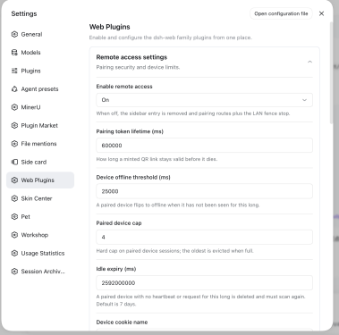
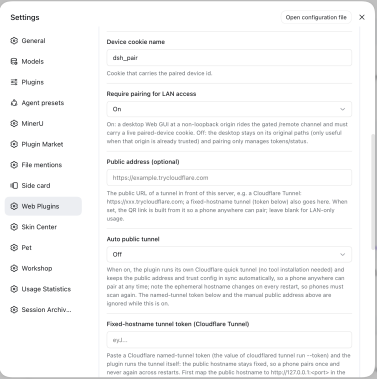
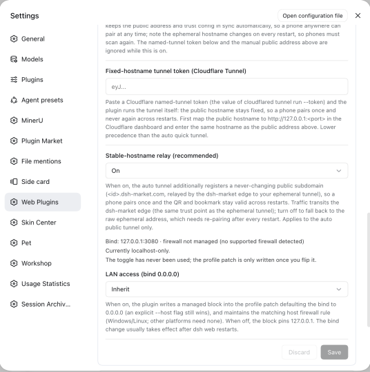

# 远程访问本机 DSH（手机 / 另一台电脑）

> **状态**：本仓已有插件 `@linxin666/dsh-remote-web-ui` 的**实测记录与配置指南**（已实测，未启用过）。
> 第三方方案 dsh-remote 的尽调记录见 [dsh-remote.md](dsh-remote.md)。

**需求**：电脑放在家里，人在外面时用手机访问它的 DSH。

**结论**：**用本仓已有的 `@linxin666/dsh-remote-web-ui` v0.3.17**（Apache-2.0，随 dsh-web 已 pin、已挂载）。走它的**自动公网隧道**即可满足需求——无需账号、无需域名、无需端口映射、无需引入任何第三方组件。

> 📌 **实际生效的配置（本仓 2026-09-13）**：CF 自动隧道 + Clash + Easytier 三者同开，**长期稳定**；**#12 局域网访问保持关闭**（`lanAvailable: false`，webserver 只绑 `127.0.0.1`）→ 因此手机的流量**只可能经由隧道**，Easytier 与 DSH 访问无关。
>
> ⚠️ **隧道曾经间歇性连不上，原因未查明**（三种归因均被实测证伪，含「Clash 模式」一说）。遇到时先重启 `make dev`；详见 §4②。

**已挂载的证据**：`plugins/dsh-web/packages/dsh-web-all/package.json` 的依赖含 `@linxin666/dsh-remote-web-ui: workspace:*`；`.dsh/profiles/node_modules/@linxin666/dsh-remote-web-ui` 已是指向该包的符号链接。

---

## 1. 为什么是它（与第三方 dsh-remote 的对比）

|                                      | **本仓已有 dsh-remote-web-ui**           | 第三方 dsh-remote v0.6.3                                |
| ------------------------------------ | ---------------------------------------------- | ------------------------------------------------------- |
| 许可证                               | **Apache-2.0**                           | PolyForm Noncommercial（商用付费）                      |
| 安装状态                             | **已 pin、已挂载**                       | 需引 submodule + bridge + relay                         |
| 常驻进程 / 开机自启                  | **无**                                   | 有（bridge）                                            |
| 是否需要`npx` 自动安装             | **否**                                   | 是（且挂载插件即触发自装运行时）                        |
| 控制端点（铸码/停止/名单/bind/更新） | **仅限 loopback**（本文件 §2 实测确认） | **对调用方无鉴权**（见 dsh-remote.md 的评审结论） |
| 能否改写 profile / 重启宿主          | **无此能力**                             | 有（`uninstallSelf` / `restartHarness`）            |
| 公网中继                             | Cloudflare 隧道；固定域名中继**可关**    | 默认走作者 SaaS；自建则 E2EE 被禁用                     |

> 第三方方案的完整评审（含三份独立专家评审的发现）见 [dsh-remote.md](dsh-remote.md)。

---

## 2. 实测结果（本机隔离实例，全部已验证）

测试方式：复制 `DSH_HOME` 到 /tmp + `--port 0` 起隔离实例，**不干扰正在运行的 3080 实例**，全程未公开任何端口。

| 项                         | 结果                                                                                                                                                   |
| -------------------------- | ------------------------------------------------------------------------------------------------------------------------------------------------------ |
| 插件加载                   | ✓ boot**0 错误**；host 半侧正常服务                                                                                                             |
| 已构建产物                 | ✓`lib/index.js` 165 KB、`lib/client.js` 242 KB                                                                                                    |
| 公开策略端点               | ✓`GET /api/pair/status` → `{"ok":true,"paired":false,"requirePairingForLan":true,"phase":"lan-required","lanAvailable":false,"lanAddresses":[]}` |
| `/remote` 闸门           | ✓ 未配对时**HTTP 403**，响应体 `{"code":"unpaired","message":"this device is not paired with the desktop"}`                                   |
| **控制端点仅限本机** | ✓**实测三种 Host**（见下表）                                                                                                                    |
| 插件自带路由               | `/api/pair/{status,issue,accept,events,heartbeat,revoke,stop,lan-bind}`、`/pair-accept`、`/pair-app`                                             |
| `cloudflared` 二进制     | ✓ 已就位且可执行：`cloudflared version 2026.8.3`                                                                                                    |

**控制端点仅限本机的实测**（`POST /api/pair/issue`）：

| 请求携带的 Host                      | 响应                                                                                                         |
| ------------------------------------ | ------------------------------------------------------------------------------------------------------------ |
| `127.0.0.1:<port>`（真 loopback）  | **409** `{"ok":false,"code":"lan-required"}` —— 端点可达，因二维码当前不可达而拒绝铸码（设计如此） |
| `192.168.1.5:<port>`（伪造局域网） | **403** `{"ok":false,"code":"forbidden"}`                                                            |
| `<本机真实网卡 IP>:<port>`         | **403** `{"ok":false,"code":"forbidden"}`                                                            |

**当前状态说明**：`phase: "lan-required"` 表示**只绑 loopback 且未配置公网地址**，此时二维码不可达，**配对尚不可用**——这正是配置的起点。该插件的配对态落盘在 `$DSH_HOME/remote-web-ui-devices.json`，本仓 `.dsh/` 下**没有这个文件**，与「从未配对过设备」一致。

---

## 3. 配置流程

### 第 0 步：重启并打开设置

```sh
make dev     # 重启（当前实例早于插件挂载）
```

打开 **设置 → Web 插件 → 远程访问设置**。

### 第 1 步：让二维码可达（二选一）

| 场景                           | 选哪个                                   | 效果                                                                                                                                              |
| ------------------------------ | ---------------------------------------- | ------------------------------------------------------------------------------------------------------------------------------------------------- |
| **在外面用（推荐路径）** | **Auto public tunnel**（面板上的这个名字；配置项 #9） | 插件自行运行`cloudflared` 快速隧道，把公网 URL 喂给二维码。**无需账号、域名、端口映射**。保持「局域网访问」（#12）**关闭**。               |
| 只在家 / 局域网用              | 局域网访问开关                           | 往 profile 的`cordis.patch.yml` 写入 bind 块，把 webserver 绑到 `0.0.0.0`；**需重启 `dsh web` 生效**（面板显示 `pendingRestart`）。 |

### 第 2 步：配对

点侧边栏设置按钮旁的**手机图标** → 面板铸一次性二维码 → 手机扫码 → 绑定后**直接进入官方 Web GUI**（竖屏自动启用移动适配层：44px 触控目标、手势、防 iOS 聚焦缩放等）。

面板提供：设备名单（名称/在线状态/最后活跃）、**单设备取消配对**、**停止**（撤销全部设备与当前令牌）。

### 第 3 步（可选）：固定地址

- **固定域名中继**（默认开）：手机始终使用 `https://<id>.dsh-market.com`，书签与配对跨 `dsh web` 重启存活。代价见 §4。
- **自带域名**：Cloudflare 命名隧道 —— 粘 token 到「固定域名隧道令牌」，并把同一 hostname 填到「公网地址」（token 不含 hostname，缺这步隧道不会启动）。

### 设置项

**只有一项必须改**（#9，原为 `Off`）——完整清单、每项含义与建议值见文末 **[配置项一览](#配置项一览)**。改完点面板右下角的 **Save**。

---

## 4. 注意事项

### ① ⚠️ `make dev` 与「局域网访问」开关会互相打架（本文件首次记录）

- 插件把 bind 块**追加到 profile patch 文件末尾**（`writeLanBind` → `${base}\n\n${block}`），且该块**整表替换 `webserver` 条目的 config**，写成静态 `host`/`port`。
- 本仓的 `scripts/merge-profile-patch.mjs` **只保留自己 BEGIN 标记之前的内容**，末尾追加的内容会被丢弃。

**后果**：开了局域网开关后跑 `make dev`/`make link-plugins` → merge 删块 → **本次 boot 仍绑 loopback** → 插件在本次 boot 把块写回 → **下一次重启才生效**。表现为「开关时灵时不灵」。

**规避**：走**隧道**（保持局域网关闭）的场景**完全不涉及**这个块，因此不受影响——这也是推荐路径的额外好处。

### ② 手机报 **Error 1033** / 公网地址 **HTTP 530**（cloudflared 连不上边缘，2026-09-13 实测定位）
**症状**：手机扫码后 Cloudflare 返回 `Error 1033`；本机 `curl` 公网地址返回 `HTTP 530`；日志里 `remote-web-ui` 一切正常（插件以为隧道 running）。

**注意**：`/healthcheck` 返回 200，所以插件认为隧道正常——**进程活着 ≠ 隧道连通**。要看真状态得问 cloudflared 自己：

```sh
# 它自己开的指标口（只读）
curl -s http://127.0.0.1:20241/ready
# → {"status":503,"readyConnections":0,"connectorId":"…"}   零条可用边缘连接
```

**看真实报错**（npm 包里的 `VERBOSE` 开关会把 cloudflared 的 stdout/stderr 直接透到终端）：

```sh
VERBOSE=1 TUNNEL_TRANSPORT_LOGLEVEL=debug make dev
```

**根因**（实测输出）：

```
| TCP Connectivity  region1.v2.argotunnel.com  FAIL   HTTP/2 connection is blocked or unreachable |
| UDP Connectivity  region1.v2.argotunnel.com  PASS   QUIC connection successful                  |
| SUMMARY: … will proceed using 'quic'.   WARNING: Allow outbound TCP on port 7844.               |
ERR Unable to establish connection with cloudflared edge error="TLS handshake with edge error: EOF"
```

即 **TCP 7844 被中间设备掐断**（TCP 能连上，TLS 握手被 EOF），而 **UDP 7844（QUIC）是通的**。cloudflared 的 precheck 因此建议改用 quic。

**但插件用不了 quic**：`SHARED_TUNNEL_FLAGS` 把传输协议**写死**了，配置 schema 里**没有**任何协议开关（已核对 `Config` 全部字段）：

```js
const SHARED_TUNNEL_FLAGS = { "--no-autoupdate": true, "--protocol": "http2" };
```

**为什么会被掐：⚠️ 原因未查明（2026-09-13，三次归因均被实测证伪）**

这一条一天内改了三版，**每版都被后续实测推翻**。过程留在下面——**不要再依据本节的任何因果说法下判断**：

| # | 曾给出的归因 | 被什么推翻 |
| --- | --- | --- |
| 1 | 「TCP 7844 在直连路径上被 GFW 封锁」 | Clash 全关时的**真·直连握手是成功的**（拿到 `CloudFlare Origin Certificate`） |
| 2 | 「真凶是 Clash 的 TUN 拦截，Clash 开着就坏」 | **Clash + Easytier 同开时隧道照常连通** |
| 3 | 「分界线是 Clash 的 `mode`（rule 坏 / global 好）」 | **用户实测 `rule` 模式下隧道同样连通**；且该结论建立在**读配置文件**之上，而 Clash Verge 在 UI 里切模式是走 API 改运行时配置、**不回写文件**——文件根本不是运行时状态 |

**方法教训（重要）**：`clash-verge.yaml`（写着 `mode: global`）与同目录 `config.yaml`（写着 `mode: rule`）**两者都不代表运行时模式**。要判断运行时状态必须查 mihomo 的 external-controller API（本项目实测端口 `127.0.0.1:9097`，见 `config.yaml`）；**读文件会得出错误结论**。

**只保留观测，不给解释**：

| 时点 | Clash | 隧道 |
| --- | --- | --- |
| 最初 | 开 | ✗ 从没连上：`TLS handshake with edge error: EOF` |
| 05:46 | 开 | ✓ 连上 |
| 05:55 | 开 | ✗ 掉线，重连超时，数分钟后**自愈** |
| 之后 | 关 | ✓ 重启 `make dev` 后连上 |
| 长期 | **开** | **✓ 稳定** |

**能连上的样本覆盖了 Clash 的各种状态**，因此「隧道连不上」应视为**间歇性故障**，与 Clash 配置的相关性**未获证实**。

> ⚠️ 有一条**独立成立**的观察（与根因无关）：**改动过 Clash / 网络状态后，cloudflared 可能缓存着已失效的 fake-ip**（如 `28.0.0.21/22`），继续往那些地址重连、耗尽退避，**不会自动改用真实 IP**——此时**重启 `make dev`** 即可恢复。

**处置（按「代价从小到大」，均不依赖上面的因果猜测）**：

- **(a) 先什么都不改**：既然现状长期稳定，就保持现状。
- **(b) 若隧道再次连不上**：先**重启 `make dev`**（清掉 cloudflared 缓存的失效地址——这条独立成立），再看 `/ready`。
- **(c) 仍连不上**：试 `VERBOSE=1 TUNNEL_TRANSPORT_LOGLEVEL=debug make dev` 看 cloudflared 的实时报错，并到 mihomo 的 external-controller API 查**运行时**模式（别读配置文件）。
- **(d) 为什么不用 quic**：QUIC 实测是通的，但插件把 `--protocol http2` **写死**且配置 schema 无可配项；改它要动 pin 仓（本仓禁止）或 fork。

> 💡 **手机与电脑在同一个 WiFi 时，别用隧道测**：流量会 `手机 → Cloudflare 边缘(实测落到 SJC/LAX) → 回到你的电脑`，**绕太平洋一圈再回来**。这种场景直接开 #12 局域网访问走 `http://<内网IP>:3080` 又快又稳，也是排查 UI 问题时最干净的路径。

> ⚠️ 这与此前那个 **Host 403** 无关（那条在 §4③）：那条是插件把 Host 改写成稳定域名、被自己的栅栏拒掉（**已修**）；这条是**隧道根本没跟边缘建立连接**。两个故障独立。

**✅ 已验证的解法（2026-09-13）**：把 Clash 切到**全局（Global）模式**后，cloudflared 立刻连上：

```
INF Registered tunnel connection connIndex=0 ... location=sjc11 protocol=http2
| TCP Connectivity  region1/2.v2.argotunnel.com  PASS   HTTP/2 connection successful |
| SUMMARY: Environment is healthy. cloudflared will use 'http2' as primary protocol.  |
```

→ **确认是「选路」而非「节点」问题**：规则模式下隧道流量走了直连（TCP 7844 被封锁），全局模式下全走代理即通。**永久解法是上面 (a) 的两条 DOMAIN-SUFFIX 规则**，不用一直挂着全局模式（全局会把你的**所有**流量都塞进代理）。

**⏳ 仍未解决**：隧道通了、**手机也配对成功了**（`.dsh/remote-web-ui-devices.json` 已生成），但 App 界面加载不出来。已确认的现象与线索：

| 观察 | 说明 |
| --- | --- |
| 设备 `lastSeenAt` 只比 `createdAt` 晚 **864ms** | 配对后手机几乎立刻停止发心跳 → **App 没有真正跑起来** |
| `Host: <隧道域名>` 打 harness `/api` → **403** | 围栏只认 loopback / `trustedHosts`，隧道域名都不在里面 |
| `Host: 127.0.0.1:3080` 打同样路径 → **401** | 说明差异只在围栏那一层 |
| harness **支持** `webserver/index-inject`（`host/webserver/src/index.ts:34,349`） | 插件的注入机制前提成立；且注入条件 `requirePairingForLan` 为 true，**应当已注入** |
| 手机上那句「网络可能不稳定，请耐心等待」**在本仓全仓搜索无命中** | 推测是**华为浏览器自己的提示**，不是 DSH 的文案 |

插件的设计是：注入一段 boot 脚本（`REMOTE_CHANNEL_BOOT_SCRIPT`）把客户端对 `/api` 的 fetch/WebSocket/EventSource **改写到 `/remote/api`**，再由插件**代理到 loopback**并附上 harness 的浏览器 cookie（`proxyLoopbackHttp`）——绕过围栏。手机没发请求，说明**这段改写没生效或页面没跑起来**。

**下一步的诊断（决定性）**：让 cloudflared 打印**每个请求**，就能看到手机到底发了什么、服务端回了什么：

```sh
VERBOSE=1 TUNNEL_LOGLEVEL=debug make dev
```

另有一个可疑点尚未验证：`appOrigin()` 用 `X-Forwarded-Proto` 判断协议，**拿不到就默认 `http`**，而配对成功后的 303 跳转正是用它拼的——若 cloudflared 没带这个头，手机可能被跳到 `http://` 地址。

### ③ 取舍与代价

- **固定域名中继经作者运营的 Cloudflare Worker**（其 README 原文："the author's worker can observe it"）→ **建议关闭**，见下条实测。
- **遥测**：浏览器端每日一次匿名心跳（随机 localStorage id + 包名）到 dsh-market.com；服务端只存加盐哈希、不存 IP。
- **配对设备 = 完全控制凭据**：可触达 chat/session/settings/凭据/agent preset 等；仅**配对、自更新、插件装卸**三个控制面留在本机（§2 已实测其 loopback 限制）。
- 🔴 **固定域名中继（#11）在本机网络上「不可能成功」——实测（2026-09-12）**：
  开着 #9 自动隧道后，日志会出现
  ```
  remote-web-ui: relay registration failed (HTTP 403) — the stable origin may serve its offline page until the retry lands
  ```
  **这不是临时故障、重试也不会好**。实测该端点返回的是 **Cloudflare 机器人挑战**，请求根本没到 dsh-market 的应用：
  ```
  HTTP/2 403
  cf-mitigated: challenge          ← Cloudflare 挑战
  server: cloudflare
  <title>Just a moment...</title>
  ```
  插件用的是 Node 的 `fetch`（undici），**解不了 JS 挑战** → 以 5 秒→60 秒退避**无限重试、无限失败**。连 `curl https://dsh-market.com/` 也吃同一个挑战，所以**不是你的请求特殊**，是该站对非浏览器客户端一律挑战。
  **🔴 它会连带打断整条隧道——不只是「固定地址用不了」（2026-09-13 更正）**。根因是插件内部两处取值走岔了：

  ```js
  // ① 只要 relay 开着（≠false），registrar 就存在——与「注册是否成功」无关
  ensureRelayRegistrar() { if (resolve().relay === false) return undefined; … }
  // ② 于是 Host 被无条件改写成「稳定域名」（取自 identity，不依赖注册结果）
  const originHostHeader = registrar === undefined ? undefined : new URL(registrar.baseUrl).host;
  tunnel.start({ kind:"quick", targetUrl, originHostHeader });   // → cloudflared --http-host-header <id>.dsh-market.com
  // ③ 但 publicBaseUrl 只在注册「成功」时才用稳定域名
  if (state.state === "running") relayUrl = state.url;     // 从没 running 过
  else if (state.state === "failed") console.warn(…);      // failed 分支只告警，不动 relayUrl → 一直是 undefined
  setPublicBase() → publicBaseUrl = relayUrl ?? rawTunnelUrl = 【临时地址】
  // ④ 栅栏信任的是 publicBaseUrl 的 host → 【临时地址】
  // ⑤ 而进来的 Host 是 【稳定域名】→ 不在名单 → 403
  ```

  **实测确认**（对运行中的实例发不同 Host）：
  | 请求 Host | `GET /api/pair/status` |
  | --- | --- |
  | `127.0.0.1:3080` | **200** |
  | `<id>.dsh-market.com`（cloudflared 实际写入的） | **403** |

  而 `ps` 显示 cloudflared 确实带着 `--http-host-header <id>.dsh-market.com` 在跑——**手机经隧道发来的每个请求，Host 都被改写成稳定域名，然后被插件自己的栅栏 403 掉**。这就是「扫码后报错」的原因，也解释了为什么 DSH 日志里**什么都看不到**（栅栏直接拒绝，不落日志）。

  **处置：把 #11 改成 `Off`**——这是**修复**，不只是止噪：`relay === false` → `ensureRelayRegistrar()` 返回 `undefined` → `originHostHeader === undefined` → **cloudflared 不再带 `--http-host-header`** → Host 保持临时域名 → 与 `publicBaseUrl` 一致 → 栅栏放行。
  （代价仍成立：临时地址每次重启会变、手机要重扫码。）
  这看起来是**插件的缺陷**（Host 改写挂在了「relay 开关」上，而不是「注册成功」上），值得向作者反馈。
  这看起来是**服务端的客户端兼容性问题**（Node 客户端过不了 CF 挑战），可考虑向作者反馈。

- **一个已披露、且本仓已复核的撤销缺口**：插件的配对闸门挂在 harness 的 `api/gate` seam 上，而**本仓 pin 的 harness（`dsh-v0.1.5-rc.2`）并不发出这个 seam**（本文件 §5 记录了复核方式）→ 闸门对**直连 `/api` 的请求完全不生效**。后果：在 LAN bind 下，设备已经兑换过的浏览器凭据在「停止 / 取消配对」后**仍然有效**，直到自然过期（**30 天**）——撤销约束的只是 `/remote` 通道与配对 cookie，**不是**那个凭据。
  → 机器非独用时**优先「只 loopback + 隧道」**，并把 LAN bind 当成一个需要想清楚才开的决定。
  ⚠️ 注意区分两个 `/api`：**插件自带的** `/api/pair/*` 控制端点**已实测仅限 loopback**（§2）；而**harness 的** `/api`（chat/session/settings…）在 LAN bind 下不受配对保护，只由 harness 自己的围栏与浏览器 cookie 把关。

### ④ 🔴 隧道一开，你的实例就在被公网扫描（2026-09-13 实测）

开通隧道后**几十秒内**，cloudflared 的请求日志里就出现了**与你手机无关的机器人**——不同 UA、不同 IP：

```
HUAWEI P30 Pro / Chrome 89   123.6.49.44    → GET /pair-accept
Windows Chrome               123.6.49.50    → GET /favicon.ico   404
MI 8 / Android 8.1           27.115.124.118 → GET /              401
vivo V2055A                  27.115.124.6   → GET /pair-app       200
Windows/Mac Chrome × 7       27.115.124.x   → GET /favicon.ico   404
```

**这是互联网上的通用扫描器在枚举 `*.trycloudflare.com` 子域**（快速隧道的域名是可预测的，且被大规模爬取）。

- **实测全部被拒**（401/404/403），没有数据泄露。
- 但**暴露面是真实的**：你的 DSH 进程、插件面板、配对入口都直接挂在公网上。
- **推论**：任何走「快速隧道」的方案都会有这个特征——**域名一旦可枚举，就会被扫**。介意的话只能改用不可枚举的入口（自有域名 + 命名隧道，或 overlay 网络）。

### ⑤ 已知限制（来自其 README）

- bind 改动需**重启**才生效。
- **纯 HTTP 局域网地址**下 service worker 不注册 → 手机从书签/历史重开需**重扫码**；**https 隧道地址下**由 service worker 接管 `/`，可直接重开且顺带续期。
- 移动适配选择器跟随官方界面；官方大改后需一次视觉 QA。
- 配对令牌一次性、限时；刷新会作废旧链接。

---

> 📋 本文档相关的未收口事项（隧道故障未查明、#11 未再试、局域网路径未验证等）统一记在 [docs/backlog.md](backlog.md)。

## 5. 验证边界（哪些实测过、哪些只是复核、哪些没验证）

### 未验证（未做，也不建议顺手做）

- **真正开启公网隧道**：本文档的实测**未开启隧道**（开启会把本机发布到互联网）。隧道开启后应验证：公网 URL 可达、`/remote` 仍被配对闸门拦、关闭后公网可达性消失。
- **手机端实际体验**（扫码、竖屏适配层、手势、重开行为）：需要真机。
- **固定域名中继 / 自带域名命名隧道**：均未启用过。

### 已复核（读源码/搜源码确认，非运行时实测）

**§4③ 撤销缺口的复核方式**：

```sh
# 在 harness 源码（排除 node_modules / lib 产物）里找 seam 字面量：
find harness -type d \( -name node_modules -o -name lib -o -name dist \) -prune \
  -o -type f \( -name '*.ts' -o -name '*.js' \) -print \
  | xargs grep -nE "api/gate([^w]|$)"
# → 无匹配。注意别用裸 "api/gate" 搜：会命中 packages/api/gateway 的路径串，是假阳性。
```

结论：pin 的 harness 不发 `api/gate`，插件的闸门监听器**不会触发**，README 自述的撤销缺口在当前 pin 上**成立**。

---

## 6. 排障速查

| 现象                 | 先看这里                                                                                                       |
| -------------------- | -------------------------------------------------------------------------------------------------------------- |
| 面板显示二维码不可达 | `GET /api/pair/status` 的 `phase`：`lan-required` = 既没开局域网也没配公网地址                           |
| 手机扫码后进不去     | 先查是不是 §4③ 那个 Host 改写问题（**最可能**）：`ps aux \| grep [c]loudflared` 看有没有 `--http-host-header`；有就是它，把 #11 改 `Off`。否则再查隧道与公网地址 |
| 手机重开要重扫码     | 非 https 来源（纯 HTTP 局域网）无法注册 service worker —— 属已知限制                                         |
| 局域网开关似乎不生效 | 见 §4①：`make dev` 会删掉 bind 块，需再重启一次                                                            |
| 手机报 **Error 1033** / 公网地址 **530** | **隧道没连上边缘**（不是配对问题）。`curl -s localhost:20241/ready` 看 `readyConnections`：为 0 即确诊。处置见 §4② |
| 日志刷 `relay registration failed (HTTP 403)` | 见 §4③ 实测条：Cloudflare 挑战挡住注册，**重试不会好**。处置=把 #11 改 `Off` |
| 面板卡片显示 `Stable-hostname sync failed: HTTP 403…`（中文：`固定域名同步失败：HTTP 403…`） | **与上一条是同一个故障**，只是客户端侧的那一面（`state.relay.state === "failed"`）。该提示是纯状态行（`role="status"`）**没有任何按钮**；处置同上——去设置卡把 #11 改 `Off` |
| 日志 `ExperimentalWarning: SQLite is an experimental feature` | Node 内置 `node:sqlite` 的实验性 API 提示，**非错误、无需处理** |

# 配置细节

## 配置项一览

面板共 **12 项**（`设置 → Web 插件 → 远程访问设置`）。**只有 #9 需要改**，其余保持出厂值即可。

| # | 配置项 | 含义说明 | 建议配置值 |
| --- | --- | --- | --- |
| 1 | **Enable remote access** | 远程访问**总开关**。关闭后：侧边栏手机图标入口被移除，配对路由与局域网栅栏一并停用——等于整个功能下线。 | **`On`**（出厂值）。要用就得开。 |
| 2 | **Pairing token lifetime (ms)** | 二维码里那个**一次性配对令牌**的有效期。到期即失效；刷新二维码会**立刻作废**上一把。 | **`600000`（10 分钟）**，保持。够你走到手机前扫码；调大只会延长暴露窗口，不会更方便。 |
| 3 | **Device offline threshold (ms)** | 已配对设备**多久没心跳就显示为「离线」**。纯展示，不影响授权。 | **`25000`（25 秒）**，保持。 |
| 4 | **Paired device cap** | 最多同时保留**几台**已配对设备；超出时**淘汰最旧的**。 | **`4`**，保持（个人自用通常 1–2 台）。 |
| 5 | **Idle expiry (ms)** | 设备**空闲多久后被删除**、必须重新配对。⚠️ 这也是 §4③ 那个「停止/取消配对后旧浏览器凭据仍有效」的窗口——**撤销约束的是 `/remote` 通道与配对 cookie，不是那份浏览器凭据**。<br>（面板自带的提示文案写「默认 7 天」，**是错的**：源码里 `DEFAULT_IDLE_EXPIRE_MS = 720*60*60*1e3` = **30 天**，字段实际值也是 `2592000000`。） | **`2592000000`（30 天）**，保持。想收紧可改小（如 7 天 = `604800000`），代价是手机要更频繁重扫。 |
| 6 | **Device cookie name** | 承载「已配对设备 id」的 **cookie 名**。 | **`dsh_pair`，别改**。一改，现有已配对设备**立即全部失效**（插件 README 明说这是预期行为）。 |
| 7 | **Require pairing for LAN access** | 来自**局域网**的请求是否必须携带已配对 cookie。关闭后插件仍管理令牌/状态，但非 loopback 请求**无需 cookie 即可通过**。 | **`On`**，保持。这是更安全的一侧。 |
| 8 | **Public address (optional)** | 本服务对外的**公网 URL**，插件用它拼二维码。 | **留空**。只在用「自带域名 + 命名隧道」时才填，且**必须与 token 的 hostname 一致**（token 本身不含 hostname，缺这步隧道不会启动）。 |
| **9** | **Auto public tunnel** | 插件**自行拉起 cloudflared 快速隧道**，自动维护公网地址与信任配置，让手机在任何网络都能配对/打开。地址是**临时**的，**每次重启会变**（手机需重扫）。**打开时 #8、#10 被忽略。** | 🔴 **`On`——这是唯一必须改的一项**（出厂为 `Off`）。 |
| 10 | **Fixed-hostname tunnel token (Cloudflare Tunnel)** | **Cloudflare 命名隧道**的 token。粘贴后插件自己跑隧道，公网 hostname **固定不变**，手机只配对一次、之后无需重扫。 | **留空**。除非你有**自己的域名**且想固定地址。 |
| 11 | **Stable-hostname relay (recommended)** | 在上面的自动隧道之外，再向 dsh-market 边缘注册一个**永不变的子域** `https://<id>.dsh-market.com`，于是手机只配一次、书签与配对**跨 `dsh web` 重启存活**。代价：流量经**作者运营的 Cloudflare 边缘**。<br>⚠️ **只在 #9 开启时才起作用**——#9 关着它就是个空转开关。<br>🔴 **实测（2026-09-12）：本机网络上它不可能成功**——注册端点被 Cloudflare 机器人挑战挡在应用之前（`cf-mitigated: challenge`），插件的 Node `fetch` 解不了 JS 挑战，会**无限重试、无限失败**（日志里那串 `relay registration failed (HTTP 403)` 就是它）。<br>🔴 **更要命的是它会连带打断整条隧道**（2026-09-13 更正）：只要 relay 开着，cloudflared 就被无条件加上 `--http-host-header <稳定域名>`，而栅栏信任的是**临时域名** → 手机请求全被 403。详见 §4③。 | 🔴 **改成 `Off`**——这是**修复**，不只是止噪（**推翻了最早「保持 On」的建议**）。<br>关掉后：不再发起注册 + **cloudflared 不再改写 Host** → 隧道恢复可用。<br>代价：临时地址每次重启会变、手机要重扫码。 |
| 12 | **LAN access (bind 0.0.0.0)** | 是否往 profile patch **写一块**、把 webserver 从 `127.0.0.1` 改绑到 `0.0.0.0`。改动**需重启 `dsh web`** 才生效。 | **保持 `Inherit`（不开）**。走隧道不需要它；且它与本仓 `merge-profile-patch.mjs` 的合并逻辑**冲突**——开了要**重启两次**才生效（§4①）。 |

> ⚠️ **最容易看走眼的一处**：#11 出厂就是 `On`，看起来「已经配好了」，但它**在 #9 关闭时完全不工作**——它自己的说明写着「the auto **tunnel** additionally registers…」「Applies to the **auto public tunnel** only」。**先开 #9，#11 才有意义。**

> 📌 本表由面板截屏逐项整理，配置项名称与出厂值以插件 **v0.3.17** 为准。若你屏幕上的标签/默认值与此不符（版本差异），**以屏幕上为准**。

## 面板截屏






